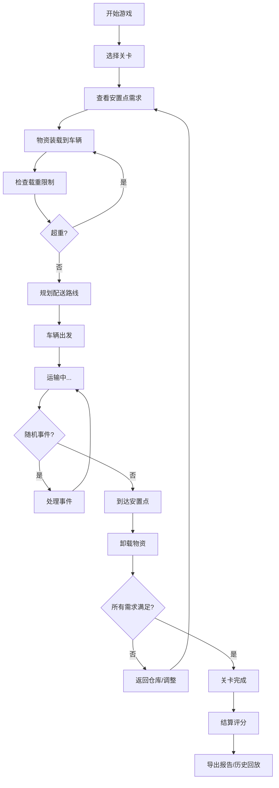

## 1. 产品概述

灾后物资配送游戏是一款面向公益组织志愿者培训的2D策略模拟游戏。玩家扮演物资调度员，在灾后场景中合理分配水、药品、帐篷等物资到各个安置点，应对道路中断、需求变化、天气事件等突发状况。

- **核心目的**：通过游戏化方式培训志愿者掌握物资配送的决策逻辑与应急处理能力
- **目标用户**：公益组织志愿者、应急管理培训人员
- **产品价值**：提供低风险、可重复的实战演练环境，提升真实场景下的决策效率

## 2. 核心 Features

### 2.1 用户角色
| 角色 | 登录方式 | 核心权限 |
|------|----------|----------|
| 玩家 | 无需登录，本地存储 | 开始游戏、暂停/继续、重开、查看历史记录、导出报告 |

### 2.2 Feature Module
1. **游戏主界面**：2D地图视图、物资面板、车辆状态、安置点需求、事件通知
2. **关卡选择**：不同难度关卡（初级/中级/高级），回合制或实时模式
3. **物资装载系统**：车辆载重限制、物资类型选择、装载优化
4. **路线规划**：2D路径选择、道路状态查看、多目的地规划
5. **随机事件系统**：天气变化、道路中断、需求激增、物资损耗
6. **结算评分**：详细计分规则、扣分说明、失败原因分析
7. **历史回放**：游戏过程记录、步骤回放、决策复盘
8. **报告导出**：PDF/JSON格式配送报告、决策分析

### 2.3 Page Details
| 页面名称 | 模块名称 | Feature description |
|----------|----------|---------------------|
| 开始页面 | 关卡选择 | 难度选择、游戏说明、历史记录入口 |
| 游戏主界面 | 2D地图 | 可交互地图、车辆位置、道路状态、安置点标记 |
| 游戏主界面 | 物资面板 | 库存显示、物资类型切换、装载操作 |
| 游戏主界面 | 车辆控制 | 车辆状态、载重显示、出发/召回操作 |
| 游戏主界面 | 事件日志 | 实时事件通知、历史事件列表 |
| 结算页面 | 评分详情 | 总分、各项得分明细、扣分原因、失败分析 |
| 历史回放 | 步骤回放 | 时间轴控制、步骤跳转、决策标记 |

## 3. 核心流程

玩家选择关卡后进入游戏，首先查看各安置点的物资需求，然后在仓库装载物资到车辆，规划配送路线后发车。运输过程中会遇到随机事件影响道路通行或物资状态，需要灵活调整策略。完成所有配送或回合结束后进行结算评分。

## 4. 用户界面设计

### 4.1 设计风格
- **主色调**：深蓝色系 (#1e3a5f) 代表专业与信任，配合橙色 (#e67e22) 作为警示色
- **辅助色**：绿色 (#27ae60) 表示正常、红色 (#c0392b) 表示紧急、黄色 (#f39c12) 表示警告
- **按钮风格**：圆角矩形，带有微阴影，hover状态有轻微放大效果
- **字体**：标题使用 Noto Sans SC Bold，正文使用 Noto Sans SC Regular
- **布局风格**：顶部信息栏 + 左侧控制面板 + 中央地图区 + 右侧事件日志的四栏布局
- **图标风格**：使用简洁的SVG图标，物资使用emoji增强识别度（💧💊⛺）

### 4.2 Page Design Overview
| 页面名称 | 模块名称 | UI Elements |
|----------|----------|-------------|
| 开始页面 | 关卡卡片 | 卡片式布局、悬停动画、难度标签、描述文字 |
| 游戏主界面 | 2D地图 | Canvas绘制、网格背景、节点连线、可缩放平移 |
| 游戏主界面 | 物资面板 | 卡片堆叠、拖拽装载、进度条显示、数字计数器 |
| 游戏主界面 | 车辆状态 | 环形进度条显示载重、状态标签、操作按钮组 |
| 结算页面 | 评分详情 | 大数字显示总分、分项列表、扣分高亮、可视化图表 |
| 历史回放 | 时间轴 | 滑块控制、播放/暂停、步骤标记点 |

### 4.3 响应式
- 桌面端优先设计，主游戏区最小宽度1200px
- 平板设备自适应调整面板大小，可折叠侧边栏
- 移动端提供简化视图，主要用于查看报告和历史记录

### 4.4 2D地图设计
- 采用俯视视角的节点-连线式地图
- 节点包括：仓库、安置点、道路交汇点
- 连线表示道路，不同颜色表示道路状态（绿色畅通、黄色拥堵、红色中断）
- 车辆动画沿路径移动，显示实时位置
- 支持鼠标悬停查看节点详情，点击选择目的地
