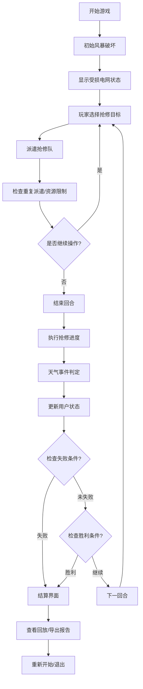

## 1. 产品概述

"电网抢修回合制"是一款模拟电力公司风暴后抢修决策的3D浏览器游戏，玩家需在有限资源下做出关键决策，平衡各方利益，确保电网快速恢复供电。

- 核心目的：让玩家体验电力调度员的决策压力，理解电力系统恢复的优先级规则
- 目标用户：电力公司团建活动参与者、策略游戏爱好者
- 核心价值：通过真实的规则机制，提供有教育意义的团队建设体验

## 2. 核心功能

### 2.1 用户角色
| 角色 | 进入方式 | 核心权限 |
|------|---------|---------|
| 玩家 | 直接进入游戏 | 进行游戏操作、查看报告、导出记录 |

### 2.2 功能模块
1. **游戏主界面**：3D电网地图、回合控制、资源面板
2. **信息面板**：用户状态、天气预警、抢修报告
3. **结算系统**：计分、失败原因、历史回放
4. **设置面板**：暂停/继续、重新开始、难度选择

### 2.3 页面详情
| 页面名称 | 模块名称 | 功能描述 |
|---------|---------|---------|
| 游戏主界面 | 3D地图 | 显示变电站、电线、用户节点、抢修队位置 |
| 游戏主界面 | 回合控制 | 开始回合、结束回合、暂停/继续 |
| 游戏主界面 | 资源面板 | 显示可用抢修队、冷却时间、当前回合 |
| 信息面板 | 用户状态 | 显示各级用户供电状态、超时倒计时 |
| 信息面板 | 天气预警 | 显示当前天气、未来天气预测 |
| 结算界面 | 计分系统 | 显示最终得分、各项评分明细 |
| 结算界面 | 失败原因 | 显示失败触发条件、关键事件时间线 |
| 结算界面 | 历史回放 | 可回看每回合操作、电网状态变化 |
| 结算界面 | 导出报告 | 导出JSON/文本格式的游戏记录 |

## 3. 核心流程

## 4. 用户界面设计

### 4.1 设计风格
- **主色调**：深蓝(#1a365d)代表电力工业，橙色(#ed8936)代表警告/紧急，绿色(#38a169)代表正常
- **辅助色**：红色(#e53e3e)表示故障，黄色(#d69e2e)表示警告
- **按钮风格**：工业风格，矩形带轻微圆角，按下有立体感
- **字体**：使用等宽字体(如JetBrains Mono)显示数据，无衬线字体显示文本
- **布局风格**：仪表盘式布局，左侧信息面板，右侧资源面板，中央3D地图
- **图标风格**：简约线性图标，使用SVG实现

### 4.2 页面设计概述
| 页面名称 | 模块名称 | UI元素 |
|---------|---------|--------|
| 游戏主界面 | 3D地图 | 俯视视角3D场景，节点连线、动态特效、鼠标悬停信息 |
| 游戏主界面 | 顶部状态栏 | 回合数、当前时间、天气图标、得分预览 |
| 游戏主界面 | 左侧面板 | 用户列表、供电状态、超时倒计时 |
| 游戏主界面 | 右侧面板 | 抢修队列表、状态、冷却时间 |
| 游戏主界面 | 底部控制栏 | 暂停/继续、结束回合、设置按钮 |
| 结算界面 | 总分展示 | 大号数字动画展示最终得分 |
| 结算界面 | 评分明细 | 各项指标条形图 |
| 结算界面 | 时间线 | 关键事件可滑动时间线 |
| 结算界面 | 操作按钮 | 回放、导出、重玩 |

### 4.3 响应式设计
- 桌面端：完整布局，键鼠操作优先
- 平板端：面板可折叠，支持触屏点击
- 移动端：简化布局，优先显示核心信息
- 触屏优化：增大点击区域，支持双指缩放地图

### 4.4 3D场景指引
- **环境**：工业风格城市俯瞰图，夜晚/黄昏氛围，轻微雾气增加深度感
- **光照**：主光源模拟黄昏阳光，辅助光突出变电站和电线
- **相机**：初始俯视45度角，支持平移、缩放、旋转
- **焦点元素**：变电站(发光立方体)、电线(发光线条)、用户节点(不同颜色球体)
- **交互**：点击选择节点，悬停显示详情，拖动移动视角
- **特效**：故障点闪烁红色，抢修中显示进度环，恢复时绿色扩散动画
- **性能**：使用实例化渲染，限制多边形数量，目标60fps
