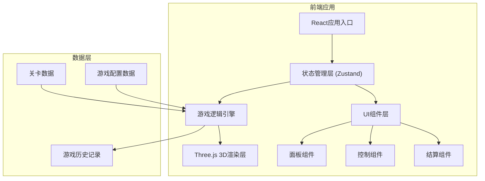

## 1. 架构设计



## 2. 技术描述

- **前端框架**: React@18 + TypeScript
- **构建工具**: Vite@5
- **状态管理**: Zustand@4 (轻量级状态管理)
- **3D渲染**: Three.js@0.160 + @react-three/fiber@8 + @react-three/drei@9
- **样式方案**: TailwindCSS@3
- **UI组件**: 自定义组件 + lucide-react图标
- **数据持久化**: LocalStorage (保存游戏记录)
- **动画**: Framer Motion (UI动画) + Three.js动画系统

## 3. 核心模块结构

```
src/
├── components/
│   ├── game/
│   │   ├── GameCanvas.tsx      # 3D游戏画布
│   │   ├── PowerGrid.tsx       # 电网3D模型
│   │   ├── Substation.tsx      # 变电站组件
│   │   ├── PowerLine.tsx       # 电线组件
│   │   └── UserNode.tsx        # 用户节点组件
│   ├── ui/
│   │   ├── TopBar.tsx          # 顶部状态栏
│   │   ├── LeftPanel.tsx       # 左侧用户面板
│   │   ├── RightPanel.tsx      # 右侧资源面板
│   │   ├── BottomBar.tsx       # 底部控制栏
│   │   └── Tooltip.tsx         # 悬浮提示
│   └── modals/
│       ├── ResultModal.tsx     # 结算弹窗
│       ├── ReplayModal.tsx     # 回放弹窗
│       └── SettingsModal.tsx   # 设置弹窗
├── store/
│   └── useGameStore.ts         # 游戏状态管理
├── game/
│   ├── types.ts                # 类型定义
│   ├── config.ts               # 游戏配置
│   ├── engine.ts               # 游戏逻辑引擎
│   └── levels.ts               # 关卡数据
├── utils/
│   ├── replay.ts               # 回放工具
│   ├── export.ts               # 导出工具
│   └── helpers.ts              # 辅助函数
├── App.tsx
├── main.tsx
└── index.css
```

## 4. 数据模型定义

### 4.1 核心类型

```typescript
// 电网节点类型
type NodeType = 'substation' | 'powerline' | 'user';

// 用户等级
type UserPriority = 'critical' | 'important' | 'normal';

// 节点状态
type NodeStatus = 'operational' | 'damaged' | 'repairing' | 'destroyed';

// 天气类型
type WeatherType = 'clear' | 'rain' | 'storm' | 'heavy_storm';

// 抢修队状态
type TeamStatus = 'idle' | 'moving' | 'repairing' | 'cooling';

// 游戏状态
type GameStatus = 'idle' | 'playing' | 'paused' | 'victory' | 'defeat';

// 电网节点
interface PowerNode {
  id: string;
  type: NodeType;
  name: string;
  position: { x: number; y: number; z: number };
  status: NodeStatus;
  health: number;
  maxHealth: number;
  connectedTo: string[];
  repairTime: number;
  repairProgress: number;
  powered: boolean;
}

// 用户节点
interface UserNode extends PowerNode {
  type: 'user';
  priority: UserPriority;
  maxOutageTime: number;
  outageTime: number;
  population: number;
}

// 抢修队
interface RepairTeam {
  id: string;
  name: string;
  status: TeamStatus;
  efficiency: number;
  currentTarget: string | null;
  cooldown: number;
  maxCooldown: number;
  position: { x: number; y: number; z: number };
}

// 天气
interface Weather {
  type: WeatherType;
  duration: number;
  damageMultiplier: number;
  repairPenalty: number;
  description: string;
}

// 游戏状态
interface GameState {
  status: GameStatus;
  turn: number;
  maxTurns: number;
  score: number;
  weather: Weather;
  nextWeather: Weather;
  nodes: PowerNode[];
  teams: RepairTeam[];
  selectedNode: string | null;
  selectedTeam: string | null;
  events: GameEvent[];
  history: GameHistoryTurn[];
  defeatReason: string | null;
  difficulty: Difficulty;
}

// 游戏事件
interface GameEvent {
  id: string;
  turn: number;
  type: 'repair_start' | 'repair_complete' | 'damage' | 'outage' | 'weather_change' | 'victory' | 'defeat';
  message: string;
  timestamp: number;
}

// 历史回合记录
interface GameHistoryTurn {
  turn: number;
  nodes: PowerNode[];
  teams: RepairTeam[];
  weather: Weather;
  score: number;
  actions: PlayerAction[];
}

// 玩家操作
interface PlayerAction {
  type: 'assign_team' | 'end_turn';
  teamId?: string;
  nodeId?: string;
  timestamp: number;
}
```

### 4.2 游戏规则配置

```typescript
// 优先级配置
const PRIORITY_CONFIG = {
  critical: {
    name: '特级保障',
    maxOutageTime: 2,
    scoreMultiplier: 10,
    penaltyPerTurn: 50,
    color: '#e53e3e'
  },
  important: {
    name: '重要用户',
    maxOutageTime: 4,
    scoreMultiplier: 5,
    penaltyPerTurn: 20,
    color: '#ed8936'
  },
  normal: {
    name: '普通用户',
    maxOutageTime: 8,
    scoreMultiplier: 2,
    penaltyPerTurn: 5,
    color: '#38a169'
  }
};

// 天气配置
const WEATHER_CONFIG: Record<WeatherType, Weather> = {
  clear: {
    type: 'clear',
    duration: 3,
    damageMultiplier: 0,
    repairPenalty: 0,
    description: '晴朗'
  },
  rain: {
    type: 'rain',
    duration: 2,
    damageMultiplier: 0.1,
    repairPenalty: 0.2,
    description: '小雨'
  },
  storm: {
    type: 'storm',
    duration: 2,
    damageMultiplier: 0.3,
    repairPenalty: 0.4,
    description: '暴风雨'
  },
  heavy_storm: {
    type: 'heavy_storm',
    duration: 1,
    damageMultiplier: 0.5,
    repairPenalty: 0.6,
    description: '强风暴'
  }
};
```

## 5. 游戏引擎核心逻辑

### 5.1 回合执行流程
1. 玩家派遣抢修队到目标节点
2. 检查资源限制（抢修队是否可用、目标是否有效）
3. 玩家结束回合
4. 执行所有抢修队的工作进度
5. 判定天气事件，可能造成新的破坏
6. 更新所有用户的停电时间
7. 检查胜利/失败条件
8. 记录回合一历史

### 5.2 胜负条件
**胜利条件**:
- 所有特级保障用户恢复供电
- 所有重要用户恢复供电
- 90%以上普通用户恢复供电
- 在最大回合数内完成

**失败条件**:
- 任意特级保障用户停电超过最大允许时间
- 2个以上重要用户停电超过最大允许时间
- 总用户停电率超过80%持续3回合
- 超过最大回合数

### 5.3 计分规则
- 每回合结束时计算得分
- 正常供电的用户按优先级加分
- 停电用户按优先级扣分
- 快速抢修有额外奖励分
- 天气恶劣时抢修成功有难度加分
