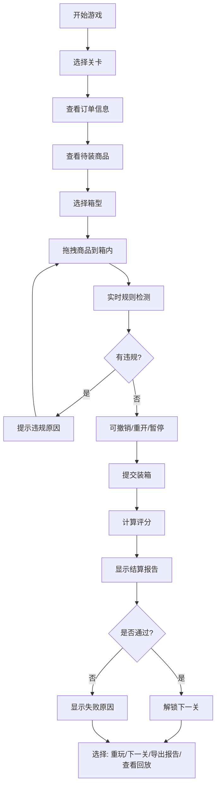

## 1. 产品概述

仓库装箱排序游戏是一款面向电商仓临时工培训的轻量级策略模拟游戏。通过2D拖拽装箱的交互方式，让玩家理解重物、易碎品、时效件的处理规则，直观呈现常见装箱难点（重物压易碎、箱型浪费、时效件漏优先），帮助工人快速掌握规范操作。

- 核心目标：培训仓储人员理解装箱规则，减少操作失误
- 目标用户：电商仓库临时工、新入职仓储人员
- 产品价值：降低培训成本，提高装箱效率和合规率

## 2. 核心功能

### 2.1 用户角色

| 角色 | 注册方式 | 核心权限 |
|------|----------|----------|
| 玩家 | 无需注册 | 开始游戏、选择关卡、查看历史记录、导出报告 |

### 2.2 功能模块

1. **主菜单页**：游戏入口、关卡选择、历史记录、规则说明
2. **游戏主界面**：Canvas装箱区域、商品托盘、订单信息、操作控制
3. **结算页面**：关卡评分、失败原因、详细报告
4. **历史回放页**：历史对局记录、操作回放、报告查看

### 2.3 页面详情

| 页面名称 | 模块名称 | 功能描述 |
|---------|---------|----------|
| 主菜单页 | 关卡选择 | 显示所有关卡、解锁状态、星级评分 |
| 主菜单页 | 历史记录 | 列表展示历史对局、点击查看详情和回放 |
| 主菜单页 | 规则说明 | 展示装箱规则、商品类型、扣分机制 |
| 游戏主界面 | 装箱区域 | Canvas绘制的箱子内部空间，支持拖拽放置商品 |
| 游戏主界面 | 商品托盘 | 待装箱商品列表，显示重量、易碎、时效等属性 |
| 游戏主界面 | 订单信息 | 当前订单要求、时效等级、箱型选择 |
| 游戏主界面 | 操作控制 | 暂停、重开、撤销、提交按钮、计时器 |
| 游戏主界面 | 实时状态 | 当前分数、已用空间、违规提示 |
| 结算页面 | 评分展示 | 本关得分、星级、各项指标得分明细 |
| 结算页面 | 失败原因 | 若失败，高亮具体违规项和对应规则 |
| 结算页面 | 报告导出 | 生成本关详细报告，支持JSON/文本格式下载 |
| 历史回放页 | 对局列表 | 显示历史对局的关卡、得分、时间 |
| 历史回放页 | 操作回放 | 逐步回放装箱过程，高亮关键操作 |
| 历史回放页 | 报告查看 | 查看历史对局的详细结算报告 |

## 3. 核心流程

玩家选择关卡 → 查看订单信息和待装商品 → 拖拽商品到箱内合适位置 → 系统实时检测违规 → 提交装箱 → 查看评分和失败原因 → 可选择重玩、回放或进入下一关 → 导出培训报告

## 4. 游戏规则设计

### 4.1 商品属性
- **重量等级**：轻(1-2kg)、中(3-5kg)、重(6-10kg)、超重(>10kg)
- **易碎等级**：普通、易碎、极易碎
- **时效等级**：普通、当日达、次日达、特快
- **尺寸**：小(1单元)、中(2单元)、大(4单元)

### 4.2 装箱规则
1. **重物不压易碎**：重量等级≥中的商品不能放在易碎品上方
2. **易碎品在上**：易碎品只能放在最上层或非易碎品上方
3. **时效优先**：时效等级高的商品优先放在易取位置（靠近箱门/上方）
4. **空间利用率**：实际占用体积/箱容积 ≥ 70%，否则扣分
5. **重心稳定**：重物应放在底部，重心偏移超过30%扣分
6. **重量限制**：总重量不能超过箱型最大承重

### 4.3 扣分机制
| 违规类型 | 扣分 | 失败条件 |
|---------|------|---------|
| 重物压易碎 | -50/次 | 累计2次直接失败 |
| 易碎品被压 | -80/次 | 累计1次直接失败 |
| 时效件放置错误 | -30/件 | 累计3次直接失败 |
| 空间浪费(<70%) | -20分 | 不直接失败 |
| 重心不稳 | -40分 | 不直接失败 |
| 超重 | -100分 | 直接失败 |

### 4.4 关卡设计
| 关卡 | 名称 | 难度 | 目标 | 特殊难点 |
|-----|------|------|------|---------|
| 1 | 新手入门 | ★ | 正确放置5件商品，无违规 | 无重物易碎混装 |
| 2 | 小心轻放 | ★★ | 处理3件易碎品，正确叠放 | 易碎品与重物混装 |
| 3 | 时效速递 | ★★ | 优先处理2件特快件 | 时效件与普通件混装 |
| 4 | 空间大师 | ★★★ | 空间利用率≥85% | 商品尺寸差异大 |
| 5 | 综合挑战 | ★★★★ | 10件商品混合，全规则生效 | 所有难点同时出现 |
| 6 | 大师考核 | ★★★★★ | 15件商品限时完成 | 限时+全规则 |

### 4.5 评分标准
- S级：90-100分，无违规，空间利用率≥90%
- A级：80-89分，轻微违规不影响结果
- B级：70-79分，有1-2项非致命违规
- C级：60-69分，及格线
- F级：<60分，失败

## 5. 用户界面设计

### 5.1 设计风格
- **主色调**：工业蓝(#165DFF)作为主色，警示橙(#FF7D00)作为违规提示色，成功绿(#00B42A)作为通过色
- **辅助色**：深灰(#4E5969)、浅灰(#F2F3F5)
- **按钮风格**：直角带轻微圆角(4px)，工业感按钮，按下有阴影效果
- **字体**：标题使用"JetBrains Mono"等宽字体，正文使用"PingFang SC"，营造工业/物流仓储氛围
- **布局风格**：模块化布局，清晰的功能分区，参考WMS仓储管理系统界面
- **图标风格**：线性图标，使用lucide-react，保持简洁专业

### 5.2 视觉元素
- 背景：浅灰底+网格线，模拟仓库地面
- 箱子：立体透视效果的纸箱，内部有网格辅助线
- 商品：根据类型用不同颜色和图标区分：
  - 重物：深蓝色，带重量图标
  - 易碎品：红色，带酒杯/易碎图标，有"小心轻放"标识
  - 时效件：橙色，带时钟/闪电图标
- 拖拽效果：半透明跟随，吸附到网格，碰撞时红色边框提示

### 5.3 页面设计概述

| 页面名称 | 模块名称 | UI元素 |
|---------|---------|--------|
| 主菜单页 | 关卡选择 | 卡片式关卡列表，显示星级、解锁状态、难度标识 |
| 主菜单页 | 历史记录 | 时间线式列表，显示得分、关卡、时间 |
| 游戏主界面 | 装箱区域 | Canvas绘制的2D俯视图箱子，带网格线和坐标 |
| 游戏主界面 | 商品托盘 | 横向滚动的商品卡片，支持长按查看详情 |
| 游戏主界面 | 操作栏 | 左侧：订单信息；右侧：计时器、分数；底部：操作按钮 |
| 游戏主界面 | 违规提示 | 顶部Toast提示，红色背景+震动动画 |
| 结算页面 | 评分面板 | 大号分数展示，星级动画，各项得分进度条 |
| 结算页面 | 失败原因 | 红色卡片，详细说明违规项和对应规则 |
| 历史回放页 | 回放控制 | 播放/暂停/进度条/倍速控制 |

### 5.4 动画设计
- 商品放置：吸附到网格时的弹性动画
- 违规提示：红色闪烁+轻微震动
- 评分展示：数字滚动动画，星级逐个点亮
- 页面切换：左右滑入效果
- 拖拽中：半透明+阴影加深

### 5.5 响应式
- 桌面端：完整布局，左右分栏（左侧订单+商品，右侧装箱区+操作）
- 平板：上下布局，装箱区在上，操作区在下
- 移动端：简化布局，重点保证拖拽操作的流畅性

## 6. 边界案例

1. **超重边界**：总重量正好等于箱型承重上限（不扣分）
2. **空间边界**：空间利用率正好70%（不扣分），69.9%（扣分）
3. **叠放边界**：重物与易碎品相邻但不在正上方（不违规）
4. **时效边界**：时效件在最上层但在箱底方向（需要判定是否易取）
5. **撤销边界**：撤销到空箱状态，再撤销无反应
6. **暂停边界**：暂停时计时器停止，所有操作禁用
7. **重开边界**：重开后清空所有状态，计时器归零
8. **提交边界**：未放置所有商品时禁止提交
