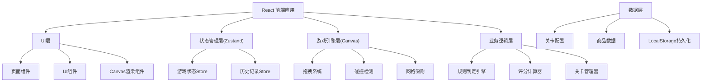
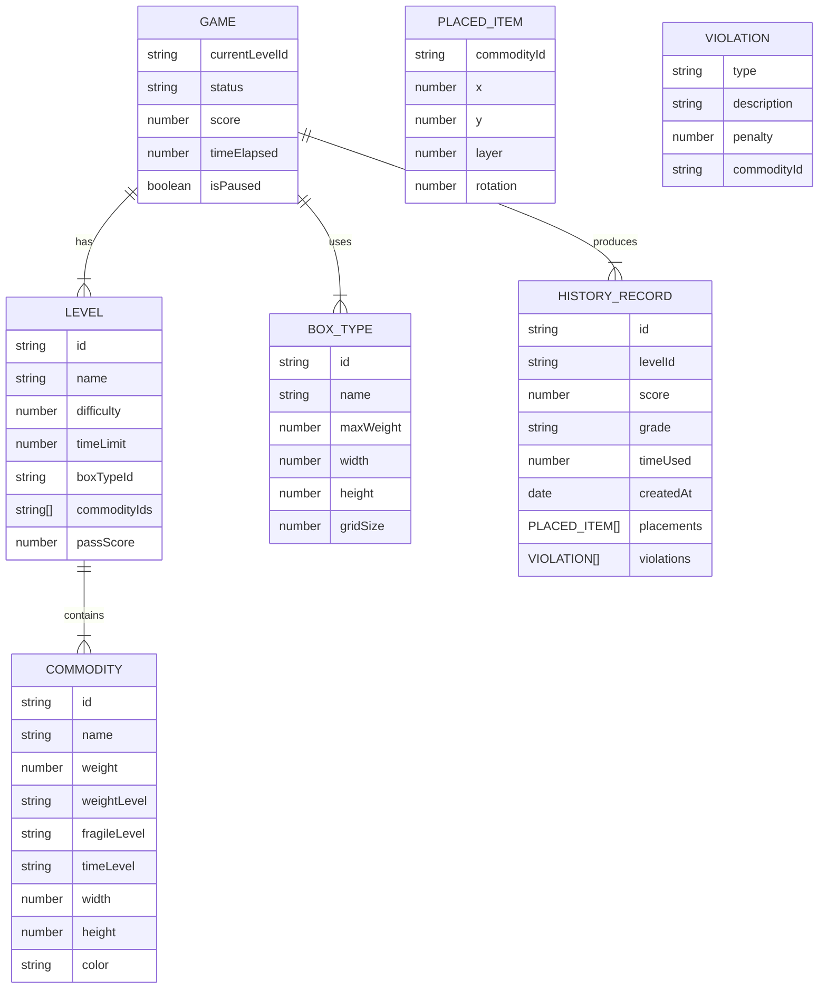

## 1. 架构设计



## 2. 技术描述

### 2.1 技术栈
- **前端框架**：React@18 + TypeScript
- **构建工具**：Vite@5
- **状态管理**：Zustand
- **样式方案**：TailwindCSS@3
- **路由**：React Router DOM@6
- **图标库**：lucide-react
- **渲染引擎**：原生Canvas 2D API

### 2.2 项目初始化
- 使用 vite-init 初始化 React + TypeScript 模板
- 无需后端，纯前端应用
- 数据持久化使用 localStorage

## 3. 目录结构

```
src/
├── components/           # 通用UI组件
│   ├── GameCanvas.tsx      # Canvas游戏主组件
│   ├── CommodityCard.tsx   # 商品卡片
│   ├── BoxSelector.tsx   # 箱型选择器
│   ├── ScorePanel.tsx     # 分数面板
│   ├── Timer.tsx         # 计时器
│   ├── Toast.tsx        # 提示组件
│   └── StarRating.tsx   # 星级评分
├── pages/               # 页面组件
│   ├── MainMenu.tsx     # 主菜单
│   ├── GameBoard.tsx      # 游戏主界面
│   ├── Settlement.tsx    # 结算页面
│   └── History.tsx         # 历史回放
├── hooks/               # 自定义Hooks
│   ├── useGameEngine.ts   # 游戏引擎Hook
│   ├── useDragDrop.ts    # 拖拽Hook
│   └── useHistory.ts      # 历史记录Hook
├── store/               # Zustand状态管理
│   ├── gameStore.ts       # 游戏状态
│   └── historyStore.ts    # 历史记录状态
├── utils/               # 工具函数
│   ├── rules/              # 规则引擎
│   │   ├── rulesEngine.ts    # 规则判定
│   │   ├── scoreCalculator.ts # 评分计算
│   │   └── collision.ts      # 碰撞检测
│   ├── canvas/             # Canvas工具
│   │   ├── renderer.ts       # 渲染器
│   │   └── grid.ts          # 网格系统
│   └── export/             # 导出工具
│       └── reportExporter.ts # 报告导出
├── data/                # 数据配置
│   ├── levels.ts          # 关卡配置
│   ├── commodities.ts     # 商品数据
│   └── boxTypes.ts       # 箱型数据
├── types/               # TypeScript类型定义
│   ├── game.ts            # 游戏相关类型
│   ├── commodity.ts       # 商品类型
│   └── index.ts           # 公共类型
├── App.tsx
├── main.tsx
└── index.css
```

## 4. 核心数据模型



## 5. 核心模块设计

### 5.1 游戏引擎模块 (useGameEngine)
- 管理游戏生命周期：开始、暂停、重开、提交
- 管理操作栈：支持撤销/重做
- 管理计时器
- 协调规则检测

### 5.2 拖拽系统模块 (useDragDrop)
- Canvas鼠标/触摸事件处理
- 商品拖拽跟随
- 网格吸附计算
- 放置位置验证

### 5.3 规则引擎模块 (rulesEngine)
- 重物压易碎检测
- 易碎品叠放检测
- 时效件位置检测
- 空间利用率计算
- 重心计算
- 超重检测
- 违规累计与扣分

### 5.4 Canvas渲染模块
- 箱子绘制（网格、边框、立体效果
- 商品绘制（根据属性显示不同样式
- 拖拽预览绘制
- 违规高亮
- 动画效果

### 5.5 历史记录模块
- 操作记录存储（localStorage）
- 对局回放
- 报告导出（JSON/文本格式）

## 6. 状态管理设计

### 6.1 Game Store
```typescript
interface GameState {
  // 游戏状态
  status: 'idle' | 'playing' | 'paused' | 'submitted' | 'failed';
  currentLevelId: string | null;
  score: number;
  timeElapsed: number;
  isPaused: boolean;
  
  // 装箱状态
  selectedBoxType: BoxType | null;
  placedItems: PlacedItem[];
  pendingCommodities: Commodity[];
  selectedCommodity: Commodity | null;
  
  // 操作历史
  operationStack: Operation[];
  currentStackIndex: number;
  
  // 违规记录
  violations: Violation[];
  
  // Actions
  startLevel: (levelId: string) => void;
  placeItem: (commodityId: string, x: number, y: number, layer: number) => void;
  removeItem: (commodityId: string) => void;
  undo: () => void;
  redo: () => void;
  pause: () => void;
  resume: () => void;
  restart: () => void;
  submit: () => SettlementResult;
  reset: () => void;
}
```

### 6.2 History Store
```typescript
interface HistoryState {
  records: HistoryRecord[];
  
  // Actions
  addRecord: (record: HistoryRecord) => void;
  getRecord: (id: string) => HistoryRecord | undefined;
  clearAll: () => void;
  exportReport: (recordId: string, format: 'json' | 'text') => string;
}
```

## 7. 关键算法

### 7.1 碰撞检测算法
- AABB（轴对齐包围盒）碰撞检测
- 分层检测（考虑层级关系
- 边界检测（商品是否在箱子范围内

### 7.2 网格吸附算法
- 将鼠标坐标吸附到最近的网格点
- 支持旋转吸附（90度旋转

### 7.3 重物压易碎检测
- 遍历已放置商品
- 检查上层商品重量等级和下层商品易碎等级
- 判断是否在正上方区域（重叠度>50%）

### 7.4 重心计算
- 加权平均计算重心坐标
- 计算重心偏移量（相对于箱子中心）

### 7.5 空间利用率计算
- 已放置商品总面积 / 箱子面积
- 考虑重叠区域去重计算

## 8. 性能优化
- Canvas分层渲染（静态层/动态层
- 拖拽时只重绘变化区域
- 使用requestAnimationFrame动画
- 状态更新防抖
- 历史记录懒加载
