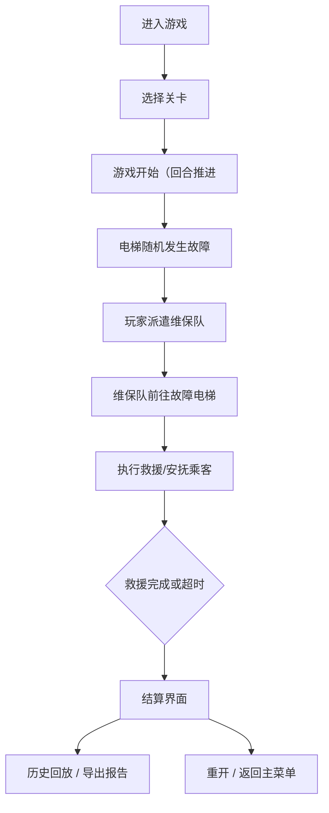

# 电梯救援协作游戏 PRD

## 1. 产品概述
一款面向物业培训的"电梯救援协作"浏览器 2D 模拟器，用于训练玩家在多部电梯同时故障场景下的处置能力。玩家将派遣维保队、安抚乘客、管控楼层停靠、判定故障类型，在有限资源下完成救援并结算报告。

- 目标用户：物业培训学员、物业管理者、电梯救援演练者
- 核心价值：将抽象的电梯救援 SOP 具象为可交互、可复盘的 2D 协作小游戏；通过回放与结算报告强化学习效果

## 2. 核心功能

### 2.1 用户角色
| 角色 | 登录方式 | 核心权限 |
|------|----------|----------|
| 玩家（学员） | 浏览器直接进入 | 开始/暂停/重开、派遣维保、选择救援、导出报告 |

### 2.2 功能模块
1. **开始界面：关卡选择、游戏规则说明、难度选择
2. **游戏主界面**：2D 楼层电梯视图、维保队面板、事件日志、乘客信息、计分面板
3. **暂停界面：暂停、继续、重开按钮
4. **结算界面**：胜利/失败原因、得分明细、救援报告、历史回放入口
5. **历史回放界面**：逐帧/时间线回放、导出报告

### 2.3 页面详情
| 页面名称 | 模块名称 | 功能描述 |
|----------|----------|----------|
| 开始界面 | 关卡选择 | 展示多关卡选择（初/中/高难度），显示每关的电梯数、维保队数、故障密度 |
| 开始界面 | 规则说明 | 简要介绍玩法与计分规则 |
| 游戏主界面 | 2D 楼层视图 | 显示楼层、电梯、维保队位置与乘客状态，实时动画 |
| 游戏主界面 | 维保队派遣面板 | 选择维保队派遣到指定电梯，显示维保队状态（空闲/执行中/冲突）|
| 游戏主界面 | 事件日志 | 实时显示救援事件（乘客呼叫、维保队到达、救援完成 |
| 游戏主界面 | 乘客信息面板 | 显示各电梯乘客人数、等待时间、情绪等级 |
| 游戏主界面 | 计分面板 | 实时得分、剩余时间、暂停按钮 |
| 结算界面 | 结算报告 | 得分明细、胜利/失败原因、救援统计 |
| 结算界面 | 历史回放 | 可按时间线回放整局游戏 |
| 结算界面 | 报告导出 | 导出 JSON 格式的救援报告 |

## 3. 核心流程
玩家进入游戏 → 选择关卡 → 游戏开始，电梯陆续发生故障 → 玩家派遣维保队 → 维保队前往故障电梯 → 执行救援 → 乘客获救/超时 → 游戏结束（时间到或全部救援完成或失败条件达成）→ 结算与回放/导出报告。

## 4. 用户界面设计

### 4.1 设计风格
- 主色调：深蓝 (#0f1e3d) 搭配橙色 (#ff8a00)，体现工业控制中心氛围
- 辅色：警报红 (#ff4d4d)、安全绿 (#4caf50)、警告黄 (#ffc107)
- 字体：标题"JetBrains Mono"（等宽），正文"Noto Sans SC"
- 布局：左侧 2D 楼层电梯视图主区域，右侧维保面板和事件日志分栏，顶部计分和控制按钮
- 按钮风格：扁平化圆角，Hover 有微交互
- 图标：使用 SVG 绘制电梯、楼层、维保队员图标

### 4.2 页面设计概览
| 页面名称 | 模块名称 | UI 元素 |
|----------|----------|----------|
| 开始界面 | 关卡卡片 | 深蓝色背景、橙色标题、圆角卡片、Hover 放大 |
| 游戏主界面 | 2D 楼层视图 | 竖向楼层堆叠、电梯井可视化 |
| 游戏主界面 | 维保队面板 | 卡片式队员列表、状态标签 |
| 游戏主界面 | 事件日志 | 时间戳 + 事件列表、滚动条 |
| 结算界面 | 结算报告 | 表格形式、得分明细、统计图表 |

### 4.3 响应式
以桌面为主，自适应窗口缩放。

## 5. 核心规则设计
- 玩家规则：
  - 每关 N 部电梯、M 支维保队
  - 电梯故障随机触发，需要维保队救援
  - 维保队一次只能处理一部电梯
  - 乘客等待超时扣情绪分，超时过长导致失败
  - 维保队冲突（同一电梯被多队同时前往）扣分
  - 故障类型多样：门卡、停电、超载、故障误判
  - 计分：成功救援加分，超时扣分，误判扣分
  - 暂停/继续/重开：暂停时时间不推进，重开重置所有状态
