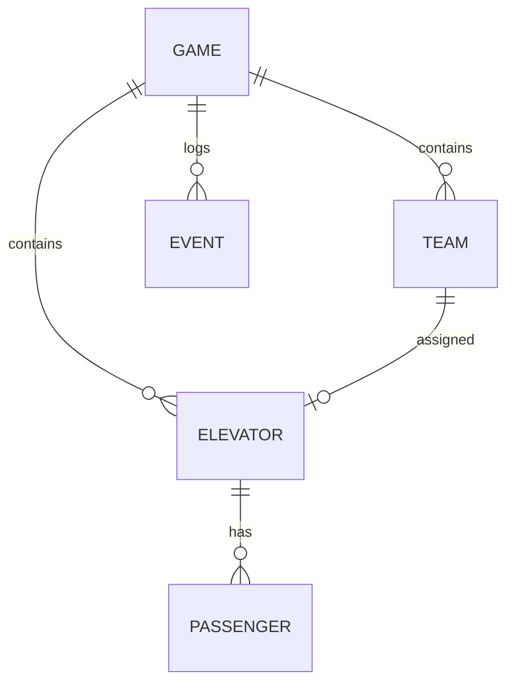

# 电梯救援协作游戏 技术架构

## 1. 架构设计
```mermaid
flowchart TD
  A["浏览器（单页应用） --> B["游戏状态引擎（Game Loop）]
  B --> C["2D 渲染层（Canvas/SVG）]
  B --> D["事件系统"]
  B --> E["数据层（本地状态）]
  E --> F["历史记录（用于回放）"]
  E --> G["导出模块"]
```

## 2. 技术说明
- 前端：原生 HTML5 + CSS3 + JavaScript（ES6+），无框架依赖，单文件部署
- 构建工具：无（纯静态文件）
- 后端：无
- 数据库：无
- 渲染：HTML5 Canvas 2D 渲染楼层与电梯，DOM 元素用于面板
- 存储：localStorage 用于保存历史记录

## 3. 核心模块
| 模块 | 职责 |
|------|------|
| GameEngine | 游戏主循环，管理游戏状态、回合推进 |
| LevelManager | 关卡配置、关卡加载 |
| Elevator | 电梯对象，状态管理 |
| MaintenanceTeam | 维保队对象，状态管理 |
| EventSystem | 事件触发与日志 |
| Renderer | 2D 渲染 |
| UIManager | UI 面板管理 |
| HistoryRecorder | 历史记录与回放 |
| ReportExporter | 报告导出 |

## 4. 数据模型

### 4.1 数据模型定义


### 4.2 数据结构
```javascript
// 游戏状态
GameState = {
  level: number,
  status: 'playing' | 'paused' | 'ended',
  score: number,
  time: number,
  elevators: Elevator[],
  teams: MaintenanceTeam[],
  events: Event[],
  passengers: Passenger[]
}

// 电梯
Elevator = {
  id: string,
  floor: number,
  targetFloor: number,
  status: 'normal' | 'fault' | 'rescued',
  faultType: string,
  passengers: number,
  assignedTeam: string | null
}

// 维保队
MaintenanceTeam = {
  id: string,
  name: string,
  status: 'idle' | 'moving' | 'working',
  assignedElevator: string | null,
  progress: number
}

// 事件
Event = {
  time: number,
  type: string,
  message: string
}
```

## 5. 游戏循环
1. 初始化游戏循环使用 `requestAnimationFrame` 驱动
2. 每帧更新：
   - 检查是否触发新故障
   - 更新维保队位置和进度
   - 更新乘客等待时间
   - 检查胜负条件
3. 渲染更新

## 6. 历史回放
- 每帧记录游戏状态快照
- 回放时按时间线逐步恢复状态
- 支持播放/暂停/快进/逐帧

## 7. 报告导出
- 导出 JSON 格式
- 包含：得分明细、事件日志、救援统计
