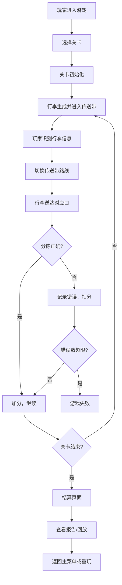

## 1. 产品概述

机场行李分拣模拟器是一款面向机场地服人员培训和休闲玩家的轻3D浏览器游戏。玩家扮演行李分拣员，通过操作传送带切换路线，将行李正确分拣到对应航班口，同时处理转机行李、超规件和延误航班等复杂情况。

- **核心目标**：在时间压力下准确分拣行李，达到关卡通关条件
- **目标用户**：机场地服培训人员、模拟经营游戏爱好者
- **市场价值**：兼具娱乐性和教育意义，可用于机场地服人员基础培训

## 2. 核心 Features

### 2.1 用户角色

| 角色 | 注册方式 | 核心权限 |
|------|----------|----------|
| 玩家 | 无需注册，直接进入 | 游戏游玩、关卡选择、成绩查看、报告导出 |

### 2.2 功能模块

1. **主菜单页面**：关卡选择、游戏说明、设置选项
2. **游戏主页面**：3D分拣场景、HUD信息面板、控制按钮
3. **结算页面**：得分统计、失败原因、分拣报告、回放选项
4. **历史记录页面**：历史游戏记录、错误回放

### 2.3 页面详情

| 页面名称 | 模块名称 | 功能描述 |
|----------|----------|----------|
| 主菜单 | 关卡选择 | 三个难度关卡，显示解锁状态和通关记录 |
| 主菜单 | 游戏说明 | 玩法说明、规则介绍、操作指南 |
| 主菜单 | 历史记录 | 查看过往游戏记录和报告 |
| 游戏主界面 | 3D场景 | 俯视视角的机场分拣大厅，包含传送带、行李、航班口 |
| 游戏主界面 | HUD面板 | 显示当前时间、分数、错误数、航班状态 |
| 游戏主界面 | 控制面板 | 路线切换按钮、暂停/继续、重开按钮 |
| 结算页面 | 得分统计 | 正确数、错误数、准确率、最终得分 |
| 结算页面 | 失败原因 | 详细列出每一次错误的类型和时间 |
| 结算页面 | 分拣报告 | 可导出的详细分拣数据报告 |
| 结算页面 | 回放功能 | 整局回放和错误片段回放 |

## 3. 核心流程

## 4. 用户界面设计

### 4.1 设计风格

- **主色调**：航空蓝 (#1E3A8A) 作为主色，安全橙 (#F97316) 作为警示色，中性灰作为背景
- **按钮风格**：圆角矩形，3D轻微凸起效果，点击有按压反馈
- **字体**：JetBrains Mono 作为数字和信息显示，Roboto 作为正文
- **布局风格**：顶部HUD信息栏，中央3D游戏区域，底部控制面板，右侧航班状态面板
- **视觉风格**：工业风+科技感，模拟真实机场的控制中心氛围

### 4.2 页面设计概览

| 页面名称 | 模块名称 | UI元素 |
|----------|----------|--------|
| 主菜单 | 关卡卡片 | 卡片式布局，悬停放大效果，显示关卡名称、难度、描述 |
| 游戏主界面 | 3D场景 | 等距/俯视视角，传送带动画，行李滚动效果，指示灯 |
| 游戏主界面 | HUD | 半透明玻璃态面板，实时更新数据 |
| 游戏主界面 | 控制面板 | 大尺寸路线切换按钮，带状态指示灯 |
| 结算页面 | 报告面板 | 表格化数据展示，可导出为JSON/CSV |
| 结算页面 | 回放控制 | 播放/暂停/进度条/倍速控制 |

### 4.3 响应式

- 桌面端优先设计，支持1280x720及以上分辨率
- 移动端适配为简化版触控操作
- 3D场景自动适配屏幕尺寸

### 4.4 3D场景指导

- **环境**：机场分拣大厅，工业风格，蓝色安全线，黄色警示带
- **光照**：顶部冷白色荧光灯，模拟机场照明，轻微环境光
- **相机**：固定俯视45度角，可轻微缩放，跟随关键行李
- **构图**：传送带呈Y型或网状分布，中央为控制区，周围为航班口
- **交互**：点击路线切换节点改变传送带方向，悬停显示行李详细信息
- **动画**：传送带滚动动画，行李移动动画，路线切换时的指示灯闪烁
- **后处理**：轻微泛光效果，HUD面板有毛玻璃效果

## 5. 关卡规则设计

### 关卡1：初出茅庐（简单）

- **时间限制**：180秒
- **传送带数量**：3条主传送带，4个航班口
- **行李类型**：仅普通行李，无转机、无超规
- **航班状态**：全部正点
- **通关条件**：准确率≥90%，错误数≤3
- **规则特色**：熟悉基本操作，行李生成速度较慢

### 关卡2：繁忙时段（中等）

- **时间限制**：240秒
- **传送带数量**：5条主传送带，6个航班口
- **行李类型**：普通行李 + 转机行李（需核对转机时间）
- **航班状态**：可能出现延误航班（行李需转存）
- **通关条件**：准确率≥85%，转机超时≤2，错误数≤5
- **规则特色**：加入转机时间压力，需要快速计算转机是否可行

### 关卡3：复杂工况（困难）

- **时间限制**：300秒
- **传送带数量**：7条主传送带，8个航班口，1个超规口，1个转存口
- **行李类型**：普通行李 + 转机行李 + 超规行李（需走超规通道）
- **航班状态**：正点、延误、取消三种状态
- **通关条件**：准确率≥80%，转机超时≤3，超规错误≤2，错误数≤8
- **规则特色**：全规则启用，行李生成速度快，需要同时处理多种特殊情况
