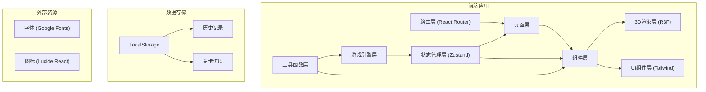

## 1. 架构设计



## 2. 技术描述

- **前端框架**：React@18 + TypeScript + Vite@5
- **3D渲染**：three@0.160, @react-three/fiber@8, @react-three/drei@9, @react-three/postprocessing@2
- **状态管理**：zustand@4
- **路由**：react-router-dom@6
- **样式**：tailwindcss@3
- **图标**：lucide-react@0.294
- **后端**：无（纯前端游戏）
- **数据库**：LocalStorage 存储游戏记录

## 3. 路由定义

| 路由 | 页面组件 | 用途 |
|------|----------|------|
| `/` | `MainMenu` | 主菜单页面，关卡选择 |
| `/game/:levelId` | `GamePage` | 游戏主页面 |
| `/result/:gameId` | `ResultPage` | 结算页面 |
| `/history` | `HistoryPage` | 历史记录页面 |
| `/replay/:gameId` | `ReplayPage` | 回放页面 |
| `/help` | `HelpPage` | 游戏说明页面 |

## 4. 核心数据模型

### 4.1 游戏状态模型

```typescript
// 行李类型
type BaggageType = 'normal' | 'transfer' | 'oversize';

// 航班状态
type FlightStatus = 'ontime' | 'delayed' | 'cancelled';

// 行李状态
type BaggageStatus = 'waiting' | 'moving' | 'delivered' | 'missed' | 'error';

// 错误类型
type ErrorType = 'wrong_gate' | 'transfer_timeout' | 'oversize_wrong_lane' | 'flight_cancelled';

interface Baggage {
  id: string;
  type: BaggageType;
  flightNumber: string;
  targetGate: string;
  weight: number;
  isOversize: boolean;
  transferTime?: number; // 转机剩余时间（分钟）
  transferFlight?: string;
  status: BaggageStatus;
  position: { x: number; z: number };
  currentConveyorId: string;
  createdAt: number;
  deliveredAt?: number;
  errorType?: ErrorType;
}

interface ConveyorNode {
  id: string;
  position: { x: number; z: number };
  connections: string[]; // 可连接的节点ID
  currentDirection: string; // 当前指向的节点ID
  isSwitch: boolean; // 是否是可切换节点
}

interface Flight {
  number: string;
  gate: string;
  status: FlightStatus;
  departureTime: number;
  destination: string;
}

interface LevelConfig {
  id: number;
  name: string;
  description: string;
  timeLimit: number;
  conveyorNodes: ConveyorNode[];
  flights: Flight[];
  baggageSpawnRate: number;
  baggageTypes: BaggageType[];
  hasOversize: boolean;
  hasTransfer: boolean;
  hasDelays: boolean;
  passConditions: {
    minAccuracy: number;
    maxErrors: number;
    maxTransferTimeouts?: number;
    maxOversizeErrors?: number;
  };
}

interface GameState {
  levelId: number;
  status: 'idle' | 'playing' | 'paused' | 'finished' | 'failed';
  timeRemaining: number;
  score: number;
  correctCount: number;
  errorCount: number;
  transferTimeoutCount: number;
  oversizeErrorCount: number;
  baggages: Baggage[];
  conveyorNodes: ConveyorNode[];
  flights: Flight[];
  events: GameEvent[]; // 用于回放
  replayMode: boolean;
  replaySpeed: number;
}

interface GameEvent {
  timestamp: number;
  type: 'baggage_spawn' | 'baggage_delivered' | 'baggage_error' | 'switch_changed' | 'flight_updated';
  data: any;
}
```

### 4.2 游戏记录模型

```typescript
interface GameRecord {
  id: string;
  levelId: number;
  levelName: string;
  startTime: number;
  endTime: number;
  score: number;
  correctCount: number;
  errorCount: number;
  accuracy: number;
  transferTimeoutCount: number;
  oversizeErrorCount: number;
  passed: boolean;
  events: GameEvent[];
  errors: BaggageError[];
}

interface BaggageError {
  baggageId: string;
  type: ErrorType;
  timestamp: number;
  description: string;
}
```

## 5. 目录结构

```
src/
├── components/
│   ├── game3d/
│   │   ├── GameScene.tsx          # 3D场景主组件
│   │   ├── Baggage.tsx            # 行李3D组件
│   │   ├── ConveyorBelt.tsx       # 传送带3D组件
│   │   ├── ConveyorSwitch.tsx     # 路线切换器3D组件
│   │   ├── FlightGate.tsx         # 航班口3D组件
│   │   └── AirportEnvironment.tsx # 机场环境
│   ├── ui/
│   │   ├── HUD.tsx                # 游戏HUD
│   │   ├── ControlPanel.tsx       # 控制面板
│   │   ├── FlightStatusPanel.tsx  # 航班状态面板
│   │   ├── BaggageInfo.tsx        # 行李信息弹窗
│   │   └── ReportPanel.tsx        # 报告面板
│   └── layout/
│       └── GameLayout.tsx         # 游戏页面布局
├── pages/
│   ├── MainMenu.tsx               # 主菜单
│   ├── GamePage.tsx               # 游戏页面
│   ├── ResultPage.tsx             # 结算页面
│   ├── HistoryPage.tsx            # 历史记录
│   ├── ReplayPage.tsx             # 回放页面
│   └── HelpPage.tsx               # 帮助页面
├── store/
│   ├── useGameStore.ts            # 游戏状态管理
│   └── useRecordStore.ts          # 记录状态管理
├── hooks/
│   ├── useGameLoop.ts             # 游戏循环hook
│   ├── useConveyorSystem.ts       # 传送带系统hook
│   └── useBaggageGenerator.ts     # 行李生成hook
├── utils/
│   ├── gameLogic.ts               # 游戏逻辑
│   ├── reportGenerator.ts         # 报告生成
│   ├── replaySystem.ts            # 回放系统
│   └── levelConfigs.ts            # 关卡配置
├── types/
│   └── game.ts                    # 类型定义
├── App.tsx
├── main.tsx
└── index.css
```

## 6. 核心游戏循环

```typescript
// useGameLoop.ts 核心逻辑
function useGameLoop() {
  const { state, updateBaggagePositions, checkCollisions, checkGameEnd } = useGameStore();
  
  useEffect(() => {
    if (state.status !== 'playing') return;
    
    const interval = setInterval(() => {
      // 1. 更新所有行李位置
      updateBaggagePositions(deltaTime);
      
      // 2. 检查行李是否到达节点
      checkNodeArrivals();
      
      // 3. 检查行李是否到达终点
      checkDeliveries();
      
      // 4. 更新倒计时
      updateTime();
      
      // 5. 检查游戏结束条件
      checkGameEnd();
      
      // 6. 记录事件（用于回放）
      recordEvent();
    }, 16); // ~60fps
    
    return () => clearInterval(interval);
  }, [state.status]);
}
```

## 7. 性能优化

- **3D优化**：使用InstancedMesh渲染多个行李，减少draw call
- **状态更新**：使用Zustand的selector避免不必要的重渲染
- **对象池**：行李对象复用，避免频繁创建销毁
- **帧率控制**：游戏逻辑固定60fps，渲染与逻辑分离
- **事件节流**：行李位置更新采用插值，减少状态更新频率
