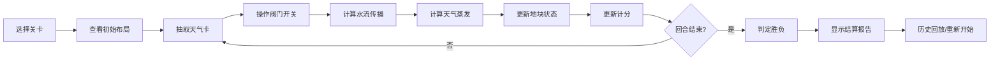

## 1. 产品概述
农田灌溉棋盘游戏是一款教育类2D策略游戏，帮助学生理解农田灌溉系统的运作原理。玩家通过操作水渠阀门来满足不同地块的作物需水需求，学习水资源管理的知识。
- 目标用户：农技站学生、农业知识学习者
- 核心价值：通过游戏化方式学习真实的灌溉原理，理解下游影响、重复灌溉、天气蒸发等概念

## 2. 核心特性

### 2.1 用户角色
| 角色 | 注册方式 | 核心权限 |
|------|----------|----------|
| 玩家 | 无需注册，直接游玩 | 进行游戏、查看历史、导出报告 |

### 2.2 功能模块
1. **游戏主界面**：2D棋盘、水渠系统、阀门控制、地块状态
2. **游戏控制面板**：回合控制、暂停/继续、重新开始、关卡选择
3. **信息面板**：天气卡、计分、作物需水状态、水资源消耗
4. **结算系统**：胜负判定、失败原因分析、历史回放
5. **报告导出**：灌溉报告生成、历史记录查看

### 2.3 页面详情
| 页面名称 | 模块名称 | 功能描述 |
|----------|----------|----------|
| 游戏主页面 | 2D棋盘模块 | 显示水渠网络、阀门开关状态、地块灌溉状态 |
| 游戏主页面 | 控制面板 | 回合前进、暂停游戏、重新开始、选择关卡 |
| 游戏主页面 | 信息面板 | 当前天气、剩余水量、当前分数、各地块需水状态 |
| 结算弹窗 | 结果展示 | 胜负结果、得分详情、失败原因分析 |
| 历史回放 | 回放控制 | 逐帧回放游戏过程、关键节点高亮 |
| 报告导出 | 报告生成 | 生成灌溉结算报告、支持文本导出 |

## 3. 核心流程
玩家选择关卡进入游戏 → 查看初始水渠布局和各地块需水量 → 每回合抽取天气卡 → 玩家操作阀门开关 → 系统计算水流传播和蒸发 → 更新地块灌溉状态和计分 → 满足胜利条件或回合结束 → 显示结算报告和失败原因 → 支持历史回放或重新开始

## 4. 用户界面设计

### 4.1 设计风格
- **主色调**：土壤棕 (#8B4513)、水渠蓝 (#4A90D9)、作物绿 (#4CAF50)
- **辅助色**：警告红 (#F44336)、中性灰 (#757575)
- **按钮风格**：圆角矩形，带有轻微阴影，点击有按压反馈
- **字体**：标题使用"ZCOOL KuaiLe"等活泼中文字体，正文使用"Noto Sans SC"
- **布局风格**：卡片式布局，左侧棋盘主区域，右侧信息面板
- **图标风格**：使用农场、水滴、阀门等简洁emoji或SVG图标

### 4.2 页面设计概述
| 页面名称 | 模块名称 | UI元素 |
|----------|----------|--------|
| 游戏主页面 | 2D棋盘 | 网格布局、蓝色水渠、可点击阀门、绿色地块、水流动画 |
| 游戏主页面 | 控制面板 | 大按钮组、回合进度条、关卡指示器 |
| 游戏主页面 | 信息面板 | 天气卡片、水量进度条、地块状态列表 |
| 结算弹窗 | 结果展示 | 大标题、得分动画、原因列表、图表 |
| 历史回放 | 回放控制 | 时间轴、播放/暂停、快进快退按钮 |

### 4.3 响应式
- 桌面端：棋盘占主要区域，右侧信息面板
- 平板端：棋盘自适应缩放，信息面板可折叠
- 移动端：竖屏时棋盘在上，控制面板在下；支持触屏操作
- 触摸优化：按钮最小48x48px，阀门点击区域放大

### 4.4 2D棋盘设计
- 网格系统：8x8或10x10棋盘格
- 水渠：蓝色线条表示，有水流动画效果
- 阀门：可点击的开关图标，有开/关状态切换
- 地块：不同作物有不同颜色，显示需水量和当前水量
- 天气效果：下雨/晴天有视觉反馈
