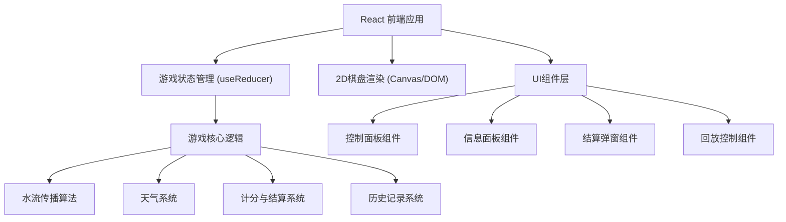

## 1. 架构设计



## 2. 技术描述
- **前端框架**：React@18 + TypeScript + Vite
- **样式方案**：TailwindCSS@3
- **状态管理**：React useReducer (游戏核心状态) + Context
- **2D渲染**：Canvas API 用于棋盘和水流动画
- **图标**：Lucide React 图标库
- **构建工具**：Vite@5
- **后端**：无后端，纯前端游戏，数据存储在LocalStorage

## 3. 核心模块设计

### 3.1 游戏状态类型定义
```typescript
// 地块类型
type TileType = 'empty' | 'canal' | 'valve' | 'plot' | 'source';

// 作物类型
type CropType = 'rice' | 'wheat' | 'corn' | 'vegetable';

// 天气类型
type WeatherType = 'sunny' | 'cloudy' | 'rainy' | 'drought';

// 阀门状态
type ValveState = 'open' | 'closed';

// 地块数据
interface PlotTile {
  id: string;
  type: 'plot';
  crop: CropType;
  waterNeeded: number;
  currentWater: number;
  isWatered: boolean;
  overwatered: boolean;
}

// 阀门数据
interface ValveTile {
  id: string;
  type: 'valve';
  state: ValveState;
  direction: 'horizontal' | 'vertical';
}

// 水渠数据
interface CanalTile {
  id: string;
  type: 'canal';
  hasWater: boolean;
  connections: ('top' | 'bottom' | 'left' | 'right')[];
}

// 游戏状态
interface GameState {
  level: number;
  round: number;
  maxRounds: number;
  isPaused: boolean;
  isGameOver: boolean;
  score: number;
  totalWater: number;
  waterUsed: number;
  currentWeather: WeatherType;
  weatherDeck: WeatherType[];
  board: (Tile | null)[][];
  history: GameSnapshot[];
  failureReasons: string[];
}
```

### 3.2 核心算法
1. **水流传播算法**：BFS从水源出发，遇到关闭阀门停止传播
2. **灌溉计算**：每回合计算各地块获得水量，考虑天气蒸发
3. **胜负判定**：检查所有地块是否在限定回合内达到需水要求
4. **失败原因分析**：检测下游断水、重复灌溉、水量不足等问题

## 4. 目录结构
```
src/
├── components/          # React组件
│   ├── GameBoard.tsx    # 2D棋盘组件
│   ├── ControlPanel.tsx # 控制面板
│   ├── InfoPanel.tsx    # 信息面板
│   ├── ResultModal.tsx  # 结算弹窗
│   ├── ReplayPlayer.tsx # 历史回放
│   └── WeatherCard.tsx  # 天气卡片
├── game/                # 游戏核心逻辑
│   ├── types.ts         # 类型定义
│   ├── logic.ts         # 游戏逻辑
│   ├── waterFlow.ts     # 水流算法
│   ├── scoring.ts       # 计分系统
│   ├── levels.ts        # 关卡数据
│   └── weather.ts       # 天气系统
├── hooks/               # 自定义Hooks
│   └── useGameState.ts  # 游戏状态管理
├── utils/               # 工具函数
│   ├── export.ts        # 报告导出
│   └── history.ts       # 历史记录
├── App.tsx              # 主应用
└── main.tsx             # 入口文件
```

## 5. 数据模型

### 5.1 关卡数据结构
```typescript
interface Level {
  id: number;
  name: string;
  description: string;
  boardSize: { rows: number; cols: number };
  initialWater: number;
  maxRounds: number;
  targetScore: number;
  boardLayout: TileConfig[][];
  weatherPool: WeatherType[];
}
```

### 5.2 历史快照
```typescript
interface GameSnapshot {
  round: number;
  boardState: (Tile | null)[][];
  score: number;
  waterUsed: number;
  weather: WeatherType;
  valveActions: ValveAction[];
}
```

## 6. 报告导出格式
```typescript
interface IrrigationReport {
  levelName: string;
  totalRounds: number;
  finalScore: number;
  isWin: boolean;
  waterUsage: {
    total: number;
    perRound: number[];
  };
  plotResults: {
    plotId: string;
    crop: string;
    waterNeeded: number;
    waterReceived: number;
    status: 'success' | 'underwatered' | 'overwatered';
  }[];
  failureReasons: string[];
  keyActions: {
    round: number;
    action: string;
    impact: string;
  }[];
}
```
