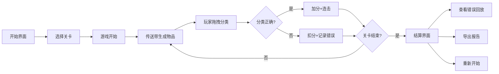

# 回收分拣产线游戏 PRD

## 1. 产品概述
一款面向环保课堂教育的垃圾分类分拣模拟器游戏，玩家通过拖拽操作将传送带上的垃圾正确分类到对应桶中。
- 目标用户：学生、环保教育参与者
- 核心价值：通过游戏化方式学习真实的垃圾分类规则，提升环保意识
- 教育意义：让玩家直观理解可回收物、污染物、危险品的分类标准

## 2. 核心功能

### 2.1 用户角色
| 角色 | 注册方式 | 核心权限 |
|------|----------|----------|
| 玩家 | 无需注册 | 体验游戏、查看成绩、导出报告 |

### 2.2 功能模块
1. **游戏主界面**：2D产线传送带、分类桶、计分板、速度指示器
2. **关卡系统**：3个难度关卡，速度递增、物品种类增多
3. **分拣操作**：鼠标拖拽物品到对应分类桶
4. **计分系统**：连击加分、错误扣分、危险品漏拦惩罚
5. **游戏控制**：开始/暂停/重开功能
6. **回放系统**：错误操作历史回放、失败原因回看
7. **结算报告**：详细分拣数据统计、PDF导出功能

### 2.3 页面详情
| 页面名称 | 模块名称 | 功能描述 |
|---------|----------|----------|
| 开始界面 | 关卡选择 | 显示3个关卡难度、最高分记录、开始按钮 |
| 游戏界面 | 传送带 | 物品从左到右移动，速度随关卡提升 |
| 游戏界面 | 分类桶 | 4个分类桶：可回收、有害、厨余、其他 |
| 游戏界面 | 状态面板 | 实时分数、连击数、剩余时间/物品数 |
| 游戏界面 | 控制按钮 | 暂停、重开、退出按钮 |
| 结算界面 | 成绩统计 | 正确率、错误分类详情、最高分 |
| 结算界面 | 错误回放 | 逐条回看错误分类的操作 |
| 结算界面 | 报告导出 | 生成分拣报告并下载 |

## 3. 核心流程

玩家选择关卡 → 进入游戏 → 传送带出现物品 → 拖拽分类 → 计分反馈 → 关卡结束 → 查看报告 → 错误回放/重新开始

## 4. 用户界面设计

### 4.1 设计风格
- **主色调**：环保绿色系（#2E7D32 主绿、#81C784 浅绿），辅以警示红（#C62828）、警告橙（#EF6C00）
- **按钮风格**：圆角矩形，带轻微3D阴影，hover时有缩放动画
- **字体**：标题使用 Noto Sans SC Bold，正文使用 Noto Sans SC Regular
- **布局风格**：横向传送带居中，分类桶底部排列，状态面板右上角
- **图标风格**：emoji + 简洁SVG图标，保持趣味性

### 4.2 页面设计概览
| 页面名称 | 模块名称 | UI元素 |
|---------|----------|--------|
| 开始界面 | 标题区域 | 大标题"回收分拣产线"、副标题、环保主题插画 |
| 开始界面 | 关卡卡片 | 3张卡片展示关卡信息，点击选中 |
| 游戏界面 | 传送带 | 灰色皮带纹理，带滚动动画效果 |
| 游戏界面 | 分类桶 | 4色垃圾桶，带分类标识和emoji |
| 游戏界面 | 物品 | 圆形/方形图标，可拖拽，带半透明拖影 |
| 游戏界面 | 状态条 | 顶部显示分数、连击、速度等级 |
| 结算界面 | 成绩单 | 大字体显示最终分数、星级评价 |
| 结算界面 | 错误列表 | 时间线样式展示错误记录，点击回放 |

### 4.3 响应性
- Desktop优先，支持触摸操作
- 最小分辨率：1024×768
- 传送带区域自适应宽度
- 移动端分类桶改为竖向排列

### 4.4 伪3D视觉效果
- 传送带使用透视效果营造纵深感
- 物品有轻微阴影和浮动动画
- 分类桶有立体边框和斜面效果
- 拖拽时物品有缩放和旋转动画
