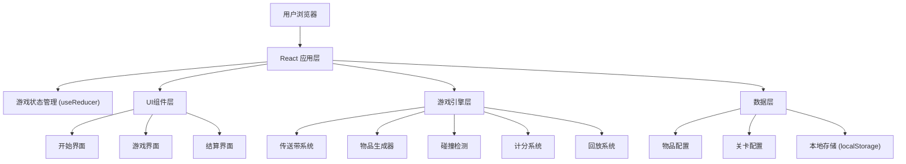

# 回收分拣产线游戏 技术架构

## 1. 架构设计



## 2. 技术描述

- **前端框架**: React@18 + TypeScript
- **构建工具**: Vite@5
- **样式方案**: TailwindCSS@3 + CSS动画
- **拖拽实现**: 原生HTML5 Drag & Drop API + 自定义拖拽逻辑
- **状态管理**: React useReducer + useContext
- **动画**: CSS Keyframes + requestAnimationFrame
- **报告导出**: jsPDF (用于生成PDF报告)
- **数据持久化**: localStorage 存储最高分和游戏记录

## 3. 路由定义

| 路由 | 页面 | 功能 |
|------|------|------|
| / | 开始界面 | 关卡选择、游戏介绍 |
| /game | 游戏界面 | 主游戏场景 |
| /result | 结算界面 | 成绩展示、错误回放、报告导出 |

## 4. 数据模型

### 4.1 核心类型定义

```typescript
// 垃圾分类类型
type WasteCategory = 'recyclable' | 'hazardous' | 'kitchen' | 'other';

// 物品定义
interface WasteItem {
  id: string;
  name: string;
  emoji: string;
  category: WasteCategory;
  isPolluted: boolean;      // 是否被污染
  isDangerous: boolean;     // 是否危险品
  points: number;
}

// 关卡配置
interface LevelConfig {
  id: number;
  name: string;
  description: string;
  speed: number;            // 传送带速度
  spawnRate: number;        // 物品生成间隔(ms)
  itemCount: number;        // 总物品数
  itemTypes: WasteCategory[]; // 出现的物品种类
  pollutionRate: number;    // 污染物出现概率
  dangerRate: number;       // 危险品出现概率
  requiredAccuracy: number; // 通关正确率要求
}

// 游戏状态
interface GameState {
  status: 'idle' | 'playing' | 'paused' | 'ended';
  currentLevel: LevelConfig | null;
  score: number;
  combo: number;
  maxCombo: number;
  correctCount: number;
  wrongCount: number;
  missedCount: number;      // 漏分拣数
  items: GameItem[];
  errors: ErrorRecord[];
  startTime: number | null;
}

// 游戏中的物品
interface GameItem extends WasteItem {
  instanceId: string;
  x: number;                // 当前位置
  y: number;
  isDragging: boolean;
  isSorted: boolean;
}

// 错误记录
interface ErrorRecord {
  id: string;
  timestamp: number;
  item: WasteItem;
  wrongCategory: WasteCategory | null; // null表示漏分拣
  correctCategory: WasteCategory;
  type: 'misclassified' | 'missed' | 'danger_missed';
}

// 游戏结果
interface GameResult {
  level: LevelConfig;
  score: number;
  accuracy: number;
  combo: number;
  correctCount: number;
  wrongCount: number;
  missedCount: number;
  errors: ErrorRecord[];
  duration: number;
}
```

### 4.2 物品配置数据

```typescript
// 可回收物
const RECYCLABLE_ITEMS: WasteItem[] = [
  { id: 'plastic-bottle', name: '塑料瓶', emoji: '🍶', category: 'recyclable', isPolluted: false, isDangerous: false, points: 10 },
  { id: 'paper', name: '纸张', emoji: '📄', category: 'recyclable', isPolluted: false, isDangerous: false, points: 10 },
  { id: 'can', name: '易拉罐', emoji: '🥫', category: 'recyclable', isPolluted: false, isDangerous: false, points: 15 },
  { id: 'glass', name: '玻璃瓶', emoji: '🍾', category: 'recyclable', isPolluted: false, isDangerous: false, points: 15 },
];

// 有害垃圾
const HAZARDOUS_ITEMS: WasteItem[] = [
  { id: 'battery', name: '电池', emoji: '🔋', category: 'hazardous', isPolluted: false, isDangerous: true, points: 25 },
  { id: 'medicine', name: '过期药品', emoji: '💊', category: 'hazardous', isPolluted: false, isDangerous: true, points: 25 },
  { id: 'lightbulb', name: '灯泡', emoji: '💡', category: 'hazardous', isPolluted: false, isDangerous: true, points: 20 },
];

// 厨余垃圾
const KITCHEN_ITEMS: WasteItem[] = [
  { id: 'apple', name: '苹果核', emoji: '🍎', category: 'kitchen', isPolluted: false, isDangerous: false, points: 10 },
  { id: 'fishbone', name: '鱼骨', emoji: '🐟', category: 'kitchen', isPolluted: false, isDangerous: false, points: 10 },
  { id: 'vegetable', name: '菜叶', emoji: '🥬', category: 'kitchen', isPolluted: false, isDangerous: false, points: 10 },
];

// 其他垃圾
const OTHER_ITEMS: WasteItem[] = [
  { id: 'cigarette', name: '烟蒂', emoji: '🚬', category: 'other', isPolluted: true, isDangerous: false, points: 10 },
  { id: 'tissue', name: '卫生纸', emoji: '🧻', category: 'other', isPolluted: true, isDangerous: false, points: 10 },
  { id: 'ceramic', name: '碎陶瓷', emoji: '🏺', category: 'other', isPolluted: false, isDangerous: false, points: 15 },
];
```

### 4.3 关卡配置

```typescript
const LEVELS: LevelConfig[] = [
  {
    id: 1,
    name: '新手培训',
    description: '基础垃圾分类练习，速度较慢',
    speed: 1,
    spawnRate: 2500,
    itemCount: 15,
    itemTypes: ['recyclable', 'kitchen', 'other'],
    pollutionRate: 0.1,
    dangerRate: 0,
    requiredAccuracy: 0.7,
  },
  {
    id: 2,
    name: '正式上岗',
    description: '速度提升，出现有害垃圾',
    speed: 1.5,
    spawnRate: 2000,
    itemCount: 25,
    itemTypes: ['recyclable', 'hazardous', 'kitchen', 'other'],
    pollutionRate: 0.15,
    dangerRate: 0.15,
    requiredAccuracy: 0.8,
  },
  {
    id: 3,
    name: '分拣大师',
    description: '高速分拣，考验反应力',
    speed: 2.2,
    spawnRate: 1500,
    itemCount: 40,
    itemTypes: ['recyclable', 'hazardous', 'kitchen', 'other'],
    pollutionRate: 0.2,
    dangerRate: 0.25,
    requiredAccuracy: 0.85,
  },
];
```

## 5. 核心组件结构

```
src/
├── components/
│   ├── game/
│   │   ├── ConveyorBelt.tsx      # 传送带组件
│   │   ├── WasteItem.tsx         # 垃圾物品组件
│   │   ├── TrashBin.tsx          # 分类桶组件
│   │   └── StatusBar.tsx         # 状态栏组件
│   ├── screens/
│   │   ├── StartScreen.tsx       # 开始界面
│   │   ├── GameScreen.tsx        # 游戏界面
│   │   └── ResultScreen.tsx      # 结算界面
│   └── ui/
│       ├── Button.tsx            # 按钮组件
│       └── Card.tsx              # 卡片组件
├── hooks/
│   ├── useGameLoop.ts            # 游戏循环Hook
│   ├── useDragAndDrop.ts         # 拖拽Hook
│   └── useReplay.ts              # 回放Hook
├── store/
│   ├── gameContext.tsx           # 游戏状态上下文
│   └── gameReducer.ts            # 状态Reducer
├── data/
│   ├── items.ts                  # 物品配置
│   └── levels.ts                 # 关卡配置
├── types/
│   └── index.ts                  # 类型定义
├── utils/
│   ├── score.ts                  # 计分工具
│   ├── pdf.ts                    # PDF生成工具
│   └── storage.ts                # 本地存储工具
└── App.tsx
```

## 6. 游戏引擎核心逻辑

### 6.1 游戏循环
- 使用 `requestAnimationFrame` 实现60fps游戏循环
- 每帧更新所有物品的x坐标
- 检测物品是否到达传送带末端（漏分拣）
- 检测碰撞和分类结果

### 6.2 拖拽系统
- 鼠标按下时记录起始位置
- 拖拽时更新物品位置（脱离传送带）
- 鼠标释放时检测是否在分类桶区域
- 正确分类：播放成功动画，加分，连击+1
- 错误分类：播放失败动画，扣分，连击归零，记录错误

### 6.3 计分规则
- 基础分：物品本身分数
- 连击加成：`连击数 × 0.1 × 基础分`
- 错误扣分：`基础分 × 1.5`
- 危险品漏拦：`基础分 × 3` 额外扣分
- 漏分拣：不扣分但计入错误统计

### 6.4 回放系统
- 游戏过程中记录每帧状态快照
- 错误回放时逐帧渲染
- 支持播放/暂停/上一条/下一条控制
