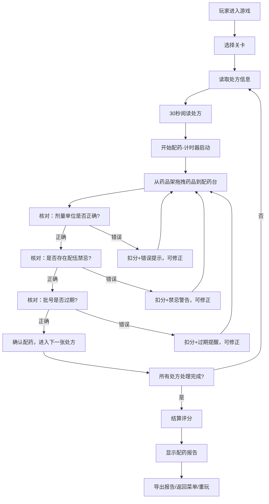

## 1. 产品概述
药房配药校验游戏是一款面向药学专业学生的教育类轻3D浏览器游戏，通过模拟真实药房配药流程，训练学生在剂量计算、禁忌拦截、批号核对等核心技能。游戏以真实药学规则为基础，通过关卡化设计和即时反馈机制，帮助学生在限时压力下掌握配药校验的关键技能。

- 核心目标：解决药学教学中缺乏真实场景实操训练的痛点
- 目标用户：药学专业师生、药房岗前培训人员
- 产品价值：将枯燥的知识点转化为可交互的游戏体验，提升学习效率和记忆效果

## 2. 核心 Features

### 2.1 用户角色
| 角色 | 登录方式 | 核心权限 |
|------|---------|---------|
| 玩家 | 无需登录 | 游戏体验、关卡挑战、报告导出 |

### 2.2 功能模块
1. **主菜单页面**：游戏标题、开始游戏、关卡选择、游戏说明、历史记录
2. **游戏主页面**：3D药房场景、2D配药台、处方面板、药品架、核对区域
3. **结算页面**：关卡评分、错误详情、扣分说明、配药报告
4. **历史回放页面**：游戏记录列表、操作回放、错误回顾

### 2.3 页面详情
| 页面名称 | 模块名称 | 功能描述 |
|---------|---------|---------|
| 主菜单 | 关卡选择 | 显示所有关卡、难度星级、最高得分 |
| 主菜单 | 游戏说明 | 规则说明、计分规则、操作指南 |
| 主菜单 | 历史记录 | 查看过往游戏记录和回放 |
| 游戏主页面 | 3D药房场景 | 轻3D药房环境，药柜、配药台、计时器可视化 |
| 游戏主页面 | 处方面板 | 显示当前处方信息：患者信息、药品、剂量、用法 |
| 游戏主页面 | 药品架 | 可拖拽的药品盒，显示药品名称、规格、批号、效期 |
| 游戏主页面 | 配药台 | 2D交互区域，放置药品进行核对 |
| 游戏主页面 | 核对系统 | 剂量核对、禁忌核对、批号核对三大校验模块 |
| 游戏主页面 | 控制面板 | 暂停/继续、重新开始、计时器、当前得分 |
| 结算页面 | 评分面板 | 关卡星级、总得分、正确率、完成时间 |
| 结算页面 | 错误详情 | 逐条显示错误类型、扣分原因、正确答案 |
| 结算页面 | 配药报告 | 导出本次配药的完整校验报告 |
| 历史回放 | 记录列表 | 显示历史游戏记录，支持筛选和搜索 |
| 历史回放 | 操作回放 | 逐帧回放操作过程，高亮错误节点 |

## 3. 核心流程

玩家从选择关卡开始，系统依次展示处方，玩家需要在限定时间内完成三张处方的配药校验。每张处方需要依次核对剂量单位、配伍禁忌和批号效期，任何一项错误都会被扣分并给出提示，玩家可以修正后重新提交。

## 4. 用户界面设计

### 4.1 设计风格
- **主色调**：医疗蓝 (#165DFF) 作为主色，代表专业和信任；辅助色为警示橙 (#FF7D00) 和错误红 (#F53F3F)，用于提示和警告；中性色以灰白为主，营造干净整洁的药房环境。
- **按钮风格**：圆角矩形按钮，带轻微阴影，主按钮采用医疗蓝填充配白色文字，次要按钮采用描边样式。危险操作用红色边框和文字。
- **字体**：标题使用「思源黑体 Bold」，正文使用「思源黑体 Regular」，数字和剂量单位使用等宽字体「JetBrains Mono」，确保数字清晰易读。
- **布局风格**：卡片式布局，配药台采用左右分栏，左侧为药品架，中间为核对操作区，右侧为处方和信息面板。
- **图标风格**：线性图标，简洁明了，药品用药瓶/药盒图标，核对用对勾/叉号，警告用三角形感叹号。

### 4.2 页面设计概述
| 页面名称 | 模块名称 | UI 元素 |
|---------|---------|---------|
| 主菜单 | 标题区 | 大字号游戏名称，医疗十字装饰元素，渐入动画 |
| 主菜单 | 关卡卡片 | 3D悬浮卡片，显示关卡名称、难度、最高得分，悬停时上浮效果 |
| 游戏主页面 | 3D场景 | 轻3D药房背景，药柜排列整齐，配药台位于前景，柔和顶部灯光 |
| 游戏主页面 | 处方面板 | 半透明卡片，患者信息用灰色小字，药品剂量用大号加粗字体 |
| 游戏主页面 | 药品架 | 横向滚动的药品盒列表，每个药品盒为可拖拽元素，显示名称、规格、批号标签 |
| 游戏主页面 | 配药台 | 虚线框放置区域，拖入后显示三个核对项（剂量/禁忌/批号），每项带状态指示灯 |
| 游戏主页面 | 计分板 | 顶部固定显示，当前得分、剩余时间、已处理处方数，时间不足时红色闪烁 |
| 游戏主页面 | 错误提示 | 从右侧滑入的Toast提示，不同错误类型对应不同颜色 |
| 结算页面 | 评分展示 | 大字号星级评分，得分环形进度条，动画从0增长到实际值 |
| 结算页面 | 扣分明细 | 表格形式展示每次错误，错误类型、扣分值、时间点，支持展开查看详情 |
| 历史回放 | 时间轴 | 水平时间轴，标记每个操作节点，错误节点用红色标记，点击可跳转到对应操作 |

### 4.3 响应式设计
- 采用桌面端优先设计，最佳分辨率为 1920×1080
- 支持平板端适配（≥1024px），简化3D场景，调整面板布局为上下结构
- 不支持移动端（<1024px），进入时提示请使用桌面端体验

### 4.4 3D 场景指引
- **环境与氛围**：明亮整洁的现代化药房，浅灰色墙面，白色药柜，木质配药台面，整体光线充足，营造专业、干净的医疗环境氛围
- **灯光设置**：主光源为顶部暖白色平行光模拟室内顶灯，辅以环境光消除阴影死角，配药台区域增加聚光灯突出操作重点
- **相机设置**：固定视角，位置在配药台正前方略高处，焦距适中，既能看到完整的3D药房环境，又能清晰观察2D配药台的操作细节，相机不跟随鼠标移动，保持稳定的游戏视角
- **构图与焦点**：画面中心为配药台操作区，3D药房环境作为背景，药柜上的药品盒有轻微的呼吸动画吸引注意力
- **交互与动画**：药品拖拽时对应3D位置有高亮效果，配药成功时有轻微的药瓶晃动动画，错误时配药台边框红光闪烁
- **后处理效果**：轻微的泛光效果增强3D质感，背景适当虚化突出前景操作区
- **资源与性能**：所有3D模型使用低多边形，总面数控制在5000面以内，材质使用基础PBR，避免使用复杂贴图，确保在普通办公电脑上流畅运行（60fps）
