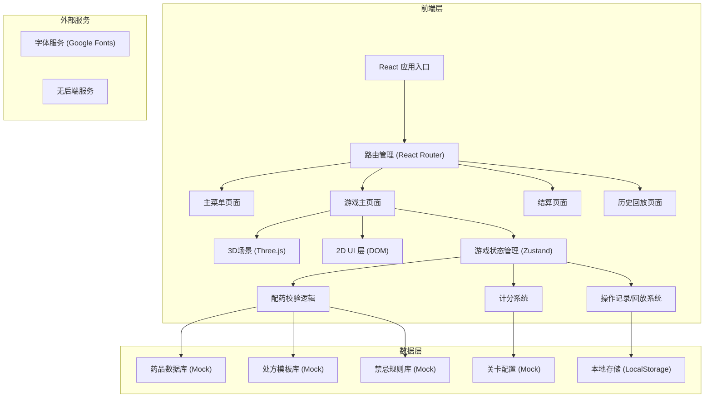
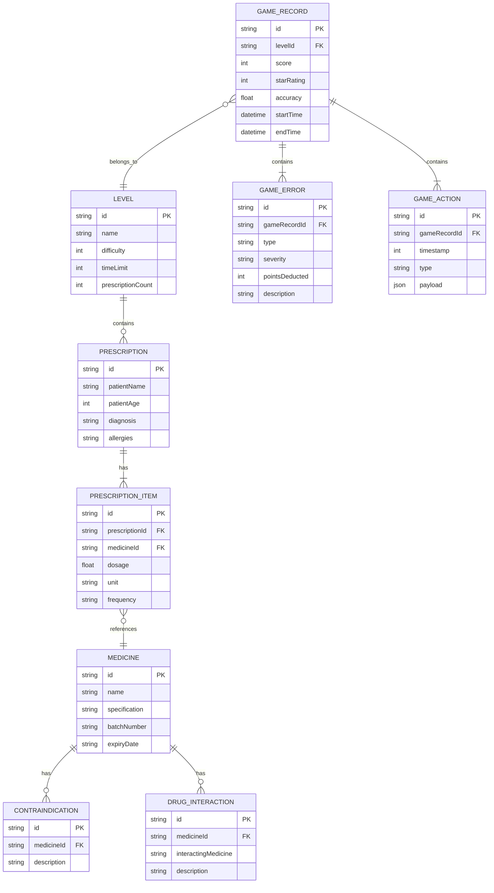

## 1. 架构设计



## 2. 技术描述

- **前端框架**：React@18 + TypeScript + Vite
- **3D引擎**：Three.js + @react-three/fiber + @react-three/drei
- **后处理**：@react-three/postprocessing
- **状态管理**：Zustand（轻量级，适合游戏状态管理）
- **样式方案**：Tailwind CSS@3 + CSS Modules（局部样式）
- **拖拽库**：@dnd-kit/core + @dnd-kit/sortable（现代拖拽解决方案）
- **图标库**：Lucide React（线性图标，符合医疗专业风格）
- **动画库**：Framer Motion（流畅的UI动画）
- **初始化工具**：Vite 5.x
- **后端**：无后端，全部使用Mock数据
- **数据持久化**：LocalStorage存储游戏记录和最高得分

## 3. 路由定义

| 路由 | 页面名称 | 用途 |
|------|---------|------|
| `/` | 主菜单页面 | 游戏入口、关卡选择、说明、历史记录入口 |
| `/game/:levelId` | 游戏主页面 | 核心配药校验游戏界面 |
| `/result/:gameId` | 结算页面 | 显示本次游戏的评分、错误详情、配药报告 |
| `/history` | 历史记录列表 | 显示所有历史游戏记录 |
| `/replay/:gameId` | 历史回放页面 | 回放指定游戏的操作过程 |
| `/guide` | 游戏说明页面 | 详细的游戏规则和操作指南 |

## 4. API 定义

无后端服务，所有数据使用Mock数据和本地存储。

### 4.1 本地存储API

```typescript
// 存储游戏记录
function saveGameRecord(record: GameRecord): void;

// 获取所有游戏记录
function getGameRecords(): GameRecord[];

// 获取指定游戏记录
function getGameRecordById(gameId: string): GameRecord | null;

// 存储关卡最高得分
function saveHighScore(levelId: string, score: number): void;

// 获取关卡最高得分
function getHighScore(levelId: string): number;
```

### 4.2 TypeScript 核心类型定义

```typescript
// 药品信息
interface Medicine {
  id: string;
  name: string;
  genericName: string;
  specification: string; // 规格，如"10mg/片"
  unit: string; // 单位：mg, g, ml, 片, 粒等
  batchNumber: string; // 批号
  expiryDate: string; // 有效期 YYYY-MM-DD
  manufacturer: string;
  category: string; // 分类：抗生素、降压药、降糖药等
  contraindications: string[]; // 禁忌症
  drugInteractions: string[]; // 药物相互作用
}

// 处方条目
interface PrescriptionItem {
  medicineId: string;
  medicineName: string;
  dosage: number; // 剂量数值
  unit: string; // 剂量单位
  frequency: string; // 用法：每日3次、每日1次等
  duration: string; // 疗程
}

// 处方
interface Prescription {
  id: string;
  patientName: string;
  patientAge: number;
  patientGender: '男' | '女';
  diagnosis: string; // 诊断
  allergies: string[]; // 过敏史
  items: PrescriptionItem[];
  doctorName: string;
  date: string;
}

// 游戏操作记录
interface GameAction {
  timestamp: number;
  type: 'drag_start' | 'drag_end' | 'place' | 'remove' | 'check' | 'confirm' | 'error' | 'correct';
  payload: {
    medicineId?: string;
    checkType?: 'dosage' | 'contraindication' | 'batch';
    isCorrect?: boolean;
    errorType?: string;
    details?: string;
  };
}

// 错误记录
interface GameError {
  id: string;
  type: 'dosage_unit' | 'dosage_amount' | 'contraindication' | 'drug_interaction' | 'batch_expired' | 'wrong_medicine' | 'timeout';
  severity: 'minor' | 'major' | 'critical';
  description: string;
  correctAnswer: string;
  pointsDeducted: number;
  timestamp: number;
}

// 游戏记录
interface GameRecord {
  id: string;
  levelId: string;
  levelName: string;
  startTime: number;
  endTime: number;
  totalTime: number;
  score: number;
  maxScore: number;
  starRating: number; // 1-3星
  prescriptions: Prescription[];
  errors: GameError[];
  actions: GameAction[];
  accuracy: number; // 正确率 0-100
}

// 关卡配置
interface LevelConfig {
  id: string;
  name: string;
  description: string;
  difficulty: 1 | 2 | 3 | 4 | 5; // 难度星级
  timeLimit: number; // 总时限（秒）
  prescriptionCount: number; // 处方数量
  prescriptionTimeLimit: number; // 每张处方时限（秒）
  errorTypes: string[]; // 可能出现的错误类型
  maxScore: number;
}

// 游戏状态
interface GameState {
  status: 'idle' | 'reading' | 'playing' | 'paused' | 'finished';
  levelId: string;
  currentPrescriptionIndex: number;
  score: number;
  timeRemaining: number;
  prescriptionTimeRemaining: number;
  errors: GameError[];
  actions: GameAction[];
  placedMedicines: string[]; // 已放置在配药台的药品ID
  checkResults: {
    medicineId: string;
    dosage: 'pending' | 'correct' | 'incorrect';
    contraindication: 'pending' | 'correct' | 'incorrect';
    batch: 'pending' | 'correct' | 'incorrect';
  }[];
}
```

## 5. 服务器架构

无后端服务器，纯前端应用。

## 6. 数据模型

### 6.1 数据模型ER图



### 6.2 Mock数据定义

所有数据存储在 `src/data/` 目录下的JSON或TS文件中：

- `src/data/medicines.ts` - 药品数据库（30+种常见药品）
- `src/data/prescriptions.ts` - 处方模板库
- `src/data/contraindications.ts` - 禁忌规则库
- `src/data/levels.ts` - 关卡配置（5个关卡，难度递增）
- `src/data/scoring.ts` - 计分规则配置

### 6.3 计分规则

| 操作 | 分值 | 说明 |
|------|------|------|
| 正确配药（无错误） | +100 | 每张处方基础分 |
| 剂量核对正确 | +20 | 额外加分 |
| 禁忌核对正确 | +20 | 额外加分 |
| 批号核对正确 | +20 | 额外加分 |
| 提前完成处方 | +5/秒 | 剩余时间换算加分 |
| 剂量单位错误 | -15 | 轻微错误 |
| 剂量数值错误 | -20 | 中等错误 |
| 未拦截禁忌 | -30 | 严重错误 |
| 未发现药物相互作用 | -25 | 严重错误 |
| 批号过期未发现 | -30 | 严重错误 |
| 选错药品 | -40 | 严重错误 |
| 单张处方超时 | -50 | 每张处方超时 |
| 总超时 | -100 | 整体超时 |
| 重复操作（来回拖拽） | -5/次 | 资源浪费惩罚 |
| 未核对就确认 | -50 | 操作违规 |

### 6.4 星级评定

| 得分率 | 星级 |
|--------|------|
| ≥90% | ⭐⭐⭐ |
| ≥75% | ⭐⭐ |
| ≥60% | ⭐ |
| <60% | 未通过 |
