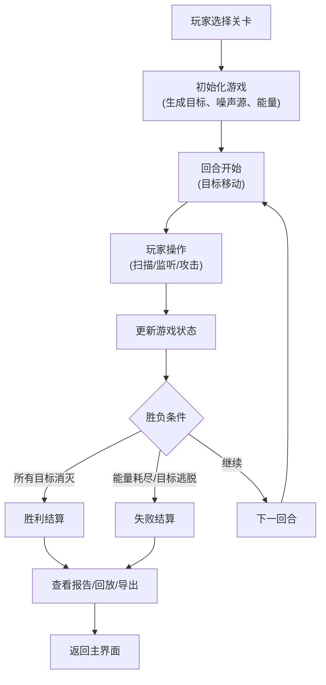
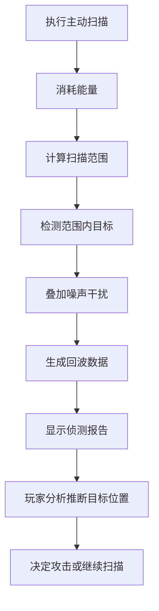

## 1. 产品概述

一款基于Canvas的2D策略推理游戏，玩家扮演潜艇声呐操作员，通过分析声呐回波和噪声信号，在网格海域中推断敌方潜艇的位置并进行打击。游戏强调真实的声呐探测逻辑和策略思考，而非视觉特效堆料。

- **核心玩法**：通过声呐扫描获取回波数据，排除噪声干扰，分析目标轨迹，在能量耗尽前定位并消灭所有敌方潜艇
- **目标用户**：科普课学生、策略游戏爱好者、对军事/声呐技术感兴趣的玩家
- **产品价值**：寓教于乐，通过游戏理解声呐探测原理、三角定位法、信号噪声区分等知识

## 2. 核心 Features

### 2.1 用户角色

| 角色 | 注册方式 | 核心权限 |
|------|----------|----------|
| 玩家 | 无需注册 | 游戏游玩、关卡选择、战绩查看、报告导出 |

### 2.2 功能模块

1. **主界面**：游戏标题、关卡选择、操作说明、历史战绩
2. **游戏界面**：网格海域Canvas、声呐控制面板、能量/回合信息、侦测报告
3. **结算界面**：评分报告、失败原因分析、轨迹回放、导出功能
4. **回放界面**：完整历史记录回放、关键事件标记、操作时间线

### 2.3 页面详情

| 页面名称 | 模块名称 | 功能描述 |
|----------|----------|----------|
| 主界面 | 关卡选择 | 提供3个难度关卡（初级/中级/高级），显示关卡信息和最佳成绩 |
| 主界面 | 操作说明 | 游戏规则、声呐原理、操作指南 |
| 主界面 | 历史战绩 | 显示最近10场游戏的结果、得分、用时 |
| 游戏界面 | 网格海域 | 12x12或16x16网格Canvas渲染，显示扫描结果、噪声源、已确认目标 |
| 游戏界面 | 声呐控制 | 主动扫描（消耗能量，有冷却）、被动监听（免费，精度低）、投放深水炸弹 |
| 游戏界面 | 状态面板 | 剩余能量、当前回合、扫描冷却时间、已消灭目标数、剩余目标数 |
| 游戏界面 | 侦测报告 | 实时显示每次扫描的回波数据、信号强度、可能方位 |
| 游戏界面 | 控制按钮 | 暂停/继续、重新开始、退出到主菜单 |
| 结算界面 | 评分报告 | 命中率、能量利用率、完成时间、总分评级（S/A/B/C/D） |
| 结算界面 | 失败分析 | 能量耗尽、目标逃脱、误击民用目标等原因说明 |
| 结算界面 | 轨迹回放 | 逐帧回放敌方潜艇移动轨迹和玩家操作记录 |
| 结算界面 | 导出功能 | 导出JSON格式的完整游戏记录，包含所有状态和操作 |

## 3. 核心流程

### 3.1 游戏主流程

### 3.2 声呐探测流程

## 4. 游戏规则与机制

### 4.1 核心机制

1. **网格系统**：12x12（初级）或16x16（中高级）网格，每个格子代表一个海域区块
2. **声呐扫描**：
   - 主动扫描：消耗5能量，3x3范围，高精度，冷却3回合
   - 扇形扫描：消耗8能量，60度扇形，中精度，冷却2回合
   - 被动监听：消耗0能量，全图范围，低精度（仅显示大致方位）
3. **噪声系统**：地图上有3-5个固定噪声源，会干扰扫描结果，产生虚假回波
4. **目标AI**：
   - 每回合移动1-2格
   - 有概率转向（30%）
   - 被扫描到后有概率规避（改变方向加速移动）
5. **能量系统**：
   - 初始能量根据难度：100/80/60
   - 每次主动扫描消耗能量
   - 攻击消耗10能量
   - 能量耗尽则游戏失败
6. **攻击系统**：
   - 选中格子投放深水炸弹
   - 命中则消灭目标
   - 未命中但在2格范围内会显示"近失"提示
7. **胜负条件**：
   - 胜利：消灭所有敌方潜艇
   - 失败：能量耗尽 / 目标到达地图边缘逃脱 / 误击3次民用目标（若有）

### 4.2 计分规则

| 项目 | 得分 |
|------|------|
| 消灭一个目标 | +100 |
| 扫描直接命中目标 | +20 |
| 首次扫描发现目标 | +50 |
| 能量剩余奖励 | 每1点能量 +1 |
| 回合数奖励 | 少于标准回合数每回合 +10 |
| 误击民用目标 | -50 |
| 未命中攻击 | -10 |

## 5. 用户界面设计

### 5.1 设计风格

- **设计方向**：复古军用控制台风格（Brutalist + Industrial）
- **主色调**：深军绿(#1a2f1a) + 荧光绿(#39ff14) + 琥珀黄(#ffb000) + 警告红(#ff3333)
- **字体**：
  - 标题：VT323（复古终端字体）
  - 正文：JetBrains Mono（等宽字体，营造控制台感）
- **按钮风格**：方形、粗边框、按下效果、单色图标
- **布局风格**：模块化面板、虚线分隔、CRT扫描线效果、像素化渲染
- **视觉特效**：荧光文字辉光、轻微屏幕闪烁、扫描时的雷达脉冲动画

### 5.2 页面设计概览

| 页面名称 | 模块名称 | UI元素 |
|----------|----------|--------|
| 主界面 | 标题区 | 大像素字体标题、扫描线动画背景、闪烁光标效果 |
| 主界面 | 关卡选择 | 三个军用风格按钮，显示难度、最佳成绩、关卡简介 |
| 主界面 | 操作说明 | 折叠面板，包含规则说明和示意图 |
| 主界面 | 历史战绩 | 表格形式，显示日期、关卡、结果、得分 |
| 游戏界面 | 网格海域 | Canvas绘制网格、扫描效果、回波点、噪声源标记、攻击爆炸效果 |
| 游戏界面 | 控制面板 | 三个扫描按钮（带冷却进度条）、攻击按钮、能量条 |
| 游戏界面 | 状态面板 | 数字显示能量、回合、目标数，带军用仪表风格边框 |
| 游戏界面 | 侦测报告 | 滚动文本区，类似终端输出，时间戳 + 回波数据 |
| 结算界面 | 评分面板 | 大字体显示评级、各项得分明细、条形图对比 |
| 结算界面 | 轨迹回放 | 时间轴滑块、播放/暂停、逐帧按钮 |
| 结算界面 | 导出按钮 | 导出JSON文件，含完整游戏状态历史 |

### 5.3 响应式设计

- **桌面优先**：主游戏区1024x768，侧边控制面板280px宽
- **平板适配**：控制面板移到底部，网格自动缩放
- **手机适配**：单列布局，网格优先显示，控制面板可折叠
- **触屏优化**：按钮最小44x44px，支持长按查看详情，双击快速攻击
- **键鼠支持**：键盘快捷键（1/2/3切换扫描模式，空格攻击，P暂停，R重开），鼠标悬停显示格子坐标

### 5.4 交互细节

- **扫描动画**：点击扫描后，从玩家位置向外扩散的雷达波动画，持续0.8秒
- **回波显示**：扫描结束后，回波点逐个淡入显示，附带信号强度数值
- **攻击效果**：投放炸弹后1秒延迟，显示爆炸动画和冲击波
- **命中反馈**：目标被消灭时显示十字准星锁定动画 + "HIT"文字弹出
- **噪声干扰**：虚假回波会轻微抖动，并带有"?"标记
- **暂停效果**：半透明遮罩 + "PAUSED"大字，所有动画停止
