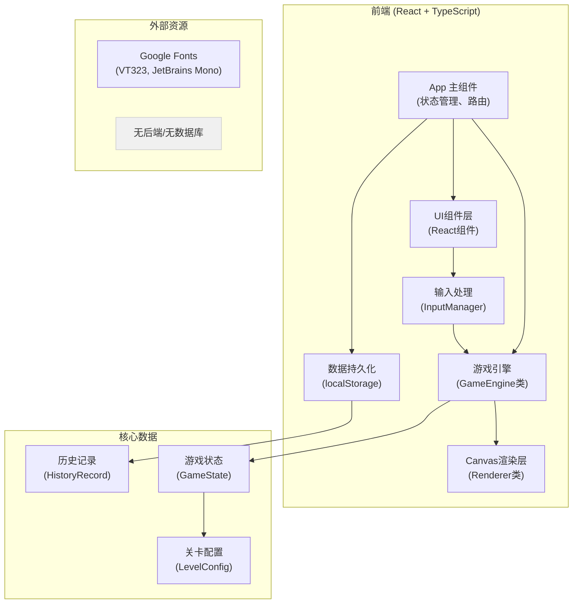

## 1. 架构设计



## 2. 技术描述

- **前端框架**：React@18 + TypeScript@5
- **构建工具**：Vite@5
- **样式方案**：TailwindCSS@3 + CSS Variables（主题色管理）
- **渲染引擎**：原生 Canvas 2D API（无第三方游戏引擎）
- **状态管理**：React useState/useReducer（游戏状态）+ useRef（Canvas引用）
- **数据持久化**：localStorage（历史战绩、最佳成绩）
- **字体资源**：Google Fonts（VT323、JetBrains Mono）
- **后端**：无（纯前端单页应用）
- **数据库**：无（数据存储在localStorage）

## 3. 目录结构

```
src/
├── types/
│   └── game.ts          # 类型定义（GameState, Position, Target等）
├── config/
│   └── levels.ts        # 关卡配置（初级/中级/高级参数）
├── engine/
│   ├── GameEngine.ts    # 游戏核心逻辑（回合、扫描、AI、胜负判定）
│   └── Renderer.ts      # Canvas渲染逻辑（网格、回波、动画）
├── components/
│   ├── MainMenu.tsx     # 主界面
│   ├── GameBoard.tsx    # 游戏画布组件
│   ├── ControlPanel.tsx # 控制面板
│   ├── StatusPanel.tsx  # 状态面板
│   ├── SonarLog.tsx     # 侦测报告
│   ├── ResultScreen.tsx # 结算界面
│   └── ReplayPlayer.tsx # 回放播放器
├── hooks/
│   └── useGameLoop.ts   # 游戏循环Hook
├── utils/
│   ├── math.ts          # 数学工具（距离、角度计算）
│   └── export.ts        # 导出功能（JSON生成）
├── App.tsx              # 应用主组件
├── main.tsx             # 入口文件
└── index.css            # 全局样式（Tailwind + 主题变量）
```

## 4. 核心数据模型

### 4.1 类型定义

```typescript
// 位置坐标
interface Position {
  x: number;
  y: number;
}

// 目标潜艇
interface Target {
  id: string;
  position: Position;
  direction: number; // 0-7 八个方向
  speed: number; // 1-2
  isDestroyed: boolean;
  hasEscaped: boolean;
  wasDetected: boolean; // 是否被扫描发现过
  avoidanceMode: boolean; // 是否在规避
  trajectory: Position[]; // 历史轨迹
}

// 噪声源
interface NoiseSource {
  id: string;
  position: Position;
  intensity: number; // 1-3 干扰强度
}

// 回波数据
interface Echo {
  id: string;
  position: Position;
  signalStrength: number; // 0-100
  isNoise: boolean; // 是否为噪声干扰
  sourceTargetId?: string; // 真实目标ID
  scanType: 'active' | 'fan' | 'passive';
  timestamp: number; // 回合数
}

// 扫描类型
type ScanType = 'active' | 'fan' | 'passive' | 'attack';

// 扫描配置
interface ScanConfig {
  type: ScanType;
  name: string;
  energyCost: number;
  cooldown: number;
  range: number;
  accuracy: number; // 0-1 影响噪声过滤能力
  description: string;
}

// 玩家操作记录
interface PlayerAction {
  type: ScanType | 'end_turn';
  position?: Position;
  energyUsed: number;
  timestamp: number; // 回合数
  result?: 'hit' | 'miss' | 'near_miss' | 'echo';
}

// 游戏状态
interface GameState {
  level: LevelConfig;
  currentTurn: number;
  energy: number;
  maxEnergy: number;
  targets: Target[];
  noiseSources: NoiseSource[];
  echoes: Echo[];
  destroyedTargets: number;
  escapedTargets: number;
  missedAttacks: number;
  civilianHits: number;
  scanCooldowns: Record<ScanType, number>;
  selectedPosition: Position | null;
  actions: PlayerAction[];
  gameStatus: 'playing' | 'paused' | 'victory' | 'defeat';
  defeatReason?: string;
  score: number;
  startTime: number;
  endTime?: number;
}

// 关卡配置
interface LevelConfig {
  id: string;
  name: string;
  difficulty: 'easy' | 'medium' | 'hard';
  gridSize: number;
  initialEnergy: number;
  targetCount: number;
  noiseSourceCount: number;
  standardTurns: number; // 标准回合数（用于计分）
  hasCivilianTargets: boolean;
  scanConfigs: Record<ScanType, ScanConfig>;
}

// 历史记录
interface HistoryRecord {
  id: string;
  levelId: string;
  levelName: string;
  difficulty: string;
  result: 'victory' | 'defeat';
  score: number;
  turns: number;
  duration: number; // 秒
  energyRemaining: number;
  targetsDestroyed: number;
  targetsTotal: number;
  defeatReason?: string;
  timestamp: number;
  gameStateSnapshot: GameState; // 完整状态快照用于回放
}

// 导出报告
interface ExportReport {
  version: string;
  exportTime: number;
  gameResult: 'victory' | 'defeat';
  defeatReason?: string;
  finalScore: number;
  levelInfo: LevelConfig;
  statistics: {
    totalTurns: number;
    energyUsed: number;
    energyEfficiency: number; // 得分/能耗
    hitRate: number; // 命中率
    targetsDestroyed: number;
    scansPerformed: number;
    attacksPerformed: number;
  };
  timeline: PlayerAction[];
  finalGameState: GameState;
}
```

### 4.2 核心算法

1. **声呐扫描算法**
   - 主动扫描：计算以玩家为中心3x3范围内的目标，根据距离衰减信号强度，叠加噪声源干扰
   - 扇形扫描：计算60度扇形区域内的目标，中精度
   - 被动监听：全图扫描，但信号强度波动大，误差范围±2格

2. **目标AI算法**
   - 移动：每回合根据方向移动speed格，遇边界则反弹
   - 转向：30%概率随机改变方向
   - 规避：被主动扫描到后，50%概率进入规避模式（速度+1，方向随机改变）

3. **噪声干扰算法**
   - 噪声源在扫描范围内时，有概率产生虚假回波
   - 虚假回波位置在噪声源周围随机偏移1-2格
   - 信号强度略低于真实目标

4. **三角定位逻辑**（玩家推理用）
   - 多次扫描同一目标可获得多个方位
   - 多个回波的交点即为目标可能位置
   - 游戏通过侦测报告辅助玩家进行逻辑推理

## 5. 路由定义

| 路由 | 页面 | 组件 | 功能 |
|------|------|------|------|
| / | 主界面 | MainMenu | 关卡选择、操作说明、历史战绩 |
| /game/:levelId | 游戏界面 | GameBoard + ControlPanel + StatusPanel + SonarLog | 核心游戏玩法 |
| /result | 结算界面 | ResultScreen | 评分报告、轨迹回放、导出 |
| /replay/:recordId | 回放界面 | ReplayPlayer | 历史记录回放 |

## 6. 关键技术实现要点

### 6.1 Canvas 渲染优化

- 使用离屏Canvas（OffscreenCanvas）预渲染静态网格
- 动画采用requestAnimationFrame，区分逻辑帧和渲染帧
- 脏矩形渲染：仅重绘变化区域
- 对象池模式复用回波、爆炸等动画对象

### 6.2 游戏状态管理

- 单一数据源：GameState为唯一真相来源
- 每次操作生成新的状态对象（不可变数据）
- 操作历史记录用于撤销（可选）和回放
- 状态快照每回合保存，用于回放功能

### 6.3 输入处理

- 键盘事件：全局监听，支持快捷键
- 鼠标事件：Canvas坐标转换为网格坐标
- 触摸事件：支持长按、双击、滑动手势
- 输入防抖：防止快速重复操作

### 6.4 数据持久化

- localStorage存储历史战绩（最多50条）
- 最佳成绩按关卡分别存储
- 游戏状态支持本地保存（暂停后继续）

### 6.5 导出功能

- 生成完整JSON报告，包含所有游戏状态
- 报告内容与画面显示完全一致
- 支持下载为.json文件
- 报告可用于导入回放

## 7. 性能预算

- 首次加载：< 200KB（不含字体）
- Canvas帧率：稳定60fps
- 单帧渲染时间：< 16ms
- 内存占用：< 100MB
- 历史记录存储：< 1MB（50条记录）
