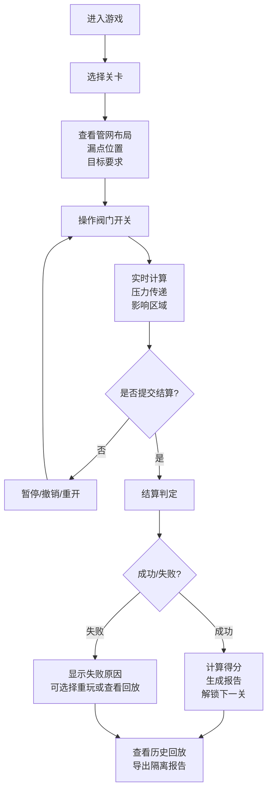

## 1. 产品概述

管道阀门解谜游戏是一款面向水务展厅的2D互动模拟游戏，玩家通过开关管网阀门隔离漏水点，同时尽量减少对居民用户的影响。游戏聚焦真实的管网物理规则，通过压力传递、影响区域计算等机制，让玩家理解水务调度的核心难点。

- 核心目标：在限定时间/步骤内隔离所有漏点，同时最小化受影响用户数量
- 目标用户：水务展厅参观者、学生、对管网系统感兴趣的大众
- 市场价值：将专业的管网调度知识转化为可互动的游戏体验，寓教于乐

## 2. 核心特性

### 2.1 用户角色

| 角色 | 注册方式 | 核心权限 |
|------|----------|----------|
| 玩家 | 无需注册，直接体验 | 选择关卡、进行游戏、查看回放、导出报告 |

### 2.2 功能模块

1. **关卡选择页**：关卡列表、难度标识、历史最佳成绩
2. **游戏主页面**：2D管网画布、实时状态面板、操作控制栏
3. **结算页面**：得分明细、失败原因分析、隔离报告
4. **历史回放页**：操作步骤回放、时间轴控制、关键节点标注

### 2.3 页面详情

| 页面名称 | 模块名称 | 功能描述 |
|----------|----------|----------|
| 关卡选择页 | 关卡列表 | 展示所有关卡，包含难度星级、最佳得分、通关状态 |
| 关卡选择页 | 关卡预览 | 点击关卡显示管网缩略图和任务目标 |
| 游戏主页面 | 2D管网画布 | 渲染管道、阀门、漏点、用户区、压力数值可视化 |
| 游戏主页面 | 交互控制 | 点击阀门开关、缩放拖拽画布、悬停查看详情 |
| 游戏主页面 | 状态面板 | 实时压力值、受影响用户数、已隔离漏点数、剩余时间/步数 |
| 游戏主页面 | 操作栏 | 暂停、重开、撤销、提交结算按钮 |
| 结算页面 | 得分结算 | 基础分、惩罚项、奖励项的明细计算 |
| 结算页面 | 失败分析 | 失败原因回溯（误关主阀、压力过低、漏点未隔离等） |
| 结算页面 | 隔离报告 | 自动生成标准格式的隔离操作报告，支持导出 |
| 历史回放页 | 时间轴 | 可拖动的操作时间轴，支持逐帧回放 |
| 历史回放页 | 播放控制 | 播放/暂停、倍速、跳转到关键节点 |

## 3. 核心流程

玩家选择关卡后进入游戏，观察管网布局和漏点位置，通过开关阀门进行操作。系统实时计算压力传递和影响区域，玩家提交后进行结算，成功则解锁下一关，失败可查看原因并重玩。

## 4. 用户界面设计

### 4.1 设计风格
- 主色调：深蓝色(#1e3a5f)作为水务主题色，搭配水蓝色(#3b82f6)作为高亮色
- 警示色：红色(#ef4444)表示漏点和压力异常，绿色(#22c55e)表示正常，橙色(#f97316)表示警告
- 整体风格：工业仪表风，带有科技感的管线布局，类似SCADA系统界面
- 按钮样式：扁平化设计，带有轻微的边框和点击反馈
- 字体：使用JetBrains Mono作为数字显示字体，思源黑体作为中文主体字体
- 图标：使用简洁的线条图标，阀门、管道、水滴等元素采用工程图标风格

### 4.2 页面设计概述

| 页面名称 | 模块名称 | UI元素 |
|----------|----------|--------|
| 关卡选择页 | 关卡卡片 | 卡片式布局，悬浮动画，星级难度标识，最佳成绩角标 |
| 游戏主页面 | 管网画布 | 深色背景，管道线条采用渐变效果，节点圆角设计，压力值动态标签 |
| 游戏主页面 | 状态面板 | 左侧固定面板，数据卡片分组展示，数值变化有动画过渡 |
| 游戏主页面 | 底部操作栏 | 半透明毛玻璃效果，按钮图标+文字，关键操作突出显示 |
| 结算页面 | 得分面板 | 数字滚动动画，明细项展开/收起，图表展示影响区域 |
| 结算页面 | 失败原因 | 时间线式展示，关键错误点高亮，关联到具体操作步骤 |
| 历史回放页 | 时间轴 | 底部横向时间轴，关键操作节点标记，拖动时有预览效果 |

### 4.3 响应式
- 桌面端优先设计，支持1280px及以上分辨率
- 平板端自适应布局，状态面板可折叠
- 移动端简化操作，支持触控缩放和点击
- 管网画布支持双指缩放和单指拖拽

### 4.4 交互细节
- 阀门点击：有0.2s的开关动画，状态变化有音效反馈
- 压力变化：数值变化时带有颜色过渡动画，异常时闪烁提醒
- 悬停效果：显示节点详情tooltip，包含编号、压力、连接关系
- 操作撤销：步骤回退时管网状态平滑过渡
- 失败提示：失败原因从右侧滑入，关联到管网中的对应位置高亮
