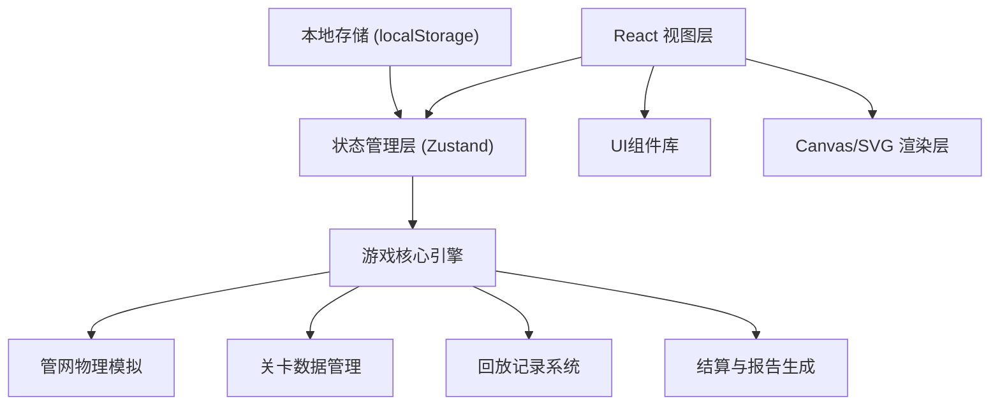
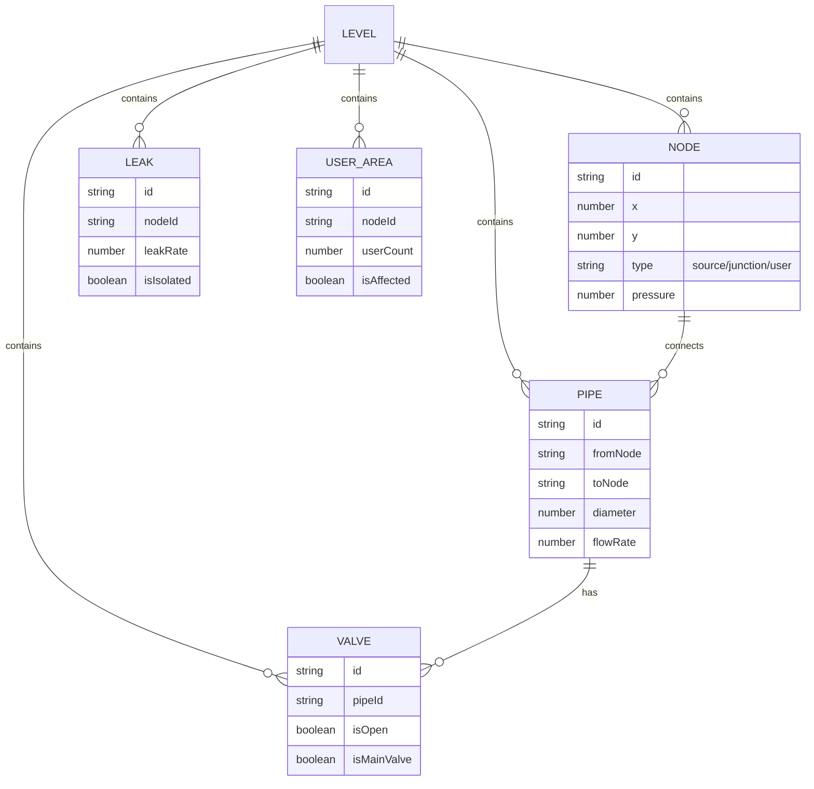

## 1. 架构设计

本项目为纯前端2D浏览器游戏，采用React + TypeScript + Vite技术栈，不依赖后端服务。游戏核心逻辑独立于UI层，便于测试和维护。



## 2. 技术描述

- **前端框架**：React@18 + TypeScript@5 + Vite@5
- **状态管理**：Zustand@4
- **样式方案**：TailwindCSS@3
- **图标库**：lucide-react
- **渲染方案**：SVG用于管网渲染（便于交互和样式控制）
- **数据持久化**：localStorage存储关卡进度和历史记录
- **初始化工具**：vite-init

## 3. 核心目录结构

```
src/
├── components/          # 通用UI组件
│   ├── Valve.tsx        # 阀门组件
│   ├── Pipe.tsx         # 管道组件
│   ├── Node.tsx         # 管网节点
│   ├── StatusPanel.tsx  # 状态面板
│   ├── Toolbar.tsx      # 操作工具栏
│   └── Modal.tsx        # 弹窗组件
├── pages/               # 页面组件
│   ├── LevelSelect.tsx  # 关卡选择页
│   ├── Game.tsx         # 游戏主页面
│   ├── Settlement.tsx   # 结算页面
│   └── Replay.tsx       # 历史回放页
├── store/               # 状态管理
│   └── useGameStore.ts  # 游戏全局状态
├── engine/              # 游戏核心引擎
│   ├── types.ts         # 类型定义
│   ├── physics.ts       # 物理模拟（压力、流量）
│   ├── solver.ts        # 管网求解器
│   └── validator.ts     # 规则校验器
├── data/                # 关卡数据
│   └── levels.ts        # 关卡配置
├── utils/               # 工具函数
│   ├── geometry.ts      # 几何计算
│   ├── report.ts        # 报告生成
│   └── replay.ts        # 回放工具
├── hooks/               # 自定义Hooks
│   ├── useGameLoop.ts   # 游戏循环
│   └── useReplay.ts     # 回放控制
└── App.tsx              # 应用入口
```

## 4. 路由定义

| 路由 | 页面 | 用途 |
|------|------|------|
| / | LevelSelect | 关卡选择页面 |
| /game/:levelId | Game | 游戏主页面 |
| /settlement | Settlement | 结算页面 |
| /replay/:recordId | Replay | 历史回放页面 |

## 5. 核心数据模型

### 5.1 管网数据模型



### 5.2 TypeScript 类型定义

```typescript
// 节点类型
interface Node {
  id: string;
  x: number;
  y: number;
  type: 'source' | 'junction' | 'user';
  pressure: number;
  label?: string;
}

// 管道
interface Pipe {
  id: string;
  fromNode: string;
  toNode: string;
  diameter: number;
  hasValve: boolean;
  valveId?: string;
}

// 阀门
interface Valve {
  id: string;
  pipeId: string;
  isOpen: boolean;
  isMainValve: boolean;
  position: { x: number; y: number };
}

// 漏点
interface Leak {
  id: string;
  nodeId: string;
  leakRate: number;
  isIsolated: boolean;
}

// 用户区
interface UserArea {
  id: string;
  nodeId: string;
  userCount: number;
  isAffected: boolean;
}

// 关卡
interface Level {
  id: string;
  name: string;
  difficulty: 1 | 2 | 3 | 4 | 5;
  description: string;
  maxSteps?: number;
  timeLimit?: number;
  targetIsolatedLeaks: number;
  maxAffectedUsers: number;
  minPressure: number;
  nodes: Node[];
  pipes: Pipe[];
  valves: Valve[];
  leaks: Leak[];
  userAreas: UserArea[];
}

// 操作记录
interface Operation {
  timestamp: number;
  type: 'valve_toggle';
  valveId: string;
  fromState: boolean;
  toState: boolean;
  gameStateSnapshot: GameState;
}

// 游戏状态
interface GameState {
  nodes: Node[];
  pipes: Pipe[];
  valves: Valve[];
  leaks: Leak[];
  userAreas: UserArea[];
  affectedUsers: number;
  isolatedLeaks: number;
  averagePressure: number;
  stepCount: number;
  elapsedTime: number;
}

// 结算结果
interface SettlementResult {
  success: boolean;
  score: number;
  breakdown: {
    baseScore: number;
    leakBonus: number;
    userPenalty: number;
    pressurePenalty: number;
    stepPenalty: number;
    timeBonus: number;
  };
  failureReasons: FailureReason[];
  report: IsolationReport;
}

// 失败原因
interface FailureReason {
  type: 'leak_not_isolated' | 'pressure_too_low' | 'too_many_affected' | 'main_valve_closed' | 'steps_exceeded' | 'time_exceeded';
  message: string;
  location?: { nodeId?: string; valveId?: string };
  operationIndex?: number;
}

// 隔离报告
interface IsolationReport {
  levelId: string;
  levelName: string;
  timestamp: number;
  operations: Operation[];
  finalState: GameState;
  affectedUserAreas: string[];
  isolatedLeaks: string[];
  closedValves: string[];
  recommendations: string[];
}
```

## 6. 游戏核心算法

### 6.1 压力传递算法
- 使用图遍历算法（BFS/DFS）从水源节点计算可达区域
- 基于阀门状态动态更新连通性
- 压力衰减模拟：距离水源越远压力越低，管道直径影响压降

### 6.2 影响区域计算
- 关闭阀门后，重新计算各用户区到水源的连通性
- 标记不可达的用户区为受影响
- 避免重复计算：使用并查集(Union-Find)数据结构优化

### 6.3 漏点隔离判定
- 漏点所在节点无法到达任何水源时判定为已隔离
- 实时更新漏点隔离状态

### 6.4 得分计算规则
```
基础分 = 1000
漏点奖励 = 已隔离漏点数 × 200
用户惩罚 = 受影响用户数 × 10
压力惩罚 = (最低压力 - 标准压力) × 50  (当压力低于阈值时)
步骤惩罚 = 超出基础步骤数 × 5
时间奖励 = 剩余时间 × 2  (限时关卡)
总分 = 基础分 + 漏点奖励 - 用户惩罚 - 压力惩罚 - 步骤惩罚 + 时间奖励
```

## 7. 失败原因检测

| 失败类型 | 检测条件 |
|----------|----------|
| 漏点未隔离 | 结算时存在未隔离的漏点 |
| 压力过低 | 任一节点压力低于最小压力阈值 |
| 影响用户过多 | 受影响用户数超过关卡限制 |
| 误关主阀 | 标记为主阀的阀门被关闭 |
| 步骤超限 | 操作步数超过最大限制 |
| 时间超限 | 用时超过时间限制 |

## 8. 回放系统设计

- 操作记录存储：每次阀门操作保存完整游戏状态快照
- 时间轴控制：支持逐帧播放、倍速播放、跳转到指定操作
- 关键节点标记：自动标记失败操作、关键隔离操作
- 导出功能：支持将回放数据导出为JSON文件
