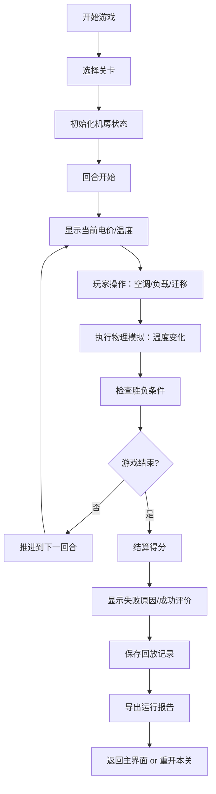

## 1. 产品概述
机房降温策略游戏是一款数据中心新人培训模拟器，玩家通过管理空调开关、负载迁移和电价策略来维持机房稳定运行。核心目标是在控制成本的同时，避免温度过高导致设备故障，培养玩家对数据中心基础设施运营的实战理解。

- 目标用户：数据中心运维新人、IDC从业人员、对基础设施运营感兴趣的学习者
- 核心价值：通过游戏化方式理解热管理、负载均衡和成本控制之间的平衡
- 市场价值：填补国内数据中心运营培训类游戏的空白，兼具教育性和趣味性

## 2. 核心特性

### 2.1 用户角色
| 角色 | 注册方式 | 核心权限 |
|------|----------|----------|
| 玩家 | 无需注册，直接进入 | 完整游戏体验、关卡挑战、历史回放 |

### 2.2 功能模块
1. **主界面**：开始游戏、关卡选择、规则说明、历史记录
2. **游戏场景**：轻3D机房可视化、实时温度热力图、机柜/空调状态显示
3. **控制系统**：空调开关、温度调节、负载迁移、运行暂停/继续/重开
4. **回合系统**：回合制推进、电价时段变化、随机事件触发
5. **结算系统**：实时计分、失败原因分析、运行报告导出
6. **回放系统**：历史对局记录、时间轴回放、关键事件标记

### 2.3 页面详情
| 页面名称 | 模块名称 | 功能描述 |
|----------|----------|----------|
| 主界面 | 开始区域 | 关卡选择、新手教程、历史记录入口 |
| 游戏界面 | 3D场景区 | 机房俯视图/3D视图切换、机柜空调可视化、温度热力叠加 |
| 游戏界面 | HUD信息栏 | 回合数、当前时间、室外温度、电价、电费累计、总分 |
| 游戏界面 | 控制面板 | 空调控制、负载迁移、操作历史、回合推进按钮 |
| 游戏界面 | 侧边状态 | 机柜详情、空调状态、温度告警、任务列表 |
| 结算界面 | 结果展示 | 最终得分、胜负判定、失败原因、详细数据统计 |
| 结算界面 | 报告导出 | CSV格式运行报告、对局数据下载 |
| 回放界面 | 回放控制 | 时间轴拖拽、播放速度、关键节点跳转 |

## 3. 核心流程

玩家流程：
1. 进入主界面选择关卡难度
2. 初始回合显示机房状态、机柜负载、空调配置
3. 每个回合玩家可执行：开/关空调、调节空调温度、在机柜间迁移负载
4. 系统根据负载、空调效率、室外温度计算温度变化
5. 热点扩散、空调过载、迁移失败等随机事件可能触发
6. 任何机柜温度超过阈值则游戏失败
7. 完成所有回合且未失败则结算成功
8. 可查看完整运行报告和历史回放

## 4. 用户界面设计

### 4.1 设计风格
- **主色调**：深色工业风背景（#0f172a），搭配科技感蓝色（#0ea5e9）和告警红色（#ef4444）
- **辅助色**：温度热力渐变（蓝→青→绿→黄→橙→红），状态指示色（绿/黄/红）
- **按钮风格**：扁平带轻微阴影，悬停有颜色过渡，禁用状态灰度显示
- **字体**：JetBrains Mono 等宽字体用于数据展示，搭配 Inter 用于说明文字
- **布局风格**：顶部HUD信息条 + 中央3D场景 + 右侧控制面板 + 底部操作栏，信息密度高但层次分明
- **图标风格**：lucide-react 线性图标，保持简洁一致

### 4.2 页面设计概览
| 页面名称 | 模块名称 | UI 元素 |
|----------|----------|---------|
| 主界面 | 开始区域 | 大标题、关卡卡片网格、操作按钮、动效背景 |
| 游戏界面 | 3D场景区 | 地板网格、机柜立方体、空调机组、温度热力半透明叠加层 |
| 游戏界面 | HUD信息栏 | 圆角卡片式数据块、图标+数值、闪烁告警动画 |
| 游戏界面 | 控制面板 | 分组选项卡、滑块控件、开关按钮、操作反馈提示 |
| 结算界面 | 结果展示 | 大号得分数字、关键指标雷达图、失败原因列表 |
| 回放界面 | 时间轴 | 可拖拽进度条、关键事件标记点、播放控制按钮 |

### 4.3 响应性
- 桌面端优先设计，1280px 以上最佳体验
- 平板端自适应布局，控制面板可折叠
- 不支持移动端操作（操作复杂度较高）

### 4.4 3D场景指导
- **环境**：纯深色背景，轻微雾效，突出机房主体
- **光照**：环境光 + 方向光模拟机房顶灯，机柜LED状态灯作为点光源
- **摄像机**：默认45度俯视角，支持鼠标拖拽旋转、滚轮缩放，限制在合理范围内
- **构图**：机柜排列成行列，空调沿墙边布置，留出操作通道
- **交互**：点击机柜高亮显示详情，悬浮显示温度标签
- **动画**：机柜风扇缓慢转动，空调出风有轻微粒子效果，温度变化有颜色过渡
- **后处理**：轻微Bloom效果增强科技感，不使用过度效果影响性能
- **性能**：机柜使用实例化渲染，总三角形数控制在 5万以内

## 5. 游戏规则与数值设计

### 5.1 核心参数
- **机柜**：8-16个，每个基础负载 2-8 kW，可迁移
- **空调**：2-4台，每台制冷量 10-20 kW，能效比随温度变化
- **温度阈值**：警告 32°C，危险 38°C，故障 42°C
- **回合时长**：模拟1小时，每天24回合
- **电价时段**：峰时(0.8元/kWh)、平时(0.5元/kWh)、谷时(0.2元/kWh)

### 5.2 物理模拟
- 机柜产热 = 当前负载 × 散热系数
- 空调制冷 = 运行台数 × 制冷量 × 效率系数
- 热扩散 = 相邻机柜温度差 × 扩散系数
- 室外温度影响 = (室外温 - 25) × 渗透系数

### 5.3 计分规则
- 基础分：每存活一回合 +100
- 温度奖励：平均温度每低于30°C +50
- 成本扣除：实际电费 × 10
- 故障惩罚：温度告警 -200，设备故障直接失败
- 负载均衡奖励：负载标准差越小奖励越高

### 5.4 失败条件
1. 任何机柜温度 ≥ 42°C 持续1回合
2. 空调过载跳闸（总制冷需求超过额定120%）
3. 负载迁移失败导致设备宕机
4. 累计电费超预算300%
