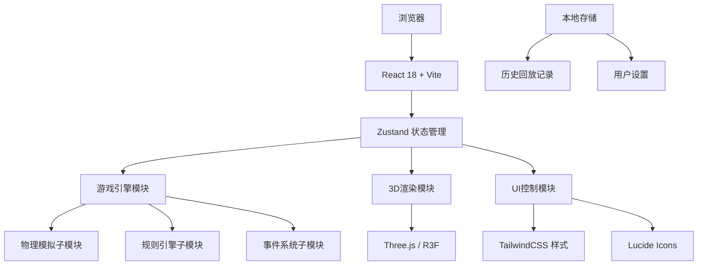

## 1. 架构设计



## 2. 技术描述

- **前端框架**：React 18 + TypeScript + Vite 5
- **3D渲染**：three@0.160, @react-three/fiber@8.15, @react-three/drei@9.92
- **状态管理**：zustand@4.4
- **样式方案**：tailwindcss@3.4, postcss, autoprefixer
- **图标库**：lucide-react@0.309
- **后端**：无，纯前端游戏
- **数据持久化**：LocalStorage 存储回放记录和用户设置
- **初始化工具**：vite-init (react-ts 模板)

## 3. 路由定义

| 路由 | 页面 | 用途 |
|------|------|------|
| / | MainMenu 主菜单 | 关卡选择、游戏介绍、历史记录 |
| /game/:levelId | GamePage 游戏界面 | 主游戏场景、控制面板、HUD |
| /result/:gameId | ResultPage 结算页 | 得分展示、失败原因、报告导出 |
| /replay/:gameId | ReplayPage 回放页 | 历史对局回放、时间轴控制 |

## 4. 目录结构

```
src/
├── pages/
│   ├── MainMenu.tsx       # 主菜单页面
│   ├── GamePage.tsx       # 游戏主页面
│   ├── ResultPage.tsx     # 结算页面
│   └── ReplayPage.tsx     # 回放页面
├── components/
│   ├── game3d/            # 3D场景组件
│   │   ├── RoomScene.tsx  # 机房场景
│   │   ├── Rack.tsx       # 机柜组件
│   │   ├── ACUnit.tsx     # 空调组件
│   │   └── HeatOverlay.tsx# 温度热力层
│   ├── ui/                # UI组件
│   │   ├── HUD.tsx        # 顶部信息栏
│   │   ├── ControlPanel.tsx # 控制面板
│   │   ├── RackDetail.tsx # 机柜详情
│   │   ├── Timeline.tsx   # 时间轴组件
│   │   └── common/        # 通用组件
│   └── layout/            # 布局组件
├── store/
│   ├── useGameStore.ts    # 游戏主状态
│   └── useUISTore.ts      # UI交互状态
├── engine/
│   ├── types.ts           # 类型定义
│   ├── config.ts          # 游戏配置/关卡数据
│   ├── physics.ts         # 物理模拟引擎
│   ├── rules.ts           # 规则判定
│   ├── events.ts          # 事件系统
│   └── replay.ts          # 回放系统
├── utils/
│   ├── temperature.ts     # 温度相关工具
│   ├── export.ts          # 报告导出工具
│   └── storage.ts         # 本地存储工具
├── hooks/
│   ├── useGameLoop.ts     # 游戏循环hook
│   └── useKeyboard.ts     # 键盘控制hook
└── App.tsx, main.tsx, index.css
```

## 5. 核心数据模型

### 5.1 类型定义

```typescript
// 机柜
interface Rack {
  id: string;
  name: string;
  position: { x: number; z: number };
  load: number;           // 当前负载 kW
  maxLoad: number;        // 最大负载 kW
  temperature: number;    // 当前温度 °C
  status: 'normal' | 'warning' | 'danger' | 'fault';
  airflow: number;        // 风量 m³/h
}

// 空调
interface ACUnit {
  id: string;
  name: string;
  position: { x: number; z: number };
  isOn: boolean;
  setPoint: number;       // 设定温度
  capacity: number;       // 额定制冷量 kW
  efficiency: number;     // 当前能效比
  powerDraw: number;      // 实际功耗 kW
  status: 'off' | 'running' | 'overload' | 'fault';
}

// 回合状态
interface TurnState {
  turn: number;           // 回合数 1-24
  hour: number;           // 小时 0-23
  outdoorTemp: number;    // 室外温度
  electricityPrice: number; // 当前电价
  electricityUsed: number; // 本回合用电量
  totalCost: number;      // 累计电费
  score: number;          // 当前得分
}

// 游戏状态
interface GameState {
  levelId: string;
  racks: Rack[];
  acUnits: ACUnit[];
  turnState: TurnState;
  gamePhase: 'playing' | 'paused' | 'won' | 'lost';
  failReason: string | null;
  operationLog: Operation[];
  eventLog: GameEvent[];
  snapshotHistory: TurnSnapshot[];
}

// 操作记录
interface Operation {
  id: string;
  turn: number;
  type: 'ac_toggle' | 'ac_setpoint' | 'migrate_load' | 'next_turn';
  payload: any;
  timestamp: number;
}

// 快照（用于回放）
interface TurnSnapshot {
  turn: number;
  racks: Rack[];
  acUnits: ACUnit[];
  turnState: TurnState;
}
```

## 6. 游戏引擎核心流程

### 6.1 回合执行流程
```
玩家操作 → 记录操作日志 → 触发物理模拟 → 更新温度/负载 →
检查规则判定 → 触发生成事件 → 检查胜负 → 生成本回合快照 →
等待下一回合操作
```

### 6.2 物理模拟公式
```
每回合温度变化 ΔT = (产热 - 制冷 + 渗透热 + 扩散热) / 热容

其中：
- 产热 = Σ(rack.load * HEAT_RATE)
- 制冷 = Σ(ac.capacity * ac.efficiency * ac.isOn)
- 渗透热 = (outdoorTemp - BASE_TEMP) * INFILTRATION_RATE
- 扩散热 = Σ(相邻温差 * DIFFUSION_RATE)
```

### 6.3 状态互斥保证
为防止状态冲突，采用以下机制：
1. 重开游戏：完整重置 store 到初始状态，清除所有历史快照
2. 暂停/继续：使用 gamePhase 标志位，暂停时禁止 tick 推进
3. 回放模式：使用独立的只读 store 实例，不写入主状态
4. 结算状态：gamePhase 设为终态后，禁止任何修改操作

## 7. 性能优化策略

1. **3D渲染优化**：
   - 机柜使用 InstancedMesh 批量渲染
   - 热力图使用 ShaderMaterial 实时计算
   - 限制帧率为 60fps，后台标签页降为 1fps

2. **状态更新优化**：
   - Zustand 选择器按需订阅，避免全量重渲染
   - 3D场景与UI状态分离更新
   - 回合快照使用结构化共享，仅存储差异

3. **回放性能**：
   - 关键帧压缩存储，每5回合存完整快照
   - 回放时插值计算中间状态
   - 支持倍速播放，最高8倍速
