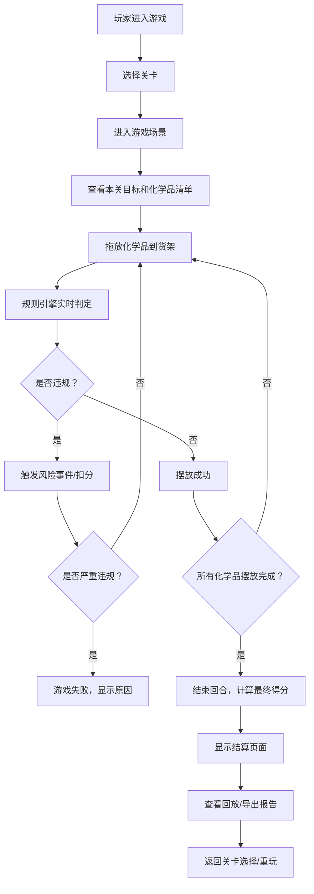

## 1. 产品概述
一款面向企业安全培训的2D浏览器化学品仓库配伍游戏，通过模拟真实仓储场景让员工掌握危化品存储规则，理解禁忌相邻、温度超限、隔离距离不足等常见风险的判定与规避。

- **核心目标**：通过游戏化方式提升员工危化品安全意识和实操能力
- **目标用户**：化工企业员工、安全管理人员、新入职员工
- **产品价值**：降低培训成本，提高培训效果，减少真实仓储事故风险

## 2. 核心 Features

### 2.1 用户角色
| 角色 | 注册方式 | 核心权限 |
|------|----------|----------|
| 培训员工 | 无需注册，直接进入 | 游戏游玩、查看报告、历史回放 |

### 2.2 功能模块
1. **游戏主界面**：2D货架系统、化学品库、环境监控面板、操作面板
2. **关卡系统**：3个难度递增的关卡，每关有不同的化学品和目标
3. **规则引擎**：禁忌相邻判定、温湿度监控、隔离距离计算
4. **风险事件系统**：违规触发警告、严重违规触发事故
5. **计分系统**：实时计分、扣分明细、最终评分
6. **游戏控制**：暂停/继续、重新开始、回合制倒计时
7. **历史回放**：记录每一步操作，可回放复盘
8. **报告导出**：生成仓储合规报告，支持PDF下载

### 2.3 页面详情
| 页面名称 | 模块名称 | 功能描述 |
|---------|----------|----------|
| 开始页面 | 关卡选择 | 显示3个关卡，显示关卡简介和目标分数 |
| 游戏页面 | 2D货架区域 | 6x4格子货架，支持拖放化学品，显示格子状态 |
| 游戏页面 | 化学品库 | 显示待摆放的化学品卡片，显示危险类别和存储要求 |
| 游戏页面 | 环境监控 | 显示当前温湿度，温度超标警告 |
| 游戏页面 | 操作面板 | 暂停、重开、结束回合、查看规则按钮 |
| 游戏页面 | 计分面板 | 实时分数、剩余时间、违规记录 |
| 结算页面 | 分数详情 | 显示得分明细、扣分原因、评级 |
| 结算页面 | 失败原因 | 如失败，显示具体失败原因和改进建议 |
| 结算页面 | 历史回放 | 时间轴控制，可逐帧回放操作过程 |
| 结算页面 | 报告导出 | 生成仓储合规报告，支持下载 |

## 3. 核心流程

## 4. 用户界面设计

### 4.1 设计风格
- **设计方向**：工业仓储风格，硬核、实用、具有专业感
- **主色调**：深灰色背景（#1a1a2e），工业蓝（#16213e），警示黄（#e8c547），危险红（#e94560），安全绿（#4ade80）
- **字体**：使用 JetBrains Mono 作为等宽字体，搭配 Inter 作为界面字体
- **按钮风格**：方正工业风，带有轻微的3D效果，边框分明
- **图标风格**：使用 Font Awesome 工业图标，保持统一线描风格
- **视觉元素**：网格背景、金属质感边框、警示条纹装饰

### 4.2 页面设计概览
| 页面名称 | 模块名称 | UI 元素 |
|---------|----------|----------|
| 开始页面 | 关卡选择 | 工业风格卡片，关卡编号、名称、难度星级、目标分数 |
| 游戏页面 | 2D货架区域 | 6x4 网格，格子高亮状态，化学品图标，危险标识，隔离距离指示 |
| 游戏页面 | 化学品库 | 卡片式布局，显示化学品名称、分子式、危险类别图标、存储要求 |
| 游戏页面 | 环境监控 | 仪表盘风格，温湿度数值，进度条，超标时红色闪烁警告 |
| 游戏页面 | 计分面板 | 数字跳动动画，扣分时红色闪烁，加分时绿色高亮 |
| 结算页面 | 分数详情 | 明细表，扣分原因标注，评级徽章，建议清单 |
| 结算页面 | 历史回放 | 时间轴滑块，播放/暂停/快进按钮，关键事件标记点 |

### 4.3 响应式设计
- 桌面端优先设计，主操作区居中显示
- 平板端自适应，货架格子适当缩小
- 移动端简化操作，化学品库改为底部抽屉式

## 5. 游戏规则与计分系统

### 5.1 核心规则
1. **禁忌相邻**：不同危险类别的化学品有特定的禁忌关系，相邻摆放会触发风险
2. **温湿度控制**：部分化学品需要特定温度范围，超限时持续扣分
3. **隔离距离**：强危险性化学品需要与其他化学品保持至少1格的隔离距离
4. **特殊存储**：部分化学品需要放置在指定区域（如防爆柜、冷藏区）

### 5.2 化学品种类（真实危化品分类）
- 爆炸品（💥）：苦味酸、硝化甘油
- 易燃液体（🔥）：乙醇、丙酮、汽油
- 氧化剂（⚡）：高锰酸钾、双氧水
- 毒害品（☠️）：氰化钾、砒霜
- 腐蚀品（🧪）：硫酸、氢氧化钠、盐酸
- 压缩气体（💨）：液氨、液化石油气

### 5.3 计分规则
| 项目 | 分值 | 说明 |
|------|------|------|
| 基础分 | 1000 | 每关起始分数 |
| 正确摆放 | +50 | 每正确摆放一个化学品 |
| 完美隔离 | +20 | 遵守隔离距离规则额外奖励 |
| 温度合规 | +30 | 全程温度合规额外奖励 |
| 提前完成 | +10/秒 | 每提前1秒完成奖励 |
| 禁忌相邻 | -100 | 首次发现扣100，持续存在每秒扣5 |
| 温度超限 | -50 | 首次超限扣50，每秒扣3 |
| 隔离不足 | -80 | 隔离距离不足扣80 |
| 错误区域 | -60 | 放错存储区域扣60 |
| 超时 | -20/秒 | 超过规定时间每秒扣20 |
| 严重事故 | 直接失败 | 强酸+强碱、氧化剂+易燃物相邻 |

### 5.4 关卡设计
| 关卡 | 名称 | 化学品数量 | 时间限制 | 难度 | 核心挑战 |
|------|------|-----------|----------|------|----------|
| 1 | 新手仓库 | 8个 | 120秒 | ★☆☆ | 基础分类摆放，学习禁忌相邻 |
| 2 | 标准仓储 | 12个 | 180秒 | ★★☆ | 温湿度控制，隔离距离要求 |
| 3 | 高危仓库 | 16个 | 240秒 | ★★★ | 多种高危化学品，特殊存储区 |
