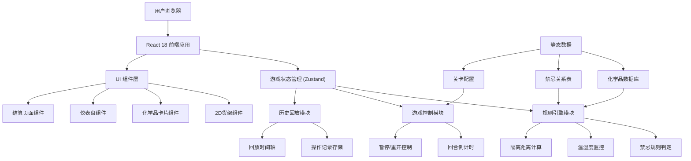
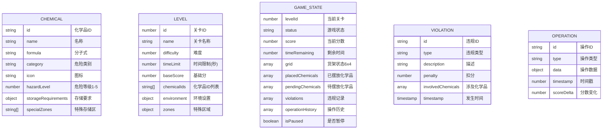

## 1. 架构设计



## 2. 技术描述
- **前端**：React@18 + TypeScript + Vite
- **样式**：TailwindCSS@3 + 自定义CSS变量
- **状态管理**：Zustand（轻量级，适合游戏状态）
- **图标**：Font Awesome Free
- **PDF导出**：jsPDF + html2canvas
- **动画**：Framer Motion（用于交互动画）
- **后端**：无，纯前端静态应用
- **数据库**：LocalStorage（存储游戏历史记录）

## 3. 目录结构
```
src/
├── components/          # UI组件
│   ├── game/           # 游戏相关组件
│   │   ├── Shelf.tsx   # 2D货架组件
│   │   ├── ChemicalCard.tsx  # 化学品卡片
│   │   ├── GridCell.tsx      # 货架格子
│   │   └── ChemicalLibrary.tsx # 化学品库
│   ├── ui/             # 通用UI组件
│   │   ├── Dashboard.tsx      # 仪表盘
│   │   ├── ScorePanel.tsx     # 计分面板
│   │   ├── ControlPanel.tsx   # 操作面板
│   │   └── Timer.tsx          # 倒计时
│   ├── layout/         # 布局组件
│   └── report/         # 报告相关组件
├── store/              # 状态管理
│   └── useGameStore.ts # 游戏状态store
├── types/              # TypeScript类型定义
│   └── index.ts
├── data/               # 静态数据
│   ├── chemicals.ts    # 化学品数据库
│   ├── rules.ts        # 禁忌规则
│   └── levels.ts       # 关卡配置
├── engine/             # 游戏引擎
│   ├── rulesEngine.ts  # 规则引擎
│   ├── scoring.ts      # 计分逻辑
│   └── history.ts      # 历史记录
├── hooks/              # 自定义Hooks
│   ├── useGameLoop.ts  # 游戏循环
│   └── useDragDrop.ts  # 拖放逻辑
├── utils/              # 工具函数
│   ├── export.ts       # 导出工具
│   └── format.ts       # 格式化工具
├── pages/              # 页面组件
│   ├── StartPage.tsx
│   ├── GamePage.tsx
│   └── ResultPage.tsx
└── App.tsx
```

## 4. 路由定义
| Route | 页面 | 用途 |
|-------|------|------|
| `/` | 开始页面 | 关卡选择、游戏介绍 |
| `/game/:levelId` | 游戏页面 | 主游戏界面 |
| `/result/:levelId` | 结算页面 | 分数展示、回放、报告导出 |

## 5. 数据模型

### 5.1 数据模型定义



### 5.2 核心类型定义

```typescript
// 危险类别枚举
enum HazardCategory {
  EXPLOSIVE = 'explosive',      // 爆炸品
  FLAMMABLE = 'flammable',      // 易燃液体
  OXIDIZER = 'oxidizer',        // 氧化剂
  TOXIC = 'toxic',              // 毒害品
  CORROSIVE = 'corrosive',      // 腐蚀品
  COMPRESSED_GAS = 'compressed_gas' // 压缩气体
}

// 腐蚀品子类别
enum CorrosiveSubType {
  ACID = 'acid',       // 酸性
  ALKALI = 'alkali',   // 碱性
  OTHER = 'other'
}

// 存储要求
interface StorageRequirements {
  minTemp: number;      // 最低温度
  maxTemp: number;      // 最高温度
  maxHumidity: number;  // 最高湿度
  isolationDistance: number; // 隔离距离(格数)
}

// 化学品
interface Chemical {
  id: string;
  name: string;
  formula: string;
  category: HazardCategory;
  corrosiveSubType?: CorrosiveSubType;
  icon: string;
  hazardLevel: 1 | 2 | 3 | 4 | 5;
  storageRequirements: StorageRequirements;
  specialZones?: string[];
  description: string;
}

// 格子状态
interface GridCell {
  row: number;
  col: number;
  chemicalId: string | null;
  zoneType: 'normal' | 'explosion_proof' | 'refrigerated' | 'toxic';
  isHighlighted: boolean;
  highlightType: 'valid' | 'invalid' | 'isolation' | null;
}

// 违规记录
interface Violation {
  id: string;
  type: 'adjacency' | 'temperature' | 'isolation' | 'zone' | 'severe';
  description: string;
  penalty: number;
  involvedCells: { row: number; col: number }[];
  timestamp: number;
  isContinuous: boolean;
}

// 操作记录
interface Operation {
  id: string;
  type: 'place' | 'remove' | 'pause' | 'resume' | 'end';
  data: {
    chemicalId?: string;
    from?: { row: number; col: number };
    to?: { row: number; col: number };
  };
  timestamp: number;
  scoreDelta: number;
  violations: Violation[];
}
```

## 6. 规则引擎核心算法

### 6.1 禁忌相邻判定矩阵

| ↓ 左/上 → 右/下 | 爆炸品 | 易燃液体 | 氧化剂 | 毒害品 | 酸性腐蚀 | 碱性腐蚀 | 压缩气体 |
|----------------|--------|----------|--------|--------|----------|----------|----------|
| 爆炸品 | ⚠️警告 | ❌严重 | ❌严重 | ⚠️警告 | ❌严重 | ❌严重 | ❌严重 |
| 易燃液体 | ❌严重 | ✅允许 | ❌严重 | ⚠️警告 | ❌严重 | ❌严重 | ⚠️警告 |
| 氧化剂 | ❌严重 | ❌严重 | ✅允许 | ⚠️警告 | ⚠️警告 | ⚠️警告 | ❌严重 |
| 毒害品 | ⚠️警告 | ⚠️警告 | ⚠️警告 | ✅允许 | ⚠️警告 | ⚠️警告 | ⚠️警告 |
| 酸性腐蚀 | ❌严重 | ❌严重 | ⚠️警告 | ⚠️警告 | ✅允许 | ❌严重 | ⚠️警告 |
| 碱性腐蚀 | ❌严重 | ❌严重 | ⚠️警告 | ⚠️警告 | ❌严重 | ✅允许 | ⚠️警告 |
| 压缩气体 | ❌严重 | ⚠️警告 | ❌严重 | ⚠️警告 | ⚠️警告 | ⚠️警告 | ✅允许 |

### 6.2 隔离距离算法

```typescript
function calculateIsolationDistance(
  cell1: { row: number; col: number },
  cell2: { row: number; col: number }
): number {
  return Math.abs(cell1.row - cell2.row) + Math.abs(cell1.col - cell2.col);
}

function checkIsolationRequirements(
  grid: GridCell[][],
  chemical: Chemical,
  targetCell: { row: number; col: number }
): Violation | null {
  const requiredDistance = chemical.storageRequirements.isolationDistance;
  if (requiredDistance <= 0) return null;

  for (let row = 0; row < grid.length; row++) {
    for (let col = 0; col < grid[row].length; col++) {
      const cell = grid[row][col];
      if (!cell.chemicalId) continue;
      
      const distance = calculateIsolationDistance(targetCell, { row, col });
      if (distance < requiredDistance) {
        return {
          id: generateId(),
          type: 'isolation',
          description: `与${cell.chemicalId}隔离距离不足`,
          penalty: 80,
          involvedCells: [targetCell, { row, col }],
          timestamp: Date.now(),
          isContinuous: false
        };
      }
    }
  }
  return null;
}
```

## 7. 性能优化要点

1. **状态更新优化**：使用Zustand的selector避免不必要的重渲染
2. **规则判定防抖**：批量操作后统一判定，而非每次操作都全量扫描
3. **动画性能**：使用transform和opacity属性，避免布局重排
4. **历史记录压缩**：操作历史采用差量存储，减少内存占用
5. **虚拟滚动**：化学品库超过10个时启用虚拟滚动
