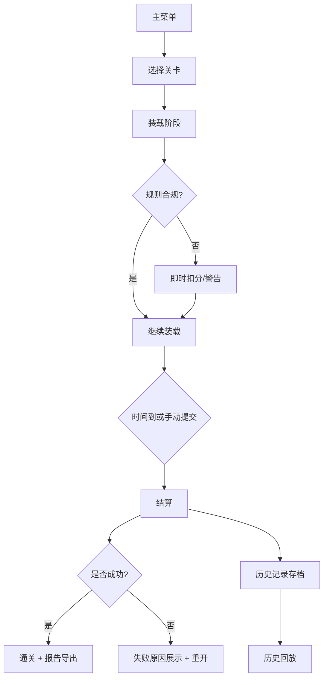

# 冷链车装载游戏 PRD

## 1. 产品概述
一款基于浏览器的 2D 装载模拟器 / 培训小游戏，玩家扮演冷链车装卸工，在限定时间内按温层规则将冻品、冷藏、常温件合理装入车厢并按卸货顺序卸货。目标不是美术堆料，而是规则真实可玩，用于培训和考核温层合规、卸货顺序、时效管理。
- 核心目标：培训冷链装车顺序的业务认知；通过关卡与计分形成正反馈。
- 目标用户：冷链物流培训学员、操作员、内部培训师。
- 价值：通过低门槛互动替代枯燥纸测，错误可视化、可回放，报告可导出留档。

## 2. 核心功能

### 2.1 功能模块
1. **主菜单**：开始、继续、关卡选择、历史回放、设置。
2. **关卡游玩**：2D 网格车厢、货物面板、计时、操作提示、暂停/继续/重开。
3. **温层判定**：邻接判定 + 区域判定，异常即时提示并结算扣分项。
4. **卸货顺序**：关卡指定目的地顺序，后装的先卸；若先卸货被挡住或被压则失败。
5. **计时与升温**：门开倒计时、超时升温，冻品/冷藏超时即判损。
6. **结算报告**：得分、扣分项、失败原因、货物列表、回放帧摘要、可导出 JSON/文本。
7. **历史回放**：保存到本地存储（localStorage），可按时间列出，可逐帧重放。

### 2.2 页面详情
| 页面 | 模块 | 说明 |
|------|------|------|
| 主菜单 | 顶部标题、关卡卡片列表、历史回放入口 | 卡片显示关卡名、星级、最近成绩 |
| 游戏界面 | 车厢网格、货物库、侧边控制面板 | 拖/点选装车、选中车厢格可卸下 |
| 结算弹窗 | 得分、扣分项、失败原因、导出按钮 | 通关/失败两种态，失败可直接重开 |
| 历史回放 | 关卡列表 + 帧播放条 | 显示记录时间、得分；可播放/暂停/拖动 |

## 3. 核心流程
玩家进入主菜单 → 选择关卡 → 读取车厢规格与货物清单 → 逐件拖入车厢格（系统判定：温层冲突、超重、卸货顺序、时限） → 提交/超时 → 进入结算（胜利或失败 + 报告）→ 可进入下一关或查看历史回放。

## 4. 用户界面设计
### 4.1 设计风格
- 主题色：冷库冷蓝 `#0ea5e9` 为冻品层、青柠绿 `#65a30d` 为冷藏、暖橙 `#f97316` 为常温；底色深灰 `#0b1220`。
- 按钮：圆角 6px、高对比描边、hover 投影。
- 字体：标题用 "Space Grotesk" 替代为 "Orbitron" 风格，正文用系统等宽/无衬线；避免 Inter。
- 布局：侧栏式（左货物库 + 中车厢网格 + 右面板）；顶栏显示关卡、时间、暂停按钮。
- 图标：lucide-react。

### 4.2 页面设计概览
| 页面 | 模块 | 视觉元素 |
|------|------|---------|
| 主菜单 | 关卡卡片 | 冷色渐变背景、卡片 hover 浮起、星级角标 |
| 游戏界面 | 车厢网格 | 2D 俯视网格，背景纹理仿保温板；货物色块 + 温层标签 |
| 结算弹窗 | 报告表 | 分条展示扣分项 + 时间轴动画 |
| 历史回放 | 帧播放条 | 拖动滑块高亮对应装载动作 |

### 4.3 响应式
- 桌面优先，布局最小宽度 1024px；窗口窄时侧栏转为上下堆叠。
