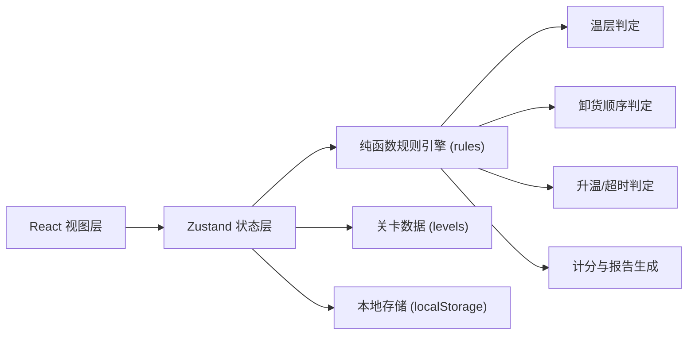

# 技术架构

## 1. 架构设计
纯前端项目：React 18 + TypeScript + Vite + Tailwind CSS。无后端，数据持久化走浏览器 localStorage。



## 2. 技术说明
- 前端：React@18 + TypeScript + Vite + Tailwind CSS + zustand
- 构建：vite-init 脚手架 (`react-ts` 模板)
- 后端：无
- 数据库：localStorage，结构化为 `cold-chain-history` JSON 数组
- 图标：lucide-react

## 3. 路由定义
| 路由 | 用途 |
|------|------|
| `/` | 主菜单 |
| `/play/:levelId` | 关卡游玩 |
| `/replay/:recordId` | 历史回放 |

## 4. 状态模型 (Zustand Store)
- `game`: `status` (idle/playing/paused/won/lost/replaying)、`levelId`、`timeLeft`、`placed`、`unplaced`、`score`、`violations`、`actionsLog`、`doorOpen`、`tempRise`
- `history`: 本地回放记录的增删查

## 5. 数据模型
### 5.1 关卡数据结构
```ts
type Zone = "frozen" | "chilled" | "ambient";
interface Cargo { id: string; name: string; zone: Zone; weight: number; destOrder: number; sku: string; }
interface Cell { x: number; y: number; zone?: Zone; cargoId?: string; }
interface Level {
  id: string;
  name: string;
  description: string;
  gridW: number;
  gridH: number;
  timeLimitSec: number;
  zoneLayout: Zone[][];   // 温层布局
  cargos: Cargo[];
  maxWeightPerRow?: number;
  difficulty: 1|2|3;
}
```

### 5.2 回放记录
```ts
interface ActionFrame { t: number; type: "place"|"unplace"|"pause"|"resume"|"submit"; payload: any; }
interface HistoryRecord {
  id: string;
  levelId: string;
  finishedAt: number;
  score: number;
  result: "won"|"lost";
  reason?: string;
  frames: ActionFrame[];
  report: ReportJSON;
}
```

## 6. 规则引擎（纯函数）
- `checkZoneConflict(cell, cargo, grid)`：货物温层与目标格温层不匹配 → 邻接 4 格是否混入不同温层 → 触发违规扣分。
- `checkUnloadOrder(placed, destOrder)`：先目的地货物必须在"后装"的上方/外侧；被其它货物压住或堵门则判失败。
- `checkTempRise(timeLeft, doorOpen, cargo.zone)`：冻品/冷藏开门超时 → 判损。
- `calcScore(violations, timeBonus)`：基础分 - 每项扣分 + 剩余时间加分。
- `buildReport(...)`：生成结构化结算对象并可导出 JSON/文本。

## 7. 目录结构
```
src/
  components/
    MainMenu.tsx
    Game/GameScreen.tsx
    Game/CargoPallet.tsx
    Game/TruckGrid.tsx
    Game/HUD.tsx
    Game/ResultModal.tsx
    Game/ReplayPlayer.tsx
  pages/
    HomePage.tsx
    PlayPage.tsx
    ReplayPage.tsx
  store/
    useGameStore.ts
    useHistoryStore.ts
  data/
    levels.ts
  rules/
    engine.ts
  types/
    index.ts
  utils/
    storage.ts
    report.ts
```

## 8. 性能与复杂度
- 网格最多 12×8，动作数量级 < 1000，纯前端即可承载。
- 回放采用帧推进而非 video，不占带宽。
- 规则判定 O(W×H)，每动作一次，无性能瓶颈。
