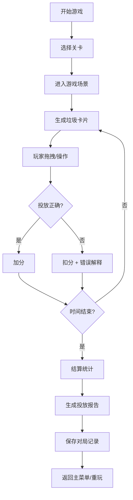

# 小区垃圾投放游戏 - 产品需求文档

## 1. 产品概述

这是一个面向社区居民的垃圾分类教育模拟器游戏，通过真实的投放规则让玩家学习正确的垃圾分类方法。游戏重点在于规则真实性而非美术堆料，让居民在互动中掌握湿垃圾破袋、可回收物污染处理、大件垃圾预约等实际投放难点。

### 目标与价值
- 教育社区居民掌握真实垃圾分类规则
- 通过游戏化方式降低学习门槛
- 针对常见投放错误进行强化训练

---

## 2. 核心功能

### 2.1 用户角色

| 角色 | 登录方式 | 核心权限 |
|------|----------|----------|
| 玩家 | 无需登录 | 游戏游玩、查看历史记录 |

### 2.2 功能模块

1. **主菜单页面**: 游戏标题、关卡选择、规则说明
2. **游戏页面**: 垃圾卡片区、投放桶区、预约点、计时器、计分板
3. **结算页面**: 得分详情、错误分析、投放报告
4. **历史回放页面**: 历史对局记录、操作回放

### 2.3 页面详情

| 页面名称 | 模块名称 | 功能描述 |
|----------|----------|----------|
| 主菜单 | 关卡选择 | 三个难度档位选择、关卡解锁进度 |
| 主菜单 | 规则说明 | 垃圾分类基础规则、特殊处理说明 |
| 游戏页面 | 垃圾卡片区 | 随机生成垃圾卡片、支持拖拽操作 |
| 游戏页面 | 投放桶区 | 四类垃圾桶、时段高亮、污染标记 |
| 游戏页面 | 预约点 | 大件垃圾预约时段、预约操作 |
| 游戏页面 | 游戏控制 | 暂停/继续、重新开始、剩余时间 |
| 游戏页面 | 计分板 | 当前分数、正确/错误统计 |
| 结算页面 | 得分详情 | 各项得分明细、准确率统计 |
| 结算页面 | 错误分析 | 每个错误的具体原因和解释 |
| 结算页面 | 投放报告 | 完整投放记录导出 |
| 历史回放 | 对局列表 | 历史对局记录、时间戳、得分 |
| 历史回放 | 操作回放 | 逐帧回放投放操作 |

---

## 3. 核心流程

### 核心游戏机制说明

1. **垃圾卡片处理**:
   - 普通垃圾: 直接拖拽到对应垃圾桶
   - 湿垃圾: 需先点击"破袋"按钮再投放
   - 被污染的可回收物: 需先点击"清洁"或改为其他分类
   - 大件垃圾: 拖拽到预约点，需在有效时段内

2. **投放规则**:
   - 干垃圾: 黑色桶，接受其他无法分类的垃圾
   - 湿垃圾: 棕色桶，必须破袋后投放
   - 可回收物: 蓝色桶，必须清洁无污染
   - 有害垃圾: 红色桶，特殊危险物品
   - 大件垃圾: 预约点，特定时段开放

3. **失败条件**:
   - 可回收物被污染未处理
   - 湿垃圾未破袋直接投放
   - 大件垃圾错过预约时段
   - 分类错误累计达到阈值

---

## 4. 用户界面设计

### 4.1 设计风格

- **设计方向**: 卡通环保风格，清新明亮
- **主色调**: 绿色系 (#2E7D32) 代表环保，配合各类垃圾桶标准色
- **辅助色**: 可回收蓝 (#1976D2)、湿垃圾棕 (#795548)、有害红 (#D32F2F)、干垃圾黑 (#212121)
- **按钮风格**: 圆润3D按钮，有按压反馈动画
- **字体**: 标题使用圆润卡通字体，正文使用易读无衬线字体
- **布局风格**: 卡片式布局，3D场景置于中央，控制面板环绕
- **图标风格**: 扁平化emoji风格图标，色彩鲜艳

### 4.2 页面设计概览

| 页面名称 | 模块名称 | UI元素 |
|----------|----------|--------|
| 主菜单 | 标题区 | 3D垃圾车动画、游戏标题、副标题 |
| 主菜单 | 关卡选择 | 三个难度卡片、解锁状态、星级评价 |
| 游戏页面 | 3D场景 | 小区投放点场景、四个垃圾桶、预约站 |
| 游戏页面 | 卡片区 | 待处理垃圾卡片队列、拖拽提示 |
| 游戏页面 | 控制面板 | 计时器、分数、暂停按钮、特殊操作按钮 |
| 结算页面 | 得分环 | 环形进度图展示准确率 |
| 结算页面 | 错误列表 | 带图标的错误项、正确做法说明 |
| 历史回放 | 时间轴 | 可拖动时间轴、操作标记点 |

### 4.3 响应式设计

- 桌面端优先设计，支持1280px以上分辨率
- 移动端适配: 垂直布局、触控优化、简化操作
- 拖拽操作同时支持鼠标和触摸事件

### 4.4 3D场景指引

- **环境**: 日间小区场景，清新明亮，有绿化背景
- **光照**: 柔和自然光 + 轻微环境光，营造舒适氛围
- **相机**: 固定正交视角，清晰展示所有投放点
- **核心元素**: 四个彩色3D垃圾桶、预约站、卡片生成台
- **动画**: 垃圾投放抛物线动画、桶盖开合、卡片翻转
- **特效**: 正确投放绿色闪光、错误投放红色震动
- **后处理**: 轻微泛光、色彩增强，保持卡通风格

---

## 5. 关卡设计

### 关卡1: 新手入门
- 垃圾种类: 基础常见垃圾
- 特殊机制: 无复杂处理
- 时间限制: 宽松
- 目标: 熟悉基础分类

### 关卡2: 进阶挑战
- 垃圾种类: 加入湿垃圾(需破袋)、轻度污染可回收物
- 特殊机制: 湿垃圾必须破袋、污染物品需判断
- 时间限制: 适中
- 目标: 掌握特殊处理流程

### 关卡3: 实战模拟
- 垃圾种类: 全类型垃圾，包含大件垃圾
- 特殊机制: 预约时段系统、多种污染情况
- 时间限制: 紧张
- 目标: 综合运用所有规则

