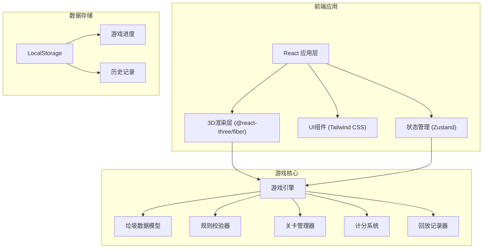

# 小区垃圾投放游戏 - 技术架构文档

## 1. 架构设计



---

## 2. 技术选型说明

### 前端技术栈
- **框架**: React 18 + TypeScript
- **构建工具**: Vite
- **样式方案**: Tailwind CSS 3
- **3D渲染**: Three.js + @react-three/fiber + @react-three/drei
- **状态管理**: Zustand (轻量级状态管理)
- **拖拽库**: @dnd-kit/core (现代拖拽解决方案)
- **动画**: Framer Motion (UI动画) + Three.js动画系统

### 后端
- **无后端**: 纯前端游戏，数据存储于LocalStorage

---

## 3. 路由定义

| 路由 | 页面 | 说明 |
|------|------|------|
| `/` | 主菜单 | 游戏入口，关卡选择 |
| `/game/:levelId` | 游戏页面 | 核心游戏场景 |
| `/result/:gameId` | 结算页面 | 得分与错误分析 |
| `/history` | 历史记录 | 对局列表与回放 |
| `/rules` | 规则说明 | 游戏规则介绍 |

---

## 4. 数据模型

### 4.1 核心数据类型定义

```typescript
// 垃圾分类
type TrashCategory = 'recyclable' | 'wet' | 'dry' | 'hazardous' | 'bulky';

// 垃圾物品定义
interface TrashItem {
  id: string;
  name: string;
  emoji: string;
  category: TrashCategory;
  isContaminated: boolean;      // 是否被污染(可回收物)
  requiresBagBreak: boolean;    // 是否需要破袋(湿垃圾)
  isBagBroken?: boolean;        是否已破袋
  isCleaned?: boolean;          是否已清洁
  description: string;
  correctAction: string;
}

// 关卡配置
interface LevelConfig {
  id: number;
  name: string;
  description: string;
  timeLimit: number;            // 时间限制(秒)
  trashCount: number;           // 垃圾数量
  difficulty: 'easy' | 'medium' | 'hard';
  availableCategories: TrashCategory[];
  hasBagBreakMechanic: boolean;
  hasContaminationMechanic: boolean;
  hasAppointmentMechanic: boolean;
  appointmentSlots?: AppointmentSlot[];
  targetScore: number;
}

// 预约时段
interface AppointmentSlot {
  id: string;
  startTime: number;  // 游戏时间(秒)
  endTime: number;    // 游戏时间(秒)
  isAvailable: boolean;
}

// 游戏状态
interface GameState {
  status: 'idle' | 'playing' | 'paused' | 'ended';
  currentLevel: number;
  score: number;
  timeRemaining: number;
  currentTrashIndex: number;
  trashQueue: TrashItem[];
  correctCount: number;
  wrongCount: number;
  errors: GameError[];
  appointmentSlots: AppointmentSlot[];
  replayActions: ReplayAction[];
}

// 游戏错误记录
interface GameError {
  id: string;
  trashItem: TrashItem;
  wrongAction: string;
  correctAction: string;
  explanation: string;
  timestamp: number;
}

// 回放动作
interface ReplayAction {
  type: 'drop' | 'bagBreak' | 'clean' | 'appoint';
  trashId: string;
  target: string;
  timestamp: number;
  isCorrect: boolean;
}

// 历史对局记录
interface GameRecord {
  id: string;
  levelId: number;
  score: number;
  accuracy: number;
  correctCount: number;
  wrongCount: number;
  duration: number;
  completedAt: string;
  replayActions: ReplayAction[];
  errors: GameError[];
}
```

### 4.2 垃圾数据库示例

| 垃圾名称 | 分类 | 特殊处理 | 说明 |
|---------|------|----------|------|
| 矿泉水瓶 | 可回收 | 污染判断 | 如有油污需清洁或改投干垃圾 |
| 剩菜剩饭 | 湿垃圾 | 需破袋 | 必须破袋后投入湿垃圾桶 |
| 废旧电池 | 有害垃圾 | 无 | 单独投放 |
| 卫生纸 | 干垃圾 | 无 | 遇水即溶，不可回收 |
| 旧沙发 | 大件垃圾 | 需预约 | 需在预约时段投放 |

---

## 5. 核心游戏规则引擎

### 5.1 规则校验器接口

```typescript
interface RuleResult {
  isCorrect: boolean;
  scoreChange: number;
  message: string;
  explanation?: string;
}

interface RuleValidator {
  validate(
    trash: TrashItem,
    target: string,      // 目标桶/预约点ID
    gameState: GameState
  ): RuleResult;
}
```

### 5.2 规则优先级

1. **大件垃圾规则**: 只能投放到预约点，且必须在有效时段内
2. **湿垃圾规则**: 必须破袋后才能投放
3. **可回收物规则**: 被污染的可回收物不能直接投放
4. **分类匹配规则**: 垃圾类别与目标桶必须匹配

---

## 6. 项目目录结构

```
src/
├── components/           # UI组件
│   ├── game/            # 游戏相关组件
│   │   ├── TrashCard.tsx
│   │   ├── TrashBin.tsx
│   │   ├── GameHUD.tsx
│   │   └── AppointmentStation.tsx
│   ├── ui/              # 通用UI组件
│   │   ├── Button.tsx
│   │   ├── Modal.tsx
│   │   └── ProgressBar.tsx
│   └── layout/          # 布局组件
├── scenes/              # 3D场景
│   ├── GameScene.tsx
│   ├── Bin3D.tsx
│   └── Ground.tsx
├── store/               # 状态管理
│   ├── useGameStore.ts
│   └── useHistoryStore.ts
├── data/                # 游戏数据
│   ├── trashItems.ts
│   └── levels.ts
├── engine/              # 游戏引擎
│   ├── rules.ts
│   ├── scoring.ts
│   └── replay.ts
├── hooks/               # 自定义Hooks
│   ├── useGameTimer.ts
│   └── useDragDrop.ts
├── types/               # 类型定义
│   └── index.ts
├── pages/               # 页面组件
│   ├── HomePage.tsx
│   ├── GamePage.tsx
│   ├── ResultPage.tsx
│   └── HistoryPage.tsx
├── utils/               # 工具函数
└── App.tsx
```

---

## 7. 关键技术实现要点

### 7.1 拖拽投放机制
- 使用 @dnd-kit 实现2D卡片拖拽
- 拖拽时3D场景高亮对应投放桶
- 投放时播放抛物线动画

### 7.2 历史回放系统
- 记录每个操作的时间戳和动作类型
- 回放时按时间序列重现操作
- 支持暂停/快进/逐帧控制

### 7.3 3D性能优化
- 复用几何体和材质
- 使用实例化渲染(InstancedMesh)
- 合理设置像素比和阴影质量

### 7.4 数据持久化
- LocalStorage存储游戏进度和历史记录
- 最大保存最近50条对局记录

