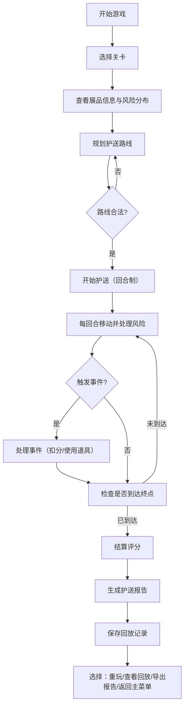

## 1. 产品概述

博物馆展品护送策略游戏，玩家扮演安保人员在闭馆后将珍贵展品从展厅护送至库房，需规划最优路线、规避环境风险、遵守门禁规则，完成护送任务并生成专业报告。

- 核心玩法：回合制路线规划 + 实时风险应对
- 目标用户：策略游戏爱好者、安保培训人员
- 产品价值：兼顾娱乐性与真实安保规则培训

## 2. 核心功能

### 2.1 用户角色
| 角色 | 注册方式 | 核心权限 |
|------|---------|----------|
| 玩家 | 无需注册 | 进行游戏、查看回放、导出报告 |

### 2.2 功能模块
1. **游戏主界面**：Canvas 地图渲染、路线规划、控制面板
2. **关卡系统**：多难度关卡、回合机制、目标展品
3. **风险系统**：湿度区、拥堵通道、未授权门禁、安保巡逻
4. **计分系统**：实时计分、扣分明细、评级判定
5. **回放系统**：历史记录存储、逐帧回放、评分复盘
6. **报告系统**：护送报告生成、失败原因分析、PDF/JSON 导出

### 2.3 功能详情
| 功能模块 | 子模块 | 功能描述 |
|---------|--------|----------|
| 游戏主界面 | 地图渲染 | 2D Canvas 绘制博物馆平面图，包含展厅、通道、库房、门禁、湿度区 |
| 游戏主界面 | 路线规划 | 点击网格规划护送路线，支持撤销、重置、确认 |
| 游戏主界面 | 控制面板 | 开始/暂停/继续/重开按钮，回合信息显示 |
| 关卡系统 | 关卡选择 | 3个难度递增关卡，不同展品类型和风险分布 |
| 关卡系统 | 回合机制 | 每回合移动一格，限时内完成护送 |
| 风险系统 | 湿度区 | 展品经过湿度 > 60% 区域会受损，需绕行或使用干燥剂 |
| 风险系统 | 拥堵通道 | 部分通道在特定回合拥堵，无法通行 |
| 风险系统 | 门禁系统 | 不同门禁需要对应权限卡，未授权开门触发警报 |
| 风险系统 | 安保巡逻 | AI 巡逻路线，被发现则任务失败 |
| 计分系统 | 基础分 | 成功护送得 1000 基础分 |
| 计分系统 | 时间奖励 | 每剩余1回合 +50 分 |
| 计分系统 | 扣分规则 | 错误操作 -100，超时 -200，资源浪费 -150，警报 -300 |
| 回放系统 | 记录存储 | localStorage 保存最近 10 场游戏记录 |
| 回放系统 | 播放控制 | 播放/暂停/快进/逐帧/跳转 |
| 报告系统 | 护送报告 | 包含路线图、风险事件、时间线、评分明细 |
| 报告系统 | 导出功能 | 支持 JSON 格式导出，可打印 |

## 3. 核心流程

## 4. 用户界面设计

### 4.1 设计风格
- 主色调：深蓝（#0a1628）作为背景，营造夜间闭馆氛围
- 强调色：琥珀色（#f59e0b）代表警告/风险，翠绿色（#10b981）代表安全/成功
- 字体：采用等宽字体（JetBrains Mono）增强策略游戏专业感
- 视觉风格：暗色调科技感，带有扫描线和 HUD 元素，模拟安保控制台
- 按钮：圆角矩形，悬停发光效果，点击反馈动画

### 4.2 页面设计
| 页面名称 | 模块名称 | UI 元素 |
|---------|----------|---------|
| 主菜单 | 标题区域 | 游戏标题、动态扫描线效果、装饰性几何图形 |
| 主菜单 | 关卡选择 | 3个关卡卡片，显示难度、展品、预计时间 |
| 主菜单 | 历史记录 | 最近游戏列表，可点击查看回放 |
| 游戏界面 | 顶部状态栏 | 当前关卡、回合数、剩余时间、当前分数 |
| 游戏界面 | Canvas 地图区 | 网格化博物馆平面图，可点击规划路线 |
| 游戏界面 | 右侧信息面板 | 展品信息、风险图例、操作说明 |
| 游戏界面 | 底部控制栏 | 暂停/继续、重开、撤销、确认路线、道具栏 |
| 结算界面 | 评分面板 | 总分、评级、各项得分明细、扣分原因 |
| 结算界面 | 报告预览 | 护送报告缩略图、导出按钮 |
| 回放界面 | 回放控制 | 播放进度条、速度控制、帧跳转 |
| 回放界面 | 评分复盘 | 实时显示当前帧的评分变化 |

### 4.3 响应式设计
- 桌面端为主，Canvas 区域自适应窗口大小
- 最低支持 1280x720 分辨率
- 触控优化：按钮最小 48x48px，支持触屏操作

### 4.4 视觉动效
- 页面加载：元素淡入 + 滑动，错落有致的动画延迟
- 路线规划：点击时网格高亮，路线绘制有轨迹动画
- 风险警告：湿度区有脉冲发光效果，警报时有红色闪烁
- 护送移动：展品图标平滑移动，带有拖尾效果
- 按钮交互：悬停时缩放 + 发光，点击时按压效果
