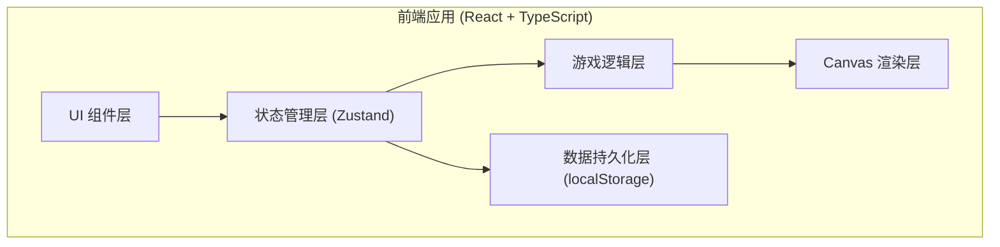

## 1. 架构设计



## 2. 技术描述
- 前端框架：React 18 + TypeScript
- 构建工具：Vite 5
- 样式方案：TailwindCSS 3
- 状态管理：Zustand
- 图标库：Lucide React
- 渲染引擎：HTML5 Canvas 2D
- 数据存储：localStorage（本地存储游戏记录和回放）

## 3. 目录结构

```
src/
├── components/           # React 组件
│   ├── MainMenu.tsx      # 主菜单
│   ├── GameCanvas.tsx    # Canvas 游戏画布
│   ├── ControlPanel.tsx  # 控制面板
│   ├── StatusBar.tsx     # 状态栏
│   ├── InfoPanel.tsx     # 信息面板
│   ├── ResultModal.tsx   # 结算弹窗
│   ├── ReplayPlayer.tsx  # 回放播放器
│   └── ReportViewer.tsx  # 报告查看器
├── store/                # Zustand 状态
│   └── useGameStore.ts   # 游戏全局状态
├── game/                 # 游戏核心逻辑
│   ├── types.ts          # 类型定义
│   ├── levels.ts         # 关卡数据
│   ├── map.ts            # 地图逻辑
│   ├── pathfinding.ts    # 路线规划
│   ├── riskSystem.ts     # 风险系统
│   ├── scoring.ts        # 计分系统
│   ├── replay.ts         # 回放系统
│   └── report.ts         # 报告生成
├── hooks/                # 自定义 Hooks
│   ├── useCanvas.ts      # Canvas 渲染 Hook
│   └── useGameLoop.ts    # 游戏循环 Hook
├── utils/                # 工具函数
│   └── export.ts         # 导出工具
├── pages/                # 页面
│   ├── HomePage.tsx      # 主页
│   ├── GamePage.tsx      # 游戏页
│   └── ReplayPage.tsx    # 回放页
├── App.tsx               # 应用入口
├── main.tsx              # React 入口
└── index.css             # 全局样式
```

## 4. 核心类型定义

```typescript
// 坐标
interface Position {
  x: number;
  y: number;
}

// 格子类型
type CellType = 'floor' | 'wall' | 'door' | 'exhibit' | 'storage' | 'humidity' | 'congestion';

// 门禁类型
interface Door {
  id: string;
  position: Position;
  requiredCard: 'A' | 'B' | 'C';
  isOpen: boolean;
  isAuthorized: boolean;
}

// 湿度区
interface HumidityZone {
  id: string;
  position: Position;
  humidity: number; // 40-100
  radius: number;
}

// 拥堵通道
interface CongestionZone {
  id: string;
  position: Position;
  activeRounds: number[]; // 哪些回合拥堵
}

// 安保人员
interface Guard {
  id: string;
  position: Position;
  patrolPath: Position[];
  currentPathIndex: number;
  visionRange: number;
}

// 展品
interface Exhibit {
  id: string;
  name: string;
  type: 'painting' | 'sculpture' | 'artifact';
  value: number;
  maxHumidity: number; // 最大承受湿度
  startPosition: Position;
}

// 关卡
interface Level {
  id: number;
  name: string;
  difficulty: 'easy' | 'medium' | 'hard';
  gridSize: { width: number; height: number };
  map: CellType[][];
  doors: Door[];
  humidityZones: HumidityZone[];
  congestionZones: CongestionZone[];
  guards: Guard[];
  exhibit: Exhibit;
  storagePosition: Position;
  maxRounds: number;
  availableCards: ('A' | 'B' | 'C')[];
  desiccantCount: number; // 干燥剂数量
}

// 游戏状态
type GamePhase = 'planning' | 'executing' | 'paused' | 'completed' | 'failed';

// 游戏事件
interface GameEvent {
  round: number;
  type: 'move' | 'door_open' | 'humidity' | 'congestion' | 'alert' | 'guard_spotted' | 'item_used';
  position: Position;
  description: string;
  scoreChange: number;
}

// 游戏记录
interface GameRecord {
  id: string;
  timestamp: number;
  levelId: number;
  totalScore: number;
  rating: 'S' | 'A' | 'B' | 'C' | 'D';
  success: boolean;
  failReason?: string;
  events: GameEvent[];
  path: Position[];
  totalRounds: number;
}

// 回放状态
interface ReplayState {
  isPlaying: boolean;
  currentFrame: number;
  speed: number;
  record: GameRecord | null;
}
```

## 5. 核心算法

### 5.1 路线合法性检查
```typescript
function validatePath(
  path: Position[],
  level: Level,
  availableCards: string[]
): { valid: boolean; errors: string[] } {
  // 1. 检查路径连续性（每步只能走相邻格子）
  // 2. 检查是否穿过墙壁
  // 3. 检查门禁权限
  // 4. 检查起点和终点是否正确
}
```

### 5.2 评分算法
```typescript
function calculateScore(events: GameEvent[], maxRounds: number, usedRounds: number): {
  baseScore: number;
  timeBonus: number;
  penalties: { type: string; amount: number }[];
  totalScore: number;
  rating: 'S' | 'A' | 'B' | 'C' | 'D';
} {
  const baseScore = 1000;
  const timeBonus = Math.max(0, (maxRounds - usedRounds) * 50);
  const penalties = events.filter(e => e.scoreChange < 0).map(e => ({
    type: e.type,
    amount: Math.abs(e.scoreChange)
  }));
  const totalScore = baseScore + timeBonus + events.reduce((sum, e) => sum + e.scoreChange, 0);
  
  // 评级
  if (totalScore >= 1200) return { ..., rating: 'S' };
  if (totalScore >= 1000) return { ..., rating: 'A' };
  if (totalScore >= 800) return { ..., rating: 'B' };
  if (totalScore >= 600) return { ..., rating: 'C' };
  return { ..., rating: 'D' };
}
```

### 5.3 安保巡逻 AI
```typescript
function updateGuard(guard: Guard, playerPos: Position): {
  guard: Guard;
  spotted: boolean;
} {
  // 沿巡逻路径移动
  // 检查视野范围内是否有玩家
  // 返回更新后的 guard 和是否发现玩家
}
```

## 6. 状态管理

### 6.1 Zustand Store
```typescript
interface GameState {
  // 游戏状态
  phase: GamePhase;
  currentLevel: Level | null;
  currentRound: number;
  playerPosition: Position;
  plannedPath: Position[];
  events: GameEvent[];
  
  // 资源
  availableCards: ('A' | 'B' | 'C')[];
  desiccantCount: number;
  
  // 计分
  score: number;
  
  // 操作
  setLevel: (level: Level) => void;
  planPath: (path: Position[]) => void;
  startExecution: () => void;
  executeStep: () => void;
  pause: () => void;
  resume: () => void;
  restart: () => void;
  useDesiccant: () => void;
  openDoor: (doorId: string) => void;
}
```

## 7. Canvas 渲染流程

1. **地图渲染**：遍历网格绘制地板、墙壁、门
2. **区域渲染**：绘制湿度区（半透明蓝色渐变）、拥堵区（橙色闪烁）
3. **元素渲染**：绘制展品、库房、安保人员
4. **路线渲染**：绘制规划路线（虚线）和已走路线（实线）
5. **UI 覆盖层**：绘制网格线、坐标、风险提示
6. **动画效果**：展品移动动画、警报闪烁、扫描线效果

## 8. 数据持久化

- 使用 localStorage 存储最近 10 条游戏记录
- Key: `museum_escort_records`
- 数据格式：`GameRecord[]`
- 回放时从 localStorage 读取完整记录进行逐帧播放
