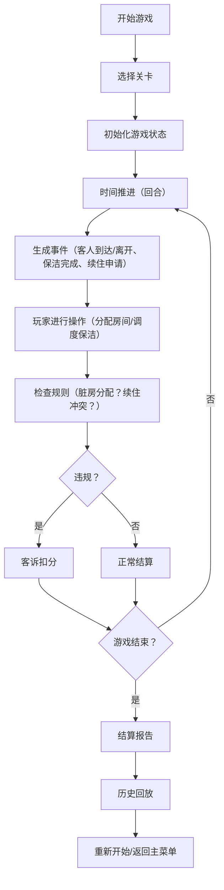

## 1. 产品概述

酒店客房调度游戏是一款模拟酒店前台运营的策略类小游戏，玩家扮演酒店前台经理，通过合理分配客房、处理客人需求、调度保洁人员来维持酒店正常运营。游戏重点在于规则真实可玩，考验玩家的资源调度和危机处理能力。

- 核心玩法：处理早到客人、续住申请、保洁延迟等真实酒店运营场景
- 目标用户：喜欢策略模拟类游戏的玩家、酒店从业人员培训使用

## 2. 核心功能

### 2.1 用户角色
| 角色 | 说明 | 核心权限 |
|------|------|----------|
| 玩家 | 酒店前台经理 | 客房分配、保洁调度、处理申请、查看报告 |

### 2.2 功能模块
1. **游戏主界面**：客房状态看板、时间轴、客人队列、操作面板
2. **关卡系统**：多关卡难度递进、回合制时间推进
3. **状态管理**：暂停/继续、重新开始、历史回放
4. **计分系统**：客诉扣分、满意度评分、结算报告
5. **数据导出**：游戏结算报告导出

### 2.3 页面详情
| 页面名称 | 模块名称 | 功能描述 |
|----------|----------|----------|
| 游戏主界面 | 客房状态看板 | 显示所有房间状态（空房/脏房/维修中/已入住） |
| 游戏主界面 | 时间轴组件 | 显示当前时间、客人预计到达/离开时间、保洁进度 |
| 游戏主界面 | 客人队列 | 显示等待入住的客人信息、特殊需求 |
| 游戏主界面 | 操作面板 | 分配房间、调度保洁、处理续住、标记维修 |
| 游戏主界面 | 计分面板 | 实时分数、客诉次数、满意度百分比 |
| 结算界面 | 结算报告 | 显示本局游戏详细数据、失败原因、评分 |
| 结算界面 | 历史回放 | 回放本局关键事件时间线 |
| 关卡选择 | 关卡列表 | 选择不同难度的关卡场景 |

## 3. 核心流程

## 4. 用户界面设计

### 4.1 设计风格
- **主色调**：深蓝色系（#1a365d）代表专业稳重，配合金色（#d4af37）点缀代表酒店品质
- **辅助色**：绿色（#48bb78）表示可用/完成、黄色（#ecc94b）表示警告、红色（#f56565）表示紧急/错误
- **按钮风格**：圆角矩形，轻微阴影，hover时有浮起效果
- **字体**：主要使用 Inter 字体，数字使用等宽字体确保对齐
- **布局风格**：卡片式布局，清晰的信息层级，网格系统确保对齐
- **图标风格**：简约线性图标，使用 Font Awesome 风格

### 4.2 页面设计概述
| 页面名称 | 模块名称 | UI元素 |
|----------|----------|--------|
| 游戏主界面 | 客房看板 | 网格布局的房间卡片，颜色区分状态，悬停显示详情 |
| 游戏主界面 | 时间轴 | Canvas绘制的横向时间轴，事件点标记，可拖拽查看 |
| 游戏主界面 | 客人队列 | 垂直列表，客人头像、姓名、到达时间、特殊需求标签 |
| 游戏主界面 | 操作面板 | 底部固定栏，大按钮方便点击，状态提示 |
| 结算界面 | 报告面板 | 居中卡片布局，数据可视化图表，关键指标高亮 |

### 4.3 响应式
- Desktop-first设计，主分辨率1920x1080
- 适配1366x768及以上分辨率
- Canvas区域自适应窗口大小
- 触摸设备优化按钮大小

## 5. 游戏规则设计

### 5.1 房间状态
- **空房（绿色）**：干净可分配
- **脏房（黄色）**：客人已离开，等待保洁
- **已入住（蓝色）**：有客人
- **维修中（红色）**：不可使用
- **续住（紫色）**：客人申请续住，需要确认

### 5.2 核心规则
- 脏房不能直接分配给新客人，必须先完成保洁
- 续住申请需要在客人离开前处理，否则客人流失
- 维修房需要标记并安排维修，期间不可分配
- 客人早到但房间未准备好会产生客诉
- 保洁延迟会导致脏房堆积，产生客诉

### 5.3 计分规则
- 成功入住：+10分
- 客人满意度高：+5分
- 客诉一次：-15分
- 超时处理申请：-10分
- 游戏失败条件：满意度低于30% 或 客诉超过5次
