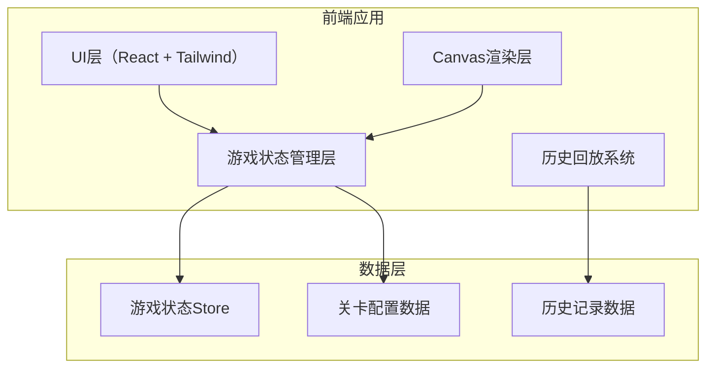

## 1. 架构设计



## 2. 技术描述

- **前端框架**：React@18 + TypeScript
- **构建工具**：Vite@5
- **样式方案**：TailwindCSS@3
- **状态管理**：Zustand（轻量级状态管理）
- **Canvas渲染**：原生Canvas 2D API
- **图标**：Lucide React
- **后端**：无（纯前端游戏）
- **数据持久化**：LocalStorage（保存历史记录和最高分）

## 3. 目录结构

```
src/
├── components/          # React组件
│   ├── GameBoard.tsx    # 游戏主界面
│   ├── RoomGrid.tsx     # 客房网格
│   ├── Timeline.tsx     # 时间轴组件
│   ├── GuestQueue.tsx   # 客人队列
│   ├── ControlPanel.tsx # 操作面板
│   ├── ScorePanel.tsx   # 计分面板
│   ├── Settlement.tsx   # 结算界面
│   └── ReplayPlayer.tsx # 回放播放器
├── game/                # 游戏核心逻辑
│   ├── types.ts         # 类型定义
│   ├── state.ts         # 状态管理
│   ├── engine.ts        # 游戏引擎
│   ├── rules.ts         # 规则校验
│   └── levels.ts        # 关卡配置
├── hooks/               # 自定义Hooks
│   └── useGameLoop.ts   # 游戏循环Hook
├── utils/               # 工具函数
│   ├── canvas.ts        # Canvas绘制工具
│   └── export.ts        # 报告导出工具
└── App.tsx              # 应用入口
```

## 4. 数据模型

### 4.1 核心类型定义

```typescript
// 房间状态
type RoomStatus = 'empty' | 'dirty' | 'occupied' | 'maintenance' | 'extend';

interface Room {
  id: number;
  number: string;
  floor: number;
  status: RoomStatus;
  guestId?: string;
  cleanProgress?: number;
  maintenanceProgress?: number;
}

// 客人状态
type GuestStatus = 'waiting' | 'checked-in' | 'checked-out' | 'complained';

interface Guest {
  id: string;
  name: string;
  arrivalTime: number;
  departureTime: number;
  actualArrivalTime?: number;
  status: GuestStatus;
  satisfaction: number;
  hasExtendRequest: boolean;
  extendNights?: number;
  specialRequest?: string;
  roomId?: number;
}

// 保洁人员
interface Cleaner {
  id: string;
  name: string;
  status: 'idle' | 'cleaning';
  currentRoomId?: number;
  progress: number;
}

// 游戏状态
interface GameState {
  status: 'menu' | 'playing' | 'paused' | 'settlement' | 'replay';
  currentLevel: number;
  currentTime: number;
  rooms: Room[];
  guests: Guest[];
  cleaners: Cleaner[];
  score: number;
  complaints: number;
  satisfaction: number;
  events: GameEvent[];
  history: HistoryRecord[];
}

// 游戏事件
interface GameEvent {
  id: string;
  type: 'guest_arrive' | 'guest_depart' | 'clean_complete' | 'extend_request' | 'complaint';
  time: number;
  data: any;
}

// 历史记录
interface HistoryRecord {
  time: number;
  state: GameState;
  action: PlayerAction;
}
```

### 4.2 关卡配置

```typescript
interface LevelConfig {
  id: number;
  name: string;
  description: string;
  difficulty: 'easy' | 'medium' | 'hard';
  roomCount: number;
  cleanerCount: number;
  duration: number; // 游戏时长（分钟）
  guestArrivalRate: number; // 客人到达频率
  events: LevelEvent[]; // 预设事件
  winConditions: {
    minSatisfaction: number;
    maxComplaints: number;
    minScore: number;
  };
}
```

## 5. 核心模块设计

### 5.1 游戏引擎 (game/engine.ts)

- 负责时间推进和事件生成
- 处理玩家操作并更新状态
- 调用规则校验器检查违规
- 记录历史操作用于回放

### 5.2 规则校验器 (game/rules.ts)

- 检查脏房分配
- 检查续住冲突
- 检查维修房误放
- 计算客诉和满意度变化

### 5.3 回放系统 (game/replay.ts)

- 录制每一步游戏状态
- 支持按时间轴回放
- 支持暂停/快进/后退
- 与正常游戏状态隔离

### 5.4 Canvas时间轴 (components/Timeline.tsx)

- 绘制时间刻度
- 标记客人到达/离开事件
- 显示保洁进度条
- 支持拖拽和缩放

## 6. 状态管理原则

1. **单一数据源**：所有游戏状态存储在Zustand Store中
2. **不可变更新**：状态更新使用不可变方式
3. **动作隔离**：玩家操作通过action函数执行
4. **历史记录**：每帧状态快照保存用于回放
5. **状态纯净**：重开游戏时状态完全重置，无残留

## 7. 报告导出

- 导出格式：JSON + 文本报告
- 包含数据：总分、客诉次数、满意度、关键事件时间线
- 支持下载保存到本地
