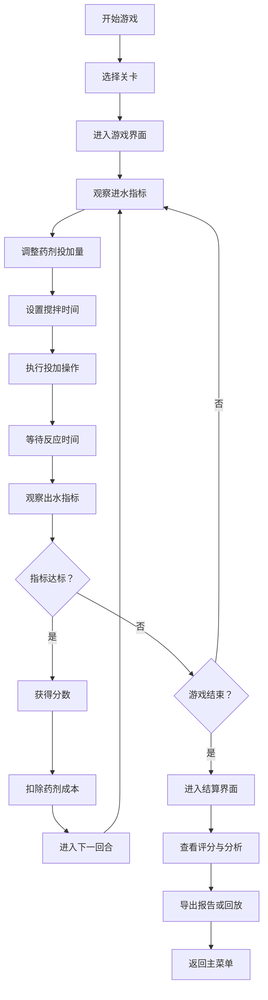

## 1. 产品概述
污水厂药剂投加游戏是一款面向环保培训新人的模拟经营类网页游戏，通过真实的污水处理药剂投加规则，让玩家理解药剂投加量与水质指标的关系，掌握成本控制的重要性。

- 核心目的：通过游戏化方式教授污水处理药剂投加知识，避免超量投加造成的成本浪费
- 目标用户：环保行业新人、污水处理厂操作员、相关专业学生
- 产品价值：将复杂的污水处理知识转化为可交互、可重复的游戏体验，降低学习门槛

## 2. 核心功能

### 2.1 用户角色
| 角色 | 注册方式 | 核心权限 |
|------|----------|----------|
| 玩家 | 无需注册 | 游戏游玩、查看历史记录、导出报告 |

### 2.2 功能模块
1. **主菜单**：关卡选择、游戏说明、历史记录
2. **游戏界面**：处理池模拟、参数控制、实时指标曲线、计分面板
3. **结算界面**：评分展示、失败原因分析、运行报告导出
4. **历史回放**：操作记录回放、指标变化复盘

### 2.3 页面详情
| 页面名称 | 模块名称 | 功能描述 |
|-----------|-------------|---------------------|
| 主菜单 | 关卡选择 | 三个难度关卡展示、解锁状态、关卡规则预览 |
| 主菜单 | 游戏说明 | 药剂投加规则、水质指标说明、操作指南 |
| 主菜单 | 历史记录 | 过往游戏记录、最高分展示 |
| 游戏界面 | 处理池模拟 | 2D可视化处理池、进水/出水动画展示 |
| 游戏界面 | 参数控制 | 药剂投加量滑块、搅拌时间滑块、投加按钮 |
| 游戏界面 | 指标曲线 | 实时水质指标折线图、阈值警戒线 |
| 游戏界面 | 计分面板 | 当前分数、成本消耗、剩余时间/回合 |
| 游戏界面 | 游戏控制 | 暂停/继续、重新开始、退出游戏 |
| 结算界面 | 评分展示 | 最终得分、星级评价、各项指标评分 |
| 结算界面 | 失败分析 | 失败原因（超量/反弹/搅拌不足）、改进建议 |
| 结算界面 | 报告导出 | 运行报告生成、JSON/TXT格式导出 |
| 历史回放 | 操作回放 | 时间轴控制、操作步骤回放 |
| 历史回放 | 指标复盘 | 关键指标变化对比、决策点分析 |

## 3. 核心流程

## 4. 用户界面设计

### 4.1 设计风格
- **主色调**：工业蓝（#165DFF）作为主色，代表专业与科技感；环保绿（#00B42A）作为成功色，代表水质达标
- **辅助色**：警告橙（#FF7D00）、危险红（#F53F3F）用于指标异常提示
- **按钮风格**：圆角矩形按钮，带有微妙的阴影效果，悬浮时有轻微放大动画
- **字体**：使用 JetBrains Mono 作为数字显示字体，保证数据可读性；使用 Noto Sans SC 作为中文显示字体
- **布局风格**：仪表盘式布局，左侧为处理池模拟区，右侧为参数控制区，底部为指标曲线区
- **图标风格**：线性图标，简洁明了，符合工业控制系统的视觉语言

### 4.2 页面设计概述
| 页面名称 | 模块名称 | UI元素 |
|-----------|-------------|-------------|
| 主菜单 | 关卡卡片 | 渐变背景卡片、关卡难度标识、解锁状态图标、规则摘要 |
| 游戏界面 | 处理池模拟 | 2D俯视图、进/出水口动画、药剂投加动画、搅拌效果可视化 |
| 游戏界面 | 参数滑块 | 自定义样式滑块、实时数值显示、单位标签、安全范围标识 |
| 游戏界面 | 指标曲线 | 多色折线图、阈值虚线、时间轴、数据点悬停提示 |
| 结算界面 | 评分面板 | 大数字得分展示、星级动画、环形进度图展示各项指标 |
| 历史回放 | 时间轴 | 可拖动进度条、关键事件标记、播放/暂停控制 |

### 4.3 响应性
- 采用桌面优先设计，最低适配分辨率 1280×720
- 主要游戏区域使用固定比例布局，保证模拟效果的一致性
- 参数控制面板可根据屏幕宽度自适应排列
- 移动端简化界面，保留核心游戏功能

### 4.4 2D模拟指导
- **处理池视觉**：使用CSS渐变模拟水体深度，添加波纹动画表现搅拌效果
- **药剂投加**：使用粒子效果模拟药剂溶解扩散过程
- **水质变化**：通过水体颜色渐变直观反映水质改善/恶化
- **指标反馈**：超阈值时使用闪烁动画和颜色变化提示玩家
- **过渡动画**：各状态切换使用平滑过渡，提升操作手感
