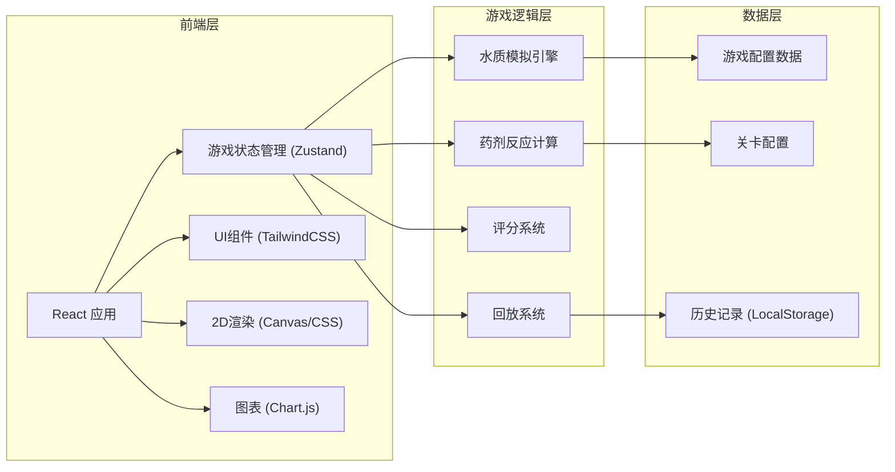

## 1. 架构设计



## 2. 技术描述
- **前端框架**: React@18 + TypeScript
- **构建工具**: Vite@5
- **样式方案**: TailwindCSS@3
- **状态管理**: Zustand@4
- **图表库**: Chart.js@4 + react-chartjs-2
- **图标库**: Lucide React
- **数据持久化**: LocalStorage
- **2D渲染**: 原生 Canvas API + CSS Animations

## 3. 路由定义
| 路由 | 页面 | 功能 |
|-------|------|------|
| / | 主菜单 | 关卡选择、游戏说明、历史记录入口 |
| /game/:levelId | 游戏界面 | 核心游戏玩法、参数控制、实时模拟 |
| /result/:gameId | 结算界面 | 评分展示、失败分析、报告导出 |
| /replay/:gameId | 历史回放 | 操作回放、指标复盘 |

## 4. 数据模型

### 4.1 游戏状态模型
```typescript
interface GameState {
  currentLevel: Level | null;
  phase: 'menu' | 'playing' | 'paused' | 'ended';
  round: number;
  maxRounds: number;
  score: number;
  totalCost: number;
  tankState: TankState;
  waterQuality: WaterQuality;
  actions: GameAction[];
  startTime: number;
  endTime: number | null;
  failReason: string | null;
}

interface TankState {
  volume: number;
  chemicalAmount: number;
  stirringTime: number;
  isStirring: boolean;
}

interface WaterQuality {
  cod: number;
  nh3n: number;
  tp: number;
  ph: number;
  timestamp: number;
}
```

### 4.2 关卡配置模型
```typescript
interface Level {
  id: string;
  name: string;
  difficulty: 'easy' | 'medium' | 'hard';
  description: string;
  maxRounds: number;
  initialWaterQuality: WaterQuality;
  targetThresholds: WaterQuality;
  chemicalCost: number;
  stirringCostPerSecond: number;
  parameters: LevelParameters;
}

interface LevelParameters {
  chemicalEfficiency: number;
  reboundFactor: number;
  minStirringTime: number;
  maxChemicalDose: number;
  incomingWaterVariation: number;
}
```

### 4.3 游戏历史记录
```typescript
interface GameRecord {
  id: string;
  levelId: string;
  levelName: string;
  score: number;
  totalCost: number;
  roundsCompleted: number;
  success: boolean;
  failReason: string | null;
  startTime: number;
  endTime: number;
  actions: GameAction[];
  qualityHistory: WaterQuality[];
}
```

## 5. 核心算法

### 5.1 药剂反应计算
```
投加后水质指标 = 当前指标 × (1 - 药剂效率 × min(投加量/最优量, 1.5))
搅拌效果 = min(搅拌时间 / 最少搅拌时间, 1)
最终指标 = 投加后指标 × (1 - 搅拌效果 × 0.3)
```

### 5.2 指标反弹计算
```
反弹量 = (投加量 - 最优量) × 反弹系数 × 指标值
下一回合指标 = 当前指标 + 反弹量 + 进水波动
```

### 5.3 评分算法
```
基础分 = 达标回合数 × 100
成本扣分 = 实际成本 / 最优成本 × 50
搅拌扣分 = 搅拌不足次数 × 20
超量扣分 = 严重超量次数 × 30
最终得分 = max(基础分 - 成本扣分 - 搅拌扣分 - 超量扣分, 0)
星级 = 得分 / 满分 × 3 取整
```

## 6. 目录结构
```
src/
├── components/
│   ├── game/
│   │   ├── TankSimulation.tsx
│   │   ├── ControlPanel.tsx
│   │   ├── QualityChart.tsx
│   │   └── ScoreBoard.tsx
│   ├── menu/
│   │   ├── LevelCard.tsx
│   │   └── GameGuide.tsx
│   ├── result/
│   │   ├── ScoreDisplay.tsx
│   │   ├── FailureAnalysis.tsx
│   │   └── ReportExport.tsx
│   └── replay/
│       ├── Timeline.tsx
│       └── ReplayControls.tsx
├── store/
│   └── useGameStore.ts
├── utils/
│   ├── simulation.ts
│   ├── scoring.ts
│   └── export.ts
├── data/
│   └── levels.ts
├── types/
│   └── index.ts
├── pages/
│   ├── Menu.tsx
│   ├── Game.tsx
│   ├── Result.tsx
│   └── Replay.tsx
└── App.tsx
```
