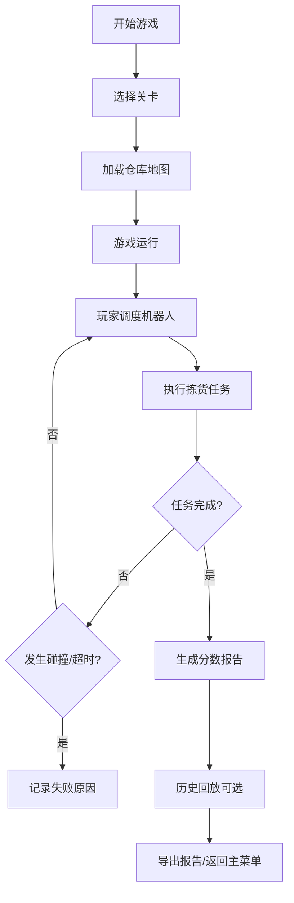

## 1. 产品概述

仓储机器人避障游戏是一款基于网格调度的策略模拟游戏，玩家扮演仓储调度员，指挥多台机器人在仓库内完成订单拣货任务。核心挑战在于避免机器人碰撞、管理电量、确保订单时效。

- **目标用户**：物流/仓储从业者、策略游戏爱好者、技术分享听众
- **核心价值**：以游戏化方式展示真实仓储调度的挑战，寓教于乐

## 2. 核心 Features

### 2.1 用户角色
| 角色 | 注册方式 | 核心权限 |
|------|----------|----------|
| 玩家 | 无需注册 | 完整游戏体验、关卡挑战、报告导出 |

### 2.2 功能模块
1. **主菜单页面**：关卡选择、游戏说明、历史记录
2. **游戏主界面**：3D仓库场景、实时控制面板、状态监控
3. **结算报告页面**：详细得分分析、失败原因、优化建议

### 2.3 页面详情
| 页面名称 | 模块名称 | Feature 描述 |
|----------|----------|--------------|
| 主菜单 | 关卡选择 | 3个难度关卡（新手/进阶/专家），解锁机制 |
| 主菜单 | 游戏说明 | 规则说明、操作指南、计分规则详解 |
| 游戏界面 | 3D场景 | 可旋转视角的仓库3D视图，支持2D/3D切换 |
| 游戏界面 | 机器人调度 | 点击选择机器人，点击目标点指派任务 |
| 游戏界面 | 实时监控 | 电量显示、任务进度、订单倒计时 |
| 游戏界面 | 游戏控制 | 暂停/继续、重新开始、速度调节（1x/2x/4x） |
| 结算报告 | 得分详情 | 基础分、各项扣分明细、最终评级 |
| 结算报告 | 失败分析 | 碰撞记录、超时订单、电量耗尽事件 |
| 结算报告 | 历史回放 | 可回放本局游戏，查看关键节点 |
| 结算报告 | 报告导出 | 导出JSON格式的详细调度报告 |

## 3. 核心流程

### 游戏规则说明
1. **网格系统**：仓库为N×M网格，每个格子可容纳一个实体（机器人/货架/障碍物）
2. **机器人属性**：
   - 移动速度：1格/秒
   - 电量：100%满电，移动消耗1%/格
   - 充电：在充电点恢复5%/秒
3. **订单系统**：
   - 每个订单包含多个货架拣货点
   - 订单有时间限制，超时扣分
4. **碰撞检测**：
   - 两机器人同一格：碰撞失败
   - 交叉移动（交换位置）：碰撞失败
5. **计分规则**：
   - 基础分：完成每个订单 +100分
   - 效率奖励：提前完成订单 +50分/分钟
   - 错误扣分：
     - 机器人碰撞：-200分/次
     - 订单超时：-100分/分钟
     - 电量耗尽：-150分/次
     - 无效路径：-20分/次

## 4. 用户界面设计

### 4.1 设计风格
- **主色调**：工业蓝（#1E3A5F）作为主色，橙黄（#F59E0B）作为强调色
- **视觉风格**：科技感工业风，网格线清晰，实体区分度高
- **字体**：JetBrains Mono（等宽字体，适合数据展示）+ Noto Sans SC
- **布局**：左侧3D场景（70%），右侧控制面板（30%）
- **交互**：悬停高亮、点击选中、平滑动画过渡

### 4.2 页面设计概览
| 页面名称 | 模块名称 | UI 元素 |
|----------|----------|---------|
| 游戏主界面 | 3D场景 | 半透明网格地板、低多边形货架、发光机器人、路径线可视化 |
| 游戏主界面 | 控制面板 | 机器人状态卡片、订单列表、操作按钮组、计分板 |
| 结算报告 | 得分面板 | 环形进度条、扣分明细条形图、评级徽章 |
| 结算报告 | 回放控制 | 时间轴滑块、播放/暂停、帧步进按钮 |

### 4.3 响应式
- 桌面端：左右分栏布局（1280px+）
- 平板端：上下布局，场景在上控制在下（768px-1279px）
- 移动端：简化场景，触控优化（<768px）

### 4.4 3D 场景指导
- **环境**：简约仓库环境，聚光灯照明，适当的环境光遮蔽
- **相机**：45度俯视角，支持轨道控制（旋转/缩放/平移）
- **动画**：机器人移动使用线性插值，路径显示为半透明线条
- **视觉反馈**：
  - 选中机器人：外发光效果
  - 路径规划：从起点到终点的预览线
  - 碰撞：红色闪烁+警告音效
  - 充电：蓝色呼吸灯效果
