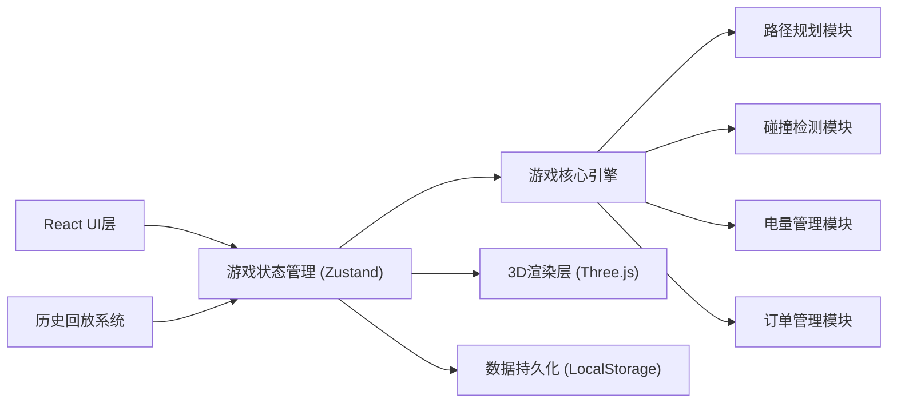

## 1. 架构设计



## 2. 技术选型

- **前端框架**: React@18 + TypeScript
- **构建工具**: Vite@5
- **样式方案**: TailwindCSS@3
- **3D渲染**: Three.js + @react-three/fiber + @react-three/drei
- **状态管理**: Zustand
- **路由**: React Router@6
- **图标**: Lucide React

## 3. 目录结构

```
src/
├── components/          # React组件
│   ├── ui/             # 基础UI组件
│   ├── game/           # 游戏相关组件
│   ├── layout/         # 布局组件
│   └── report/         # 报告相关组件
├── store/              # Zustand状态管理
│   ├── gameStore.ts    # 游戏主状态
│   └── replayStore.ts  # 回放状态
├── game/               # 游戏核心逻辑
│   ├── engine.ts       # 游戏引擎
│   ├── pathfinding.ts  # A*路径规划
│   ├── collision.ts    # 碰撞检测
│   ├── robot.ts        # 机器人类
│   ├── order.ts        # 订单类
│   └── levels.ts       # 关卡定义
├── hooks/              # 自定义Hooks
├── types/              # TypeScript类型定义
├── utils/              # 工具函数
├── pages/              # 页面组件
└── App.tsx             # 应用入口
```

## 4. 路由定义

| 路由 | 页面 | 用途 |
|------|------|------|
| `/` | 主菜单 | 关卡选择、游戏说明 |
| `/game/:levelId` | 游戏主界面 | 游戏运行、机器人调度 |
| `/report/:gameId` | 结算报告 | 得分分析、历史回放、报告导出 |

## 5. 核心数据模型

### 5.1 类型定义

```typescript
// 坐标点
interface Position {
  x: number;
  y: number;
}

// 机器人
interface Robot {
  id: string;
  name: string;
  position: Position;
  targetPosition?: Position;
  battery: number; // 0-100
  status: 'idle' | 'moving' | 'charging' | 'picking' | 'dead';
  path: Position[];
  currentOrderId?: string;
  color: string;
}

// 货架
interface Shelf {
  id: string;
  position: Position;
  hasGoods: boolean;
  goodsType?: string;
}

// 订单
interface Order {
  id: string;
  items: { shelfId: string; quantity: number }[];
  createdAt: number;
  deadline: number;
  status: 'pending' | 'in_progress' | 'completed' | 'timeout';
  assignedRobotId?: string;
}

// 障碍物
interface Obstacle {
  id: string;
  position: Position;
  type: 'wall' | 'pillar';
}

// 充电点
interface ChargingStation {
  id: string;
  position: Position;
}

// 关卡
interface Level {
  id: string;
  name: string;
  difficulty: 'easy' | 'medium' | 'hard';
  gridSize: { width: number; height: number };
  robots: Robot[];
  shelves: Shelf[];
  obstacles: Obstacle[];
  chargingStations: ChargingStation[];
  orders: Order[];
  timeLimit: number; // 秒
}

// 游戏事件（用于回放）
interface GameEvent {
  timestamp: number;
  type: 'move' | 'collision' | 'pick' | 'charge' | 'order_complete' | 'battery_dead';
  data: Record<string, any>;
}

// 游戏记录
interface GameRecord {
  id: string;
  levelId: string;
  startTime: number;
  endTime: number;
  score: Score;
  events: GameEvent[];
  finalState: {
    robots: Robot[];
    orders: Order[];
  };
}

// 得分
interface Score {
  baseScore: number;
  efficiencyBonus: number;
  collisionPenalty: number;
  timeoutPenalty: number;
  batteryPenalty: number;
  invalidPathPenalty: number;
  total: number;
  rating: 'S' | 'A' | 'B' | 'C' | 'D' | 'F';
}
```

### 5.2 游戏状态

```typescript
interface GameState {
  // 游戏配置
  level: Level | null;
  gameSpeed: 1 | 2 | 4;
  isPaused: boolean;
  isGameOver: boolean;
  
  // 游戏实体
  robots: Robot[];
  orders: Order[];
  
  // 选中状态
  selectedRobotId: string | null;
  hoveredPosition: Position | null;
  
  // 时间
  gameTime: number; // 游戏运行时间（秒）
  
  // 计分
  score: Score;
  
  // 事件记录
  events: GameEvent[];
  
  // Actions
  startGame: (levelId: string) => void;
  pauseGame: () => void;
  resumeGame: () => void;
  restartGame: () => void;
  setGameSpeed: (speed: 1 | 2 | 4) => void;
  selectRobot: (robotId: string | null) => void;
  assignTarget: (robotId: string, target: Position) => void;
  tick: (deltaTime: number) => void;
}
```

## 6. 核心算法

### 6.1 A*路径规划
- 网格图遍历
- 曼哈顿距离作为启发函数
- 支持动态避障（考虑其他机器人位置）

### 6.2 碰撞检测
- 位置重叠检测
- 路径交叉检测（交换位置）
- 每帧更新检测

### 6.3 游戏主循环
- 使用 requestAnimationFrame
- 固定时间步长更新逻辑
- 插值渲染平滑动画
