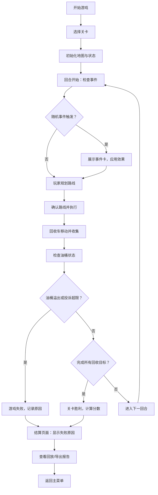

## 1. 产品概述

餐厨油脂回收游戏是一款2D策略模拟游戏，玩家扮演城市管理科的回收调度员，负责安排餐厨油脂回收车的行驶路线，在有限时间内收集餐馆产生的废弃油脂，避免油桶溢出引发市民投诉。游戏强调真实的规则设计和策略深度，而非美术效果，核心挑战在于路线规划、容量管理和突发事件处理。

- 核心目标：通过合理规划回收路线，在限定回合内完成所有餐馆的油脂回收，避免油桶溢出和投诉事件
- 目标用户：城市管理从业者、策略游戏爱好者、学生群体

## 2. 核心功能

### 2.1 用户角色

| 角色 | 注册方式 | 核心权限 |
|------|----------|----------|
| 玩家 | 无需注册，直接进入 | 进行游戏、查看历史记录、导出结算报告 |

### 2.2 功能模块

1. **游戏主界面**：2D地图展示、餐馆与油桶状态、回收车位置、信息面板
2. **路线规划模块**：点击规划路线、路径预览、路线确认
3. **回合管理模块**：回合推进、暂停/继续、重新开始
4. **事件系统模块**：随机事件卡、投诉事件处理
5. **容量管理模块**：油桶容量监控、车辆容量管理、溢出判定
6. **结算报告模块**：回合结算、失败原因分析、分数计算
7. **历史回放模块**：游戏记录存储、步骤回放、导出报告
8. **关卡系统模块**：多难度关卡、边界案例关卡

### 2.3 页面详情

| 页面名称 | 模块名称 | 功能描述 |
|----------|----------|----------|
| 主菜单页 | 关卡选择 | 展示所有可用关卡，显示难度星级、目标分数 |
| 主菜单页 | 历史记录 | 展示已完成游戏的历史记录列表 |
| 游戏主界面 | 2D地图区域 | 网格地图，显示道路、餐馆、回收站位置 |
| 游戏主界面 | 信息面板 | 显示当前回合、分数、投诉次数、车辆状态 |
| 游戏主界面 | 路线规划栏 | 显示已规划路线、距离预估、容量预估 |
| 游戏主界面 | 控制按钮 | 暂停/继续、重新开始、结束回合、查看报告 |
| 事件弹窗 | 事件卡展示 | 显示随机事件内容、影响范围、可选处理方式 |
| 结算页面 | 结算报告 | 详细展示本关各项数据、失败原因（如失败）、分数明细 |
| 结算页面 | 历史回放 | 可逐帧回放本关的操作过程 |
| 结算页面 | 报告导出 | 可导出JSON格式的完整结算报告 |

## 3. 核心流程

玩家进入游戏后选择关卡，在2D网格地图上观察餐馆分布和油桶状态，规划回收车的行驶路线。每回合开始时可能触发随机事件，玩家需要根据事件调整策略。确认路线后回收车自动执行，收集油脂返回回收站。若任何餐馆油桶溢出或投诉次数达到上限，游戏失败。完成所有回收目标后进入结算页面，可查看详细报告和历史回放。

## 4. 用户界面设计

### 4.1 设计风格

- **主色调**：深蓝色（#1e3a5f）代表专业和城市管理，搭配暖橙色（#e67e22）作为警示色（油桶接近满时），红色（#c0392b）表示溢出危险
- **辅助色**：绿色（#27ae60）表示正常状态，灰色（#7f8c8d）表示道路和背景
- **按钮风格**：扁平化圆角按钮，悬停时有轻微放大和阴影效果，禁用状态呈半透明灰色
- **字体**：标题使用"Noto Sans SC Bold"，正文使用"Noto Sans SC Regular"，数字使用等宽字体增强可读性
- **布局风格**：左侧为游戏地图区域（占70%宽度），右侧为信息和控制面板（占30%宽度），采用卡片式设计区分不同功能模块
- **图标风格**：使用简洁的SVG图标，餐馆用🍴餐具图标，油桶用🛢️油桶图标，回收车用🚛卡车图标，道路用浅灰色线条

### 4.2 页面设计概览

| 页面名称 | 模块名称 | UI元素 |
|----------|----------|--------|
| 主菜单页 | 关卡选择 | 卡片式关卡列表，显示难度星级、目标分数、地图预览缩略图 |
| 主菜单页 | 历史记录 | 可滚动列表，显示日期、关卡名称、最终分数、胜负状态 |
| 游戏主界面 | 2D地图区域 | 网格背景、可交互餐馆节点、油桶容量条、回收车精灵、路线高亮 |
| 游戏主界面 | 信息面板 | 回合数、当前分数、投诉次数（带进度条）、车辆容量条 |
| 游戏主界面 | 餐馆详情 | 鼠标悬停显示餐馆名称、油桶当前量/容量、预计每回合增量 |
| 游戏主界面 | 路线规划栏 | 已选节点列表、预计行驶距离、预计收集量、操作按钮 |
| 游戏主界面 | 控制按钮区 | 暂停按钮、重开按钮、结束回合按钮、查看报告按钮 |
| 事件弹窗 | 事件卡 | 大卡片居中展示，事件标题、描述、影响说明、确认按钮 |
| 结算页面 | 报告头部 | 胜负状态大字显示、关卡名称、最终分数、总回合数 |
| 结算页面 | 分数明细 | 各项得分/扣分列表，带图标和数值 |
| 结算页面 | 失败原因 | 红色高亮显示，具体到哪个餐馆在第几回合溢出 |
| 结算页面 | 回放控制 | 播放/暂停、上一步/下一步、进度滑块、速度调节 |
| 结算页面 | 导出按钮 | 导出JSON报告按钮，带复制到剪贴板功能 |

### 4.3 响应式设计

- 采用桌面优先设计，主界面最小支持宽度1280px
- 在屏幕宽度小于1024px时，右侧控制面板移至底部，改为上下布局
- 地图区域自适应缩放，保持网格清晰可辨
- 触摸设备支持点击规划路线，长按查看详情

### 4.4 动画与交互

- 页面加载时，各模块采用淡入+向上滑动的错落动画（延迟50ms逐级）
- 回收车移动采用平滑的CSS transition，速度根据距离动态调整
- 油桶容量接近满时（>80%），容量条会有轻微的脉冲动画提醒
- 事件卡弹出时带有缩放和阴影动画
- 路线规划时，鼠标悬停的节点会有高亮和放大效果
- 结算页面数据采用数字滚动动画，从0滚动到最终值
