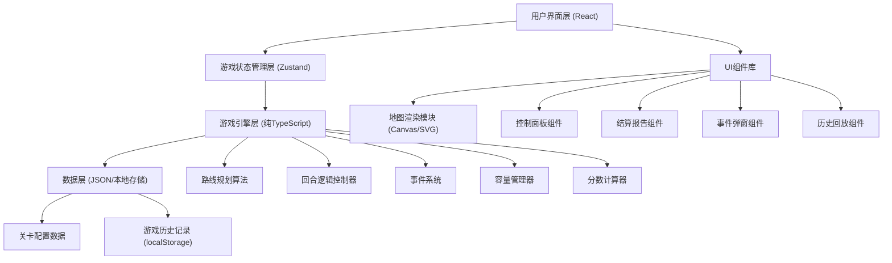

## 1. 架构设计



## 2. 技术描述

- **前端框架**：React@18 + TypeScript + Vite
- **状态管理**：Zustand（轻量级，适合游戏状态管理）
- **样式方案**：TailwindCSS@3 + CSS变量
- **地图渲染**：HTML5 Canvas（2D网格地图，性能更好）
- **图标方案**：Lucide React + 自定义SVG图标
- **数据存储**：localStorage（存储游戏历史记录）
- **动画方案**：Framer Motion（用于UI过渡动画）
- **构建工具**：Vite@5

## 3. 目录结构

```
src/
├── types/              # 类型定义
│   └── game.ts         # 游戏核心类型
├── data/               # 静态数据
│   ├── levels.ts       # 关卡配置
│   └── events.ts       # 事件卡配置
├── engine/             # 游戏引擎（纯逻辑，无React依赖）
│   ├── GameEngine.ts   # 游戏主引擎
│   ├── RoutePlanner.ts # 路线规划算法
│   ├── TurnManager.ts  # 回合管理
│   ├── EventSystem.ts  # 事件系统
│   └── ScoreCalculator.ts # 分数计算
├── store/              # 状态管理
│   └── useGameStore.ts # Zustand store
├── components/         # React组件
│   ├── GameMap/        # 地图渲染组件
│   ├── ControlPanel/   # 控制面板
│   ├── InfoPanel/      # 信息面板
│   ├── EventModal/     # 事件弹窗
│   ├── Settlement/     # 结算页面
│   ├── Replay/         # 回放组件
│   └── MainMenu/       # 主菜单
├── hooks/              # 自定义Hooks
│   ├── useGameLoop.ts  # 游戏循环Hook
│   └── useReplay.ts    # 回放控制Hook
├── utils/              # 工具函数
│   ├── storage.ts      # 本地存储
│   └── export.ts       # 报告导出
├── App.tsx             # 应用入口
├── main.tsx            # React入口
└── index.css           # 全局样式
```

## 4. 核心数据模型

### 4.1 类型定义

```mermaid
erDiagram
    LEVEL ||--o{ RESTAURANT : contains
    LEVEL ||--o{ ROAD : contains
    LEVEL ||--|| STATION : has
    GAME ||--|| LEVEL : uses
    GAME ||--o{ TURN : has
    TURN ||--o{ ACTION : has
    TURN ||--o| EVENT : triggers
    GAME ||--|| TRUCK : has
    RESTAURANT ||--|| OIL_BARREL : has
    TRUCK ||--o{ RESTAURANT : visits
    GAME ||--|| HISTORY : produces
    
    LEVEL {
        string id
        string name
        int difficulty
        int maxTurns
        int maxComplaints
        int gridWidth
        int gridHeight
    }
    
    RESTAURANT {
        string id
        string name
        int x
        int y
        int oilPerTurn
    }
    
    OIL_BARREL {
        int capacity
        int currentAmount
        bool isOverflowing
    }
    
    TRUCK {
        int capacity
        int currentLoad
        int x
        int y
        int maxDistance
    }
    
    EVENT {
        string id
        string title
        string description
        string type
        int effectValue
        string affectedTarget
    }
    
    HISTORY {
        string id
        datetime timestamp
        string levelId
        int finalScore
        bool isWin
        string failureReason
        TURN[] turns
    }
```



### 4.2 TypeScript核心类型

```typescript
// 位置坐标
interface Position {
  x: number;
  y: number;
}

// 餐馆
interface Restaurant {
  id: string;
  name: string;
  position: Position;
  oilPerTurn: number;
  barrelCapacity: number;
  currentOil: number;
}

// 回收站
interface Station {
  id: string;
  name: string;
  position: Position;
}

// 道路
interface Road {
  from: Position;
  to: Position;
  distance: number;
}

// 回收车
interface Truck {
  capacity: number;
  currentLoad: number;
  position: Position;
  maxDistancePerTurn: number;
}

// 事件卡
interface GameEvent {
  id: string;
  title: string;
  description: string;
  type: 'positive' | 'negative' | 'neutral';
  effect: {
    type: 'oil_increase' | 'complaint' | 'capacity_change' | 'road_block';
    value: number;
    target?: string;
  };
}

// 路线节点
interface RouteNode {
  type: 'restaurant' | 'station';
  id: string;
  position: Position;
}

// 单回合动作
interface TurnAction {
  turn: number;
  route: RouteNode[];
  totalDistance: number;
  collectedOil: Record<string, number>;
  complaints: number;
}

// 游戏状态
interface GameState {
  level: Level;
  restaurants: Restaurant[];
  station: Station;
  truck: Truck;
  currentTurn: number;
  score: number;
  complaints: number;
  isPaused: boolean;
  isGameOver: boolean;
  isWin: boolean;
  failureReason?: string;
  currentEvent?: GameEvent;
  plannedRoute: RouteNode[];
  turnHistory: TurnAction[];
}

// 关卡配置
interface Level {
  id: string;
  name: string;
  difficulty: 1 | 2 | 3 | 4 | 5;
  description: string;
  maxTurns: number;
  maxComplaints: number;
  targetScore: number;
  gridSize: { width: number; height: number };
  restaurants: Omit<Restaurant, 'currentOil'>[];
  station: Station;
  truck: Omit<Truck, 'position'>;
  eventProbability: number;
}
```

## 5. 核心算法

### 5.1 路线规划算法
- 使用曼哈顿距离计算两点间距离
- 检查路线总距离是否超出车辆每回合最大行驶距离
- 检查车辆容量是否足够容纳计划收集的油脂
- 自动计算最优返回回收站的路径

### 5.2 溢出判定逻辑
- 每回合结束后，所有餐馆油桶自动增加 oilPerTurn
- 若 currentOil > barrelCapacity，则触发溢出
- 每次溢出增加1次投诉，扣减分数
- 投诉次数达到 maxComplaints 则游戏失败

### 5.3 分数计算规则
- 基础分：完成每回合 +100 分
- 效率奖：剩余行驶距离 × 2 分
- 容量奖：车辆容量利用率 × 50 分
- 溢出惩罚：每次溢出 -200 分
- 投诉惩罚：每次投诉 -150 分
- 回合奖励：提前完成每剩余回合 +300 分

## 6. 历史回放数据格式

```json
{
  "id": "game_20240101_123456",
  "timestamp": "2024-01-01T12:34:56Z",
  "levelId": "level_001",
  "levelName": "新手教学",
  "isWin": true,
  "finalScore": 2850,
  "totalTurns": 8,
  "maxTurns": 10,
  "failureReason": null,
  "turns": [
    {
      "turn": 1,
      "route": [
        {"type": "restaurant", "id": "r1", "position": {"x": 2, "y": 3}},
        {"type": "station", "id": "s1", "position": {"x": 5, "y": 5}}
      ],
      "collectedOil": {"r1": 15},
      "complaintsThisTurn": 0,
      "scoreThisTurn": 180,
      "restaurantStates": [
        {"id": "r1", "currentOil": 0, "isOverflowing": false}
      ]
    }
  ]
}
```
