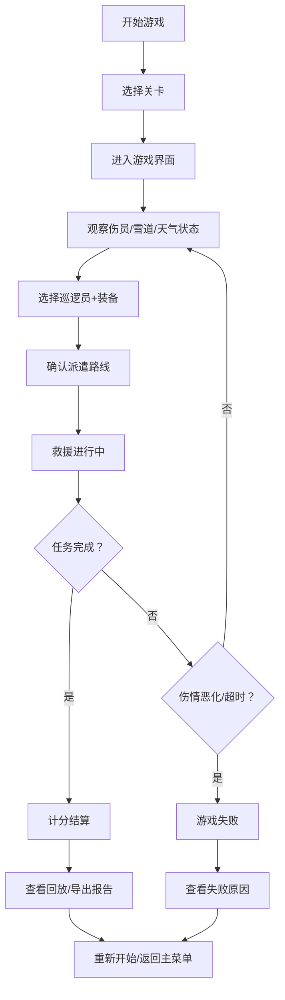

## 1. 产品概述

滑雪救援派遣游戏是一款针对雪场巡逻员培训的严肃游戏模拟器，玩家扮演救援调度员，在真实的雪场环境中处理伤员救援任务。游戏核心在于装备匹配、路线规划、伤情管理的策略决策，而非美术效果。

- **核心目标**：培训巡逻员的救援派遣决策能力，处理装备不匹配、路线关闭、伤情恶化等常见难点
- **目标用户**：雪场管理人员、巡逻员培训师、应急救援爱好者
- **产品价值**：提供低风险的训练环境，提升救援响应效率和决策质量

## 2. 核心功能

### 2.1 用户角色
| 角色 | 注册方式 | 核心权限 |
|------|----------|----------|
| 玩家 | 无需注册，本地游玩 | 完整游戏体验、查看历史回放、导出救援报告 |

### 2.2 功能模块
1. **游戏主界面**：3D雪场场景、2D调度地图、实时状态栏
2. **关卡系统**：多难度关卡、回合制任务、动态事件
3. **救援调度**：巡逻员派遣、装备选择、路线规划
4. **状态管理**：暂停/继续、重新开始、游戏重置
5. **结算系统**：计分计算、失败原因分析、评级展示
6. **历史回放**：游戏记录存储、回放控制、评分回顾
7. **报告导出**：救援报告生成、PDF/JSON导出

### 2.3 页面详情
| 页面名称 | 模块名称 | 功能描述 |
|-----------|----------|----------|
| 主菜单 | 开始游戏、关卡选择、历史记录 | 游戏入口、关卡难度选择、查看历史对局 |
| 游戏主界面 | 3D场景、2D地图、控制面板 | 实时显示雪场状态、伤员位置、巡逻员状态，进行调度操作 |
| 装备选择面板 | 装备列表、属性展示、确认选择 | 为派遣任务选择合适的救援装备 |
| 暂停菜单 | 继续、重新开始、返回主菜单 | 游戏暂停时的操作选项 |
| 结算页面 | 得分详情、失败原因、评级 | 展示本局游戏的详细结果和分析 |
| 回放页面 | 时间轴、播放控制、关键事件 | 回放历史对局，查看关键决策点 |
| 报告页面 | 救援详情、统计数据、导出按钮 | 生成并导出完整的救援任务报告 |

## 3. 核心流程

玩家从主菜单选择关卡开始游戏，进入游戏界面后观察雪场状态和伤员信息，选择巡逻员和装备进行派遣，监控救援过程中伤情变化和路线状况，在时间压力下完成所有救援任务或任务失败，最终查看结算结果并可回放或导出报告。

## 4. 用户界面设计

### 4.1 设计风格
- **主色调**：冰雪蓝 (#165DFF) 作为主色，白色/浅灰为背景，橙色 (#FF7D00) 作为警示/行动色
- **按钮风格**：圆角矩形，微立体效果，悬停时有颜色过渡动画
- **字体**：标题使用 Noto Sans SC Bold，正文使用 Noto Sans SC Regular，数字使用等宽字体
- **布局风格**：三栏式布局（左：信息面板，中：3D/2D场景，右：控制面板），卡片式模块化设计
- **图标风格**：使用线性图标，统一24px尺寸，颜色与主题一致

### 4.2 页面设计概述
| 页面名称 | 模块名称 | UI元素 |
|-----------|----------|---------|
| 游戏主界面 | 3D场景模块 | 雪道模型、巡逻员模型、伤员标记、天气粒子效果、动画过渡 |
| 游戏主界面 | 2D地图模块 | 俯视图、雪道连线、位置标记、状态颜色编码、缩放拖动 |
| 游戏主界面 | 状态栏 | 倒计时、得分、天气图标、伤情警示、实时刷新 |
| 装备选择面板 | 装备卡片 | 图标、名称、属性值、适用伤情、选中高亮 |
| 结算页面 | 结果展示 | 大字号得分、评级徽章、动画效果展开详情 |
| 回放页面 | 时间轴 | 进度条、关键事件标记、播放/暂停/快进控制 |

### 4.3 响应式
- 桌面端优先设计，最小支持1280px宽度
- 控制面板在小屏幕可折叠为侧边栏
- 3D场景自适应容器大小，保持宽高比

### 4.4 3D场景指引
- **环境**：雪山滑雪场场景，使用程序化生成的雪地地形，多雪道布局
- **光照**：自然光+环境光，模拟白天雪地光照效果，雪面有高光反射
- **相机**：默认第三人称视角，可旋转缩放，聚焦于主要救援区域
- **交互**：点击雪道/伤员/巡逻员显示详细信息，悬停有高亮效果
- **动画**：巡逻员移动动画、伤员状态变化、天气粒子效果（降雪、雾）
- **后处理**：轻微泛光效果，增强雪地质感，雾气渐变效果
- **性能**：使用低多边形模型，实例化渲染，目标帧率60fps

## 5. 游戏规则

### 5.1 核心要素
- **雪道系统**：不同难度（绿/蓝/黑/双黑），可动态关闭，影响通行时间
- **伤员系统**：不同伤情（轻伤/中度/重伤/危重），随时间恶化，有救援时间窗口
- **巡逻员系统**：不同技能等级、速度、专长，有疲劳值
- **装备系统**：雪橇、雪地摩托、担架、医疗包、AED等，各有适用场景
- **天气系统**：晴天、小雪、大雪、暴风雪，影响视野和移动速度

### 5.2 计分规则
- 成功救援一名伤员：+100~500分（根据伤情）
- 快速救援奖励：剩余时间越多奖励越高
- 装备匹配奖励：正确装备+50分
- 路线选择奖励：最优路线+30分
- 伤员恶化惩罚：-100分
- 救援失败惩罚：-200分
- 超时：游戏结束

### 5.3 失败条件
- 任意伤员伤情恶化至死亡
- 总时间耗尽
- 关键装备缺失导致无法完成救援
