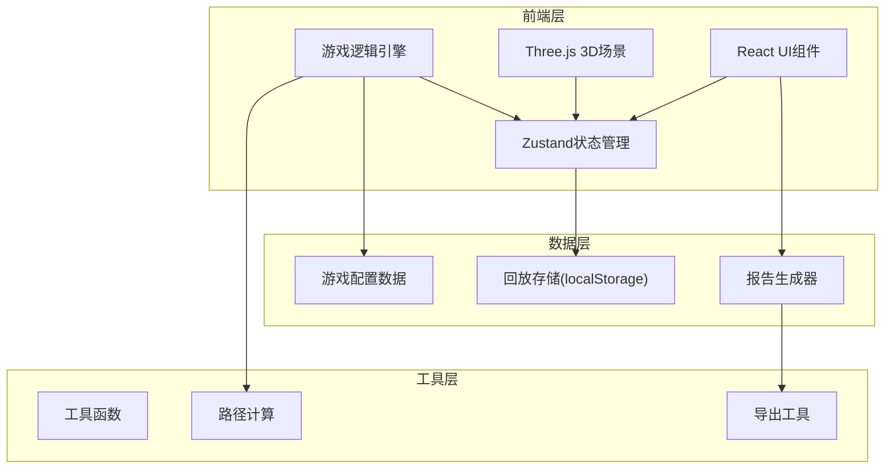

## 1. 架构设计



## 2. 技术描述

- **前端框架**：React@18 + TypeScript
- **构建工具**：Vite@5
- **样式方案**：TailwindCSS@3
- **状态管理**：Zustand
- **3D渲染**：Three.js + @react-three/fiber + @react-three/drei
- **后处理**：@react-three/postprocessing
- **路由**：react-router-dom@6
- **图标**：lucide-react
- **数据存储**：localStorage（回放记录）
- **报告导出**：jsPDF（PDF）+ JSON序列化

## 3. 路由定义

| 路由 | 页面组件 | 用途 |
|-------|----------|------|
| / | MainMenu | 主菜单页面 |
| /game/:levelId | GamePage | 游戏主界面 |
| /result/:gameId | ResultPage | 结算页面 |
| /replay/:gameId | ReplayPage | 历史回放页面 |
| /report/:gameId | ReportPage | 报告导出页面 |

## 4. 数据模型

### 4.1 核心类型定义

```typescript
// 雪道难度
type SlopeDifficulty = 'green' | 'blue' | 'black' | 'double_black';

// 伤情等级
type InjurySeverity = 'minor' | 'moderate' | 'severe' | 'critical';

// 天气类型
type WeatherType = 'clear' | 'light_snow' | 'heavy_snow' | 'blizzard';

// 装备类型
type EquipmentType = 'skis' | 'snowmobile' | 'stretcher' | 'medkit' | 'aed' | 'oxygen';

// 游戏状态
type GameStatus = 'menu' | 'playing' | 'paused' | 'victory' | 'defeat';

interface Position {
  x: number;
  y: number;
  z: number;
}

interface Slope {
  id: string;
  name: string;
  difficulty: SlopeDifficulty;
  start: Position;
  end: Position;
  isOpen: boolean;
  baseTravelTime: number;
}

interface Victim {
  id: string;
  name: string;
  position: Position;
  slopeId: string;
  injury: InjurySeverity;
  requiredEquipment: EquipmentType[];
  timeRemaining: number;
  maxTime: number;
  isRescued: boolean;
}

interface Patroller {
  id: string;
  name: string;
  skillLevel: number;
  speed: number;
  specialties: SlopeDifficulty[];
  fatigue: number;
  status: 'idle' | 'dispatched' | 'returning';
  position: Position;
  currentVictimId?: string;
}

interface Equipment {
  type: EquipmentType;
  name: string;
  icon: string;
  speedBonus: number;
  applicableInjuries: InjurySeverity[];
  requiredFor: InjurySeverity[];
}

interface LevelConfig {
  id: string;
  name: string;
  description: string;
  difficulty: number;
  timeLimit: number;
  slopes: Slope[];
  victims: Victim[];
  patrollers: Patroller[];
  initialWeather: WeatherType;
  weatherEvents: WeatherEvent[];
}

interface WeatherEvent {
  time: number;
  type: WeatherType;
  duration: number;
}

interface GameState {
  status: GameStatus;
  currentLevelId: string;
  timeElapsed: number;
  timeLimit: number;
  score: number;
  weather: WeatherType;
  slopes: Slope[];
  victims: Victim[];
  patrollers: Patroller[];
  selectedPatrollerId?: string;
  selectedVictimId?: string;
  selectedEquipment: EquipmentType[];
  dispatchHistory: DispatchRecord[];
  keyEvents: GameEvent[];
}

interface DispatchRecord {
  id: string;
  timestamp: number;
  patrollerId: string;
  victimId: string;
  equipment: EquipmentType[];
  route: string[];
  estimatedTime: number;
  actualTime?: number;
  success: boolean;
}

interface GameEvent {
  timestamp: number;
  type: 'dispatch' | 'rescue' | 'deterioration' | 'weather_change' | 'slope_close' | 'victory' | 'defeat';
  data: Record<string, unknown>;
}

interface ReplayData {
  id: string;
  levelId: string;
  startTime: number;
  endTime: number;
  finalScore: number;
  result: 'victory' | 'defeat';
  events: GameEvent[];
  stateSnapshots: { timestamp: number; state: Partial<GameState> }[];
}
```

### 4.2 状态管理结构

```typescript
// Zustand Store
interface GameStore {
  // 状态
  gameState: GameState;
  replayMode: boolean;
  replayData?: ReplayData;
  replayTime: number;
  
  // 动作
  startGame: (levelId: string) => void;
  pauseGame: () => void;
  resumeGame: () => void;
  restartGame: () => void;
  endGame: (victory: boolean) => void;
  
  selectPatroller: (id: string) => void;
  selectVictim: (id: string) => void;
  toggleEquipment: (type: EquipmentType) => void;
  confirmDispatch: () => boolean;
  
  updateGame: (deltaTime: number) => void;
  
  // 回放
  loadReplay: (replayId: string) => void;
  seekReplay: (time: number) => void;
  playReplay: () => void;
  pauseReplay: () => void;
  
  // 存储
  saveReplay: () => void;
  getReplayList: () => ReplayData[];
  deleteReplay: (id: string) => void;
  
  // 报告
  generateReport: () => ReportData;
  exportReportPDF: () => void;
  exportReportJSON: () => void;
}
```

## 5. 项目结构

```
src/
├── components/
│   ├── game/
│   │   ├── Game3DScene.tsx      # 3D场景组件
│   │   ├── Game2DMap.tsx        # 2D地图组件
│   │   ├── StatusBar.tsx        # 状态栏
│   │   ├── VictimPanel.tsx      # 伤员信息面板
│   │   ├── PatrollerPanel.tsx   # 巡逻员面板
│   │   ├── EquipmentSelector.tsx # 装备选择器
│   │   └── PauseMenu.tsx        # 暂停菜单
│   ├── ui/
│   │   ├── Button.tsx
│   │   ├── Card.tsx
│   │   ├── ProgressBar.tsx
│   │   └── Modal.tsx
│   ├── menu/
│   │   ├── MainMenu.tsx
│   │   └── LevelSelect.tsx
│   ├── result/
│   │   ├── ResultScreen.tsx
│   │   └── ScoreBreakdown.tsx
│   ├── replay/
│   │   ├── ReplayPlayer.tsx
│   │   └── Timeline.tsx
│   └── report/
│       └── ReportView.tsx
├── pages/
│   ├── MainMenuPage.tsx
│   ├── GamePage.tsx
│   ├── ResultPage.tsx
│   ├── ReplayPage.tsx
│   └── ReportPage.tsx
├── store/
│   └── useGameStore.ts          # Zustand状态管理
├── game/
│   ├── engine/
│   │   ├── GameEngine.ts        # 游戏核心引擎
│   │   ├── PathFinder.ts        # 路径计算
│   │   └── ScoreCalculator.ts   # 计分逻辑
│   ├── data/
│   │   ├── levels.ts            # 关卡配置
│   │   ├── equipment.ts         # 装备数据
│   │   └── constants.ts         # 游戏常量
│   └── types/
│       └── index.ts             # 类型定义
├── utils/
│   ├── replayStorage.ts         # 回放存储
│   ├── reportGenerator.ts       # 报告生成
│   └── export.ts                # 导出工具
├── hooks/
│   ├── useGameLoop.ts           # 游戏循环Hook
│   └── useWeatherEffects.ts     # 天气效果Hook
├── App.tsx
├── main.tsx
└── index.css
```

## 6. 核心实现要点

### 6.1 游戏循环
使用 `requestAnimationFrame` 实现主循环，每帧更新：
- 游戏时间流逝
- 伤员伤情恶化检查
- 巡逻员位置更新
- 天气事件触发
- 胜利/失败条件检测

### 6.2 路径寻找
基于雪道连接图实现A*寻路算法，考虑：
- 雪道难度与巡逻员技能匹配
- 雪道开放/关闭状态
- 天气对移动速度的影响
- 装备速度加成

### 6.3 回放系统
- 关键帧快照 + 事件记录双轨制
- 快照每5秒保存一次完整状态
- 事件记录精确到毫秒的操作
- 回放时通过插值实现平滑动画

### 6.4 报告生成
- 收集本局所有关键数据
- 生成统计图表（救援时间分布、得分构成）
- 支持PDF和JSON两种格式导出
