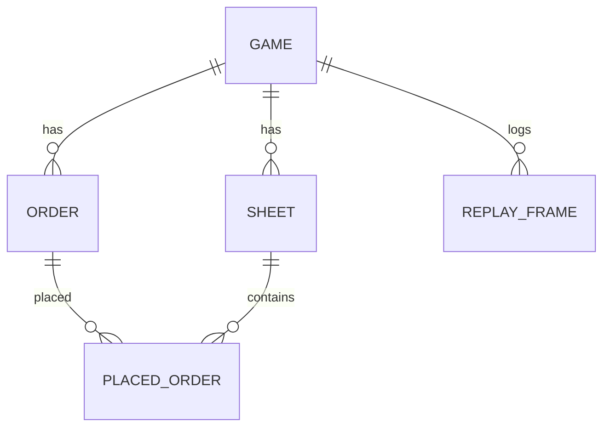

# 印刷排产拼版游戏 - 技术架构

## 1. 架构设计
纯前端单页应用，无后端，无外部服务。回放与报告均通过 localStorage / Blob 导出实现。

```mermaid
flowchart LR
    "浏览器" --> "React + Vite"
    "React + Vite" --> "Zustand 状态层"
    "Zustand 状态层" --> "Canvas 2D 渲染模块"
    "Zustand 状态层" --> "拼版算法模块"
    "Zustand 状态层" --> "回合结算模块"
    "回合结算模块" --> "回放日志"
    "回放日志" --> "localStorage / Blob 导出"
```

## 2. 技术说明
- **前端**：React 18 + TypeScript + Vite。
- **状态**：Zustand（游戏状态机）+ Immer 可选。
- **渲染**：Canvas 2D（拼版区） + React DOM（侧栏 UI）。
- **样式**：Tailwind CSS + 少量 CSS 变量。
- **图标**：lucide-react。
- **构建 / 启动**：`pnpm dev` / `pnpm build`。

## 3. 路由定义
| 路由 | 用途 |
|------|------|
| `/` | 主菜单，关卡/历史入口 |
| `/game` | 游戏主界面（带查询参数 `?level=`） |
| `/replay` | 回放页面，读取 `localStorage` 或 `?id=` |

## 4. API 定义
无后端。所有数据结构通过 TS 类型定义：

```ts
type Order = {
  id: string;
  name: string;
  sizeW: number; // 毫米
  sizeH: number;
  copies: number;
  colors: ColorSet; // 单黑/双色/四色/专色
  deadline: number; // 剩余回合
  price: number;
  quality: number; // 0-100
};

type Sheet = {
  id: string;
  format: SheetFormat; // 大对开/四开/八开
  placed: PlacedOrder[];
  waste: number;
  ink: ColorSet;
};

type GameState = {
  level: 1|2|3;
  day: number;
  maxDays: number;
  orders: Order[];
  sheets: Sheet[];
  inkStock: Record<ColorSet, number>;
  cash: number;
  score: number;
  logs: ReplayFrame[];
  paused: boolean;
  finished: boolean;
};
```

## 5. 服务器架构
无。

## 6. 数据模型
全部存储于 Zustand store，回放日志按 `ReplayFrame[]` 结构序列化后存入 `localStorage['impose_history']`，上限 20 条。

### 6.1 数据模型定义

