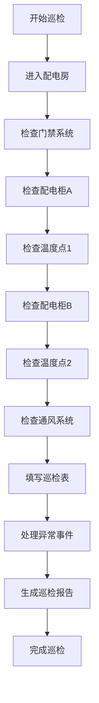

# 配电房巡检游戏 - 产品需求文档 (PRD)

## 1. 产品概述
配电房巡检游戏是一款面向物业培训的2D浏览器交互模拟游戏，通过模拟真实配电房巡检流程，训练玩家按照正确顺序执行巡检任务。
- 主要目标：让玩家掌握配电房巡检的标准流程、异常处理和报告生成
- 目标用户：物业运维人员、安全巡检员、新入职培训员工
- 核心价值：通过游戏化方式降低培训成本，提高巡检规范执行力

## 2. 核心功能

### 2.1 游戏核心模块
| 模块名称 | 功能描述 |
|---------|---------|
| 关卡系统 | 3个难度递增关卡，每关有不同巡检任务和异常事件 |
| 巡检地图 | 2D俯视/侧视配电房布局，可点击的巡检点 |
| 步骤清单 | 显示当前应执行的巡检步骤及顺序 |
| 计分系统 | 实时计分，正确操作加分，错误操作扣分 |
| 异常事件 | 随机触发温度异常、门禁异常等事件 |
| 历史回放 | 记录游戏过程，可回放查看每一步操作 |
| 结算报告 | 生成详细巡检报告，包含得分明细和错误分析 |

### 2.2 页面详情
| 页面名称 | 模块名称 | 功能描述 |
|---------|---------|---------|
| 主菜单页 | 游戏标题 | 展示游戏名称、版本信息 |
| 主菜单页 | 关卡选择 | 显示可用关卡、难度等级、历史最高得分 |
| 主菜单页 | 游戏说明 | 巡检流程介绍、操作指南、计分规则说明 |
| 游戏页 | 巡检地图 | 2D配电房布局，可交互巡检点 |
| 游戏页 | 步骤清单 | 当前任务步骤列表，标记已完成/待完成/错误 |
| 游戏页 | 状态面板 | 显示当前得分、剩余时间、异常计数 |
| 游戏页 | 控制面板 | 暂停/继续/重开按钮 |
| 结算页 | 得分详情 | 详细得分明细，正确/错误操作列表 |
| 结算页 | 回放控制 | 播放/暂停/进度条控制历史回放 |
| 结算页 | 报告导出 | 导出巡检报告为文本格式 |

## 3. 核心流程

### 3.1 游戏流程
1. 玩家进入主菜单，选择关卡
2. 阅读游戏说明和操作指南
3. 开始游戏，进入巡检场景
4. 按照步骤清单顺序执行巡检任务
5. 处理可能出现的异常事件
6. 完成所有巡检步骤或时间耗尽
7. 查看结算报告和历史回放
8. 可选择重开或返回主菜单

### 3.2 巡检流程

### 3.3 计分规则
| 操作类型 | 分值 | 说明 |
|---------|------|------|
| 正确顺序巡检 | +10分 | 按正确顺序完成单个巡检点 |
| 完成全流程 | +50分 | 按顺序完成所有巡检步骤 |
| 顺序错误 | -15分 | 未按清单顺序执行 |
| 漏检项目 | -20分 | 跳过必需巡检点 |
| 重复记录 | -10分 | 重复巡检同一项目 |
| 异常未处理 | -25分 | 出现异常未及时处理 |
| 异常未升级 | -30分 | 严重异常未上报 |
| 超时 | -5分/秒 | 超过规定时间 |
| 报告完整 | +30分 | 生成完整巡检报告 |

## 4. 用户界面设计

### 4.1 设计风格
- **主色调**: 工业蓝 (#1a56db)、安全黄 (#fbbf24)、警示红 (#dc2626)
- **辅助色**: 中性灰 (#6b7280)、背景灰 (#1f2937)
- **按钮风格**: 扁平化设计，圆角按钮，悬停有颜色过渡动画
- **字体**: 系统默认字体，标题18-24px，正文14-16px
- **布局风格**: 卡片式布局，顶部状态栏，左侧步骤清单，右侧巡检地图
- **图标风格**: 使用SVG图标，简洁线条风格

### 4.2 页面设计概览
| 页面名称 | 模块名称 | UI元素 |
|---------|---------|--------|
| 主菜单页 | 游戏标题 | 大号字体标题，副标题，渐变背景 |
| 主菜单页 | 关卡选择 | 卡片式关卡列表，显示星级和最高分 |
| 主菜单页 | 游戏说明 | 折叠面板，图文说明 |
| 游戏页 | 巡检地图 | 2D网格布局，可点击巡检点，动画反馈 |
| 游戏页 | 步骤清单 | 垂直列表，步骤状态颜色标记 |
| 游戏页 | 状态面板 | 实时更新的得分、时间、异常计数器 |
| 游戏页 | 控制面板 | 底部固定按钮栏 |
| 结算页 | 得分详情 | 表格展示操作明细，颜色区分正负分 |
| 结算页 | 回放控制 | 播放控制按钮，进度条，时间显示 |
| 结算页 | 报告导出 | 报告预览区，复制/下载按钮 |

### 4.3 响应式设计
- 桌面优先设计，最低支持1024x768分辨率
- 平板端自适应布局，可缩放巡检地图
- 移动端简化布局，保留核心功能

## 5. 关卡设计

### 关卡1：入门巡检
- **难度**: 简单
- **任务**: 基础巡检流程，无异常事件
- **时间限制**: 3分钟
- **巡检点**: 4个（门禁、配电柜A、温度点、配电柜B）
- **目标得分**: 100分

### 关卡2：标准巡检
- **难度**: 中等
- **任务**: 完整巡检流程，含1个随机异常
- **时间限制**: 4分钟
- **巡检点**: 6个（门禁、配电柜A/B、温度点1/2、通风系统）
- **目标得分**: 150分

### 关卡3：严格巡检
- **难度**: 困难
- **任务**: 复杂巡检流程，含2-3个随机异常
- **时间限制**: 5分钟
- **巡检点**: 8个（门禁、配电柜A/B/C、温度点1/2/3、通风系统）
- **目标得分**: 200分
