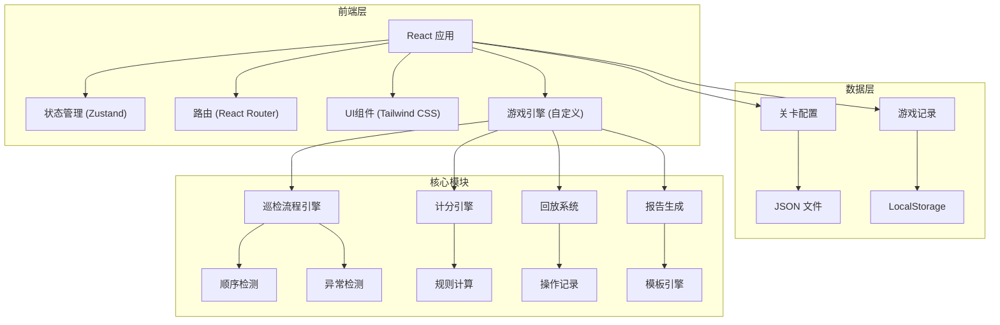

# 配电房巡检游戏 - 技术架构文档

## 1. 架构设计


## 2. 技术说明
- **前端框架**: React@18 + TypeScript
- **构建工具**: Vite
- **样式方案**: Tailwind CSS@3
- **状态管理**: Zustand
- **路由**: React Router DOM
- **图标**: Lucide React
- **数据存储**: LocalStorage (本地存储游戏记录)
- **后端**: 无后端 (纯前端应用)

## 3. 路由定义
| 路由路径 | 页面组件 | 功能说明 |
|---------|---------|---------|
| `/` | HomePage | 主菜单页，关卡选择 |
| `/game/:levelId` | GamePage | 游戏主页面 |
| `/result/:levelId` | ResultPage | 结算报告页 |

## 4. 数据模型

### 4.1 关卡配置 (LevelConfig)
```typescript
interface LevelConfig {
  id: string;
  name: string;
  difficulty: 'easy' | 'medium' | 'hard';
  timeLimit: number; // 秒
  targetScore: number;
  inspectionPoints: InspectionPoint[];
  requiredOrder: string[]; // 正确顺序的巡检点ID列表
  possibleAnomalies: AnomalyConfig[];
}

interface InspectionPoint {
  id: string;
  name: string;
  type: 'door' | 'cabinet' | 'temperature' | 'ventilation' | 'form';
  position: { x: number; y: number };
  icon: string;
  description: string;
}

interface AnomalyConfig {
  id: string;
  type: 'temperature' | 'door' | 'equipment';
  severity: 'warning' | 'critical';
  triggerProbability: number;
  requiresUpgrade: boolean;
  description: string;
}
```

### 4.2 游戏状态 (GameState)
```typescript
interface GameState {
  levelId: string;
  currentStep: number;
  completedSteps: string[];
  skippedSteps: string[];
  duplicateSteps: string[];
  activeAnomalies: ActiveAnomaly[];
  score: number;
  scoreDetails: ScoreDetail[];
  timeRemaining: number;
  isPaused: boolean;
  isCompleted: boolean;
  operationHistory: OperationRecord[];
}

interface ActiveAnomaly {
  configId: string;
  type: string;
  severity: string;
  isHandled: boolean;
  isUpgraded: boolean;
  triggeredAt: number;
}

interface ScoreDetail {
  id: string;
  type: 'correct' | 'wrong_order' | 'skipped' | 'duplicate' | 'anomaly_unhandled' | 'anomaly_not_upgraded' | 'timeout' | 'report_complete';
  description: string;
  points: number;
  timestamp: number;
}

interface OperationRecord {
  type: 'inspect' | 'anomaly_handle' | 'anomaly_upgrade' | 'generate_report';
  targetId: string;
  timestamp: number;
  isCorrect: boolean;
  details: string;
}
```

### 4.3 游戏记录 (GameRecord)
```typescript
interface GameRecord {
  levelId: string;
  score: number;
  completedAt: number;
  timeTaken: number;
  errors: string[];
  replayData: OperationRecord[];
}
```

## 5. 核心模块设计

### 5.1 巡检流程引擎
- **职责**: 管理巡检流程状态，验证操作顺序
- **核心方法**:
  - `getNextStep()`: 获取下一步应执行的巡检点
  - `validateStep(pointId)`: 验证当前步骤是否正确
  - `completeStep(pointId)`: 完成一个巡检步骤
  - `checkAnomalies()`: 检查是否触发异常事件

### 5.2 计分引擎
- **职责**: 根据游戏规则计算得分
- **核心方法**:
  - `addScore(type, description)`: 添加得分项
  - `calculateTimeoutPenalty()`: 计算超时扣分
  - `getFinalScore()`: 获取最终得分
  - `getScoreBreakdown()`: 获取得分明细

### 5.3 回放系统
- **职责**: 记录和回放游戏操作
- **核心方法**:
  - `recordOperation(operation)`: 记录操作
  - `getReplayData()`: 获取回放数据
  - `playReplay(callback)`: 播放回放

### 5.4 报告生成器
- **职责**: 生成巡检报告
- **核心方法**:
  - `generateReport()`: 生成报告内容
  - `exportReport()`: 导出报告文本

## 6. 组件结构
```
src/
├── components/
│   ├── layout/
│   │   ├── Header.tsx          # 顶部状态栏
│   │   └── Footer.tsx          # 底部控制栏
│   ├── game/
│   │   ├── InspectionMap.tsx   # 巡检地图
│   │   ├── InspectionPoint.tsx # 巡检点组件
│   │   ├── StepChecklist.tsx   # 步骤清单
│   │   ├── AnomalyAlert.tsx    # 异常告警
│   │   └── ReportForm.tsx      # 报告表单
│   ├── menu/
│   │   ├── LevelCard.tsx       # 关卡卡片
│   │   └── Instructions.tsx    # 游戏说明
│   └── result/
│       ├── ScoreDetail.tsx     # 得分详情
│       ├── ReplayPlayer.tsx    # 回放播放器
│       └── ReportExport.tsx    # 报告导出
├── pages/
│   ├── HomePage.tsx
│   ├── GamePage.tsx
│   └── ResultPage.tsx
├── store/
│   ├── gameStore.ts            # 游戏状态
│   └── levelStore.ts           # 关卡配置
├── hooks/
│   ├── useGameEngine.ts        # 游戏引擎Hook
│   ├── useTimer.ts             # 计时器Hook
│   └── useReplay.ts            # 回放Hook
├── utils/
│   ├── scoreCalculator.ts      # 计分工具
│   ├── reportGenerator.ts      # 报告生成
│   └── storage.ts              # 本地存储
├── data/
│   └── levels.json             # 关卡配置数据
└── types/
    └── index.ts                # 类型定义
```

## 7. 性能优化
- 使用 React.memo 避免不必要的重渲染
- 使用 useCallback 和 useMemo 优化性能
- 巡检地图使用 CSS Grid 布局
- 动画使用 CSS transitions 而非 JavaScript
- 游戏状态更新使用批处理

## 8. 安全考虑
- 无用户数据上传，所有记录本地存储
- 游戏配置数据不可修改
- 防止作弊：得分计算在客户端但有校验逻辑
