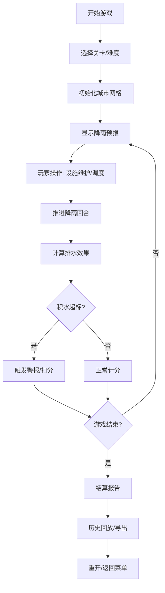

## 1. 产品概述

城市排水防涝游戏是一款面向学生群体的市政科普模拟器，通过回合制策略玩法让玩家理解城市雨水口、泵站和低洼点的联动机制。游戏以真实的防涝规则为核心，玩家需要在动态降雨事件中合理管理排水设施，避免城市积水灾害。

- 核心目标：科普城市排水系统原理，培养学生的防涝策略思维
- 目标用户：中学生、大学生及对市政工程感兴趣的大众
- 产品价值：将复杂的城市排水系统转化为可交互、可玩的策略游戏，寓教于乐

## 2. 核心 Features

### 2.1 Feature 模块

1. **游戏主界面**：城市网格地图、3D视角切换、设施状态面板
2. **设施管理模块**：雨水口维护、泵站调度、低洼点监测
3. **回合控制系统**：降雨回合推进、暂停/继续、重开功能
4. **事件系统**：随机降雨事件、雨水口堵塞、泵站超载
5. **计分系统**：防涝评分、设施效率、积水惩罚
6. **历史回放模块**：完整对局记录、时间轴回溯
7. **报告导出模块**：PDF/JSON格式结算报告、数据统计

### 2.2 页面详情

| 页面名称 | 模块名称 | 功能描述 |
|----------|----------|----------|
| 游戏主界面 | 城市网格地图 | 10x10可交互网格，显示道路、建筑、低洼点分布 |
| 游戏主界面 | 3D视角控制 | 鼠标拖拽旋转、滚轮缩放、触屏手势支持 |
| 游戏主界面 | 设施状态面板 | 实时显示各雨水口、泵站、低洼点的运行状态 |
| 游戏主界面 | 降雨模拟 | 可视化降雨强度、积水深度动态渲染 |
| 设施管理 | 雨水口操作 | 清理堵塞、升级容量、状态检查 |
| 设施管理 | 泵站调度 | 调整抽水功率、启停控制、过载保护 |
| 设施管理 | 低洼点监测 | 预警设置、临时排水措施 |
| 回合控制 | 控制面板 | 暂停、继续、重开、速度调节(1x/2x/4x) |
| 事件系统 | 降雨预报 | 提前1-2回合预警降雨强度和持续时间 |
| 事件系统 | 故障警报 | 雨水口堵塞、泵站超载、积水超标实时警报 |
| 计分系统 | 实时评分 | 设施完好率、积水处理速度、响应时效 |
| 历史回放 | 时间轴控制 | 拖拽回放到任意回合、步进回放 |
| 报告导出 | 结算报告 | 包含最终得分、失败原因(如有)、关键事件时间线、设施运行统计 |

## 3. 核心流程

### 3.1 游戏主流程

### 3.2 排水计算核心逻辑

1. 雨水从降雨点流向最近的雨水口
2. 雨水口收集雨水后汇入管网
3. 泵站将管网水抽到外围水体
4. 低洼点天然积水，需要额外泵站支持
5. 堵塞的雨水口收集效率降低50%-80%
6. 超载泵站会停机1-2回合

## 4. 用户界面设计

### 4.1 设计风格

- **主色调**：深蓝色系(#165DFF, #0E42D2)代表水体/排水系统，橙红色(#FF7D00, #F53F3F)代表警报/积水
- **辅助色**：薄荷绿(#00B42A)代表设施正常，灰蓝(#4E5969)代表城市建筑
- **按钮风格**：扁平化+微渐变，圆角8px，悬停有轻微上浮动画
- **字体**：标题使用 'Orbitron' (科技感)，正文使用 'Noto Sans SC' (清晰易读)
- **布局风格**：左侧地图主区域 + 右侧状态面板 + 底部控制栏
- **Icon风格**：线性图标，使用emoji辅助表达(💧🌧️🚰⚠️)

### 4.2 页面设计概述

| 页面名称 | 模块名称 | UI Elements |
|----------|----------|-------------|
| 游戏主界面 | 城市网格 | 等距3D视角，网格单元100px，悬浮高亮，点击选中 |
| 游戏主界面 | 状态面板 | 卡片式布局，实时数据更新，异常状态红色闪烁 |
| 游戏主界面 | 降雨效果 | 粒子系统模拟降雨，积水区域用蓝色半透明覆盖，深度用颜色深浅表示 |
| 设施管理 | 操作面板 | 滑入式面板，操作按钮组，进度条显示维护进度 |
| 历史回放 | 时间轴 | 底部横向时间轴，可拖拽滑块，关键事件标记点 |
| 结算报告 | 报告页面 | 数据可视化图表，时间线罗列，导出按钮组 |

### 4.3 响应式设计

- **桌面端优先**：1280px以上完整布局，支持键鼠操作
- **平板端(768-1279px)**：右侧面板改为底部抽屉，触屏手势支持
- **移动端(<768px)**：简化视图，核心操作按钮放大，支持触屏拖拽和双指缩放

### 4.4 3D 场景设计

- **环境**：简约城市风格，低多边形建筑，程序化生成网格地面
- **光照**：方向光模拟日光，环境光提供基础照明，积水区域有高光反射
- **相机**：透视相机，初始45度俯视角，可拖拽旋转(限制在30-60度)，可缩放
- **交互**：射线检测实现网格点击，选中单元有金色描边高亮
- **动画**：降雨粒子系统、积水水位变化动画、设施运行指示灯动画
- **后处理**：轻微Bloom效果增强科技感，降雨时增加雾气效果
- **性能预算**：单帧Draw Call < 200，粒子数量 < 500，保持60fps

## 5. 胜负判定与计分规则

### 5.1 胜利条件
- 完成所有降雨回合(通常10-20回合)
- 全程无严重积水(积水深度 < 安全阈值)
- 设施完好率 > 80%

### 5.2 失败条件(任一触发)
- 任一低洼点积水深度超过警戒线持续3回合
- 泵站连续超载导致永久性损坏
- 城市积水面积超过50%持续2回合
- 计分低于0分

### 5.3 计分规则
- 每回合顺利排水：+100分
- 提前清理堵塞雨水口：+50分
- 泵站调度合理无超载：+30分
- 积水超标：-50分/格/回合
- 设施损坏：-200分/个
- 响应时效奖励：降雨来临前完成准备 +100分
