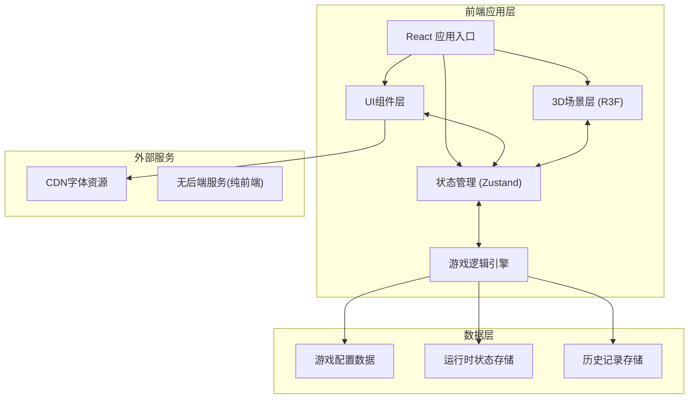
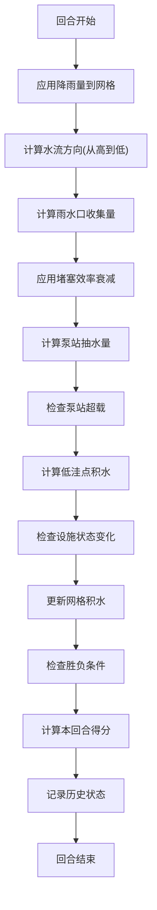

## 1. 架构设计



## 2. 技术栈描述

- **前端框架**: React@18 + TypeScript
- **构建工具**: Vite@5
- **样式方案**: TailwindCSS@3
- **3D引擎**: three@0.160, @react-three/fiber@8.15, @react-three/drei@9.92, @react-three/postprocessing@2.15
- **状态管理**: Zustand@4.4
- **图表可视化**: recharts@2.10
- **图标库**: lucide-react@0.300
- **动画库**: framer-motion@10.17
- **PDF导出**: jspdf@2.5, html2canvas@1.4

## 3. 核心模块划分

### 3.1 目录结构

```
src/
├── components/           # React UI组件
│   ├── GameCanvas.tsx    # 3D画布容器
│   ├── ControlPanel.tsx  # 控制面板
│   ├── StatusPanel.tsx   # 状态面板
│   ├── FacilityPanel.tsx # 设施管理面板
│   ├── Timeline.tsx      # 时间轴回放
│   ├── ReportModal.tsx   # 结算报告
│   └── ui/               # 基础UI组件
├── store/                # Zustand状态管理
│   ├── useGameStore.ts   # 游戏主状态
│   └── useHistoryStore.ts # 历史记录状态
├── engine/               # 游戏逻辑引擎
│   ├── types.ts          # 类型定义
│   ├── config.ts         # 游戏配置常量
│   ├── simulator.ts      # 排水模拟核心
│   └── levelData.ts      # 关卡数据
├── three/                # 3D场景组件
│   ├── CityGrid.tsx      # 城市网格
│   ├── Facilities.tsx    # 设施渲染
│   ├── RainEffect.tsx    # 降雨效果
│   ├── WaterEffect.tsx   # 积水效果
│   └── CameraControls.tsx # 相机控制
├── utils/                # 工具函数
│   ├── export.ts         # 导出工具
│   └── helpers.ts        # 通用工具
├── App.tsx               # 应用入口
└── main.tsx              # React入口
```

### 3.2 路由定义

| 路由 | 页面/用途 |
|------|----------|
| `/` | 游戏主页面(包含所有功能模块) |
| 无其他路由 | 单页应用，通过组件状态切换视图 |

## 4. 数据模型

### 4.1 核心数据类型定义

```typescript
// 网格单元类型
type CellType = 'road' | 'building' | 'lowland' | 'drain' | 'pump';

// 设施基础接口
interface Facility {
  id: string;
  x: number;
  y: number;
  status: 'normal' | 'warning' | 'danger' | 'broken';
  efficiency: number; // 0-1
}

// 雨水口
interface Drain extends Facility {
  type: 'drain';
  capacity: number; // 最大处理量
  blockage: number; // 堵塞程度 0-1
  inflow: number; // 当前入流量
}

// 泵站
interface Pump extends Facility {
  type: 'pump';
  power: number; // 0-1 功率
  maxPower: number;
  currentLoad: number;
  overloadCount: number;
  connectedDrains: string[];
}

// 低洼点
interface Lowland extends Facility {
  type: 'lowland';
  waterLevel: number;
  maxSafeLevel: number;
  dangerCount: number; // 持续危险回合数
}

// 网格单元
interface GridCell {
  x: number;
  y: number;
  type: CellType;
  elevation: number; // 海拔高度
  waterDepth: number; // 积水深度
  facility?: Facility;
}

// 降雨事件
interface RainEvent {
  startTurn: number;
  duration: number;
  intensity: 'light' | 'moderate' | 'heavy' | 'storm';
  affectedArea: { x: number; y: number; radius: number }[];
}

// 游戏状态
interface GameState {
  turn: number;
  maxTurns: number;
  isPaused: boolean;
  isGameOver: boolean;
  isVictory: boolean;
  failReason?: string;
  score: number;
  speed: 1 | 2 | 4;
  grid: GridCell[][];
  facilities: Facility[];
  rainEvents: RainEvent[];
  currentRain: RainEvent | null;
  forecast: RainEvent[]; // 未来降雨预报
  selectedCell: { x: number; y: number } | null;
}

// 历史记录
interface HistoryRecord {
  turn: number;
  state: GameState;
  scoreDelta: number;
  events: string[];
  timestamp: number;
}

// 结算报告
interface GameReport {
  finalScore: number;
  isVictory: boolean;
  failReason?: string;
  totalTurns: number;
  scoreBreakdown: {
    baseScore: number;
    drainMaintenance: number;
    pumpEfficiency: number;
    waterPenalty: number;
    facilityDamage: number;
    bonus: number;
  };
  keyEvents: { turn: number; event: string }[];
  facilityStats: {
    drains: { total: number; broken: number; avgEfficiency: number };
    pumps: { total: number; broken: number; avgLoad: number };
    lowlands: { total: number; maxLevel: number; dangerTurns: number };
  };
  timeline: HistoryRecord[];
}
```

### 4.2 游戏配置常量

```typescript
// 排水计算参数
export const CONFIG = {
  GRID_SIZE: 10,
  CELL_SIZE: 10,
  MAX_TURNS: 15,
  WATER_FLOW_RATE: 0.8, // 水流速度系数
  DRAIN_BASE_CAPACITY: 10,
  PUMP_BASE_POWER: 15,
  BLOCKAGE_GROWTH_RATE: 0.15, // 每回合堵塞增加
  BLOCKAGE_EFFECT: [1, 0.7, 0.4, 0.1], // 不同堵塞程度的效率
  OVERLOAD_THRESHOLD: 0.9, // 超载阈值
  OVERLOAD_DAMAGE_THRESHOLD: 3, // 连续超载多少次损坏
  LOWLAND_DANGER_THRESHOLD: 8, // 低洼点危险水位
  LOWLAND_FAIL_THRESHOLD: 3, // 持续危险多少回合失败
  FLOOD_FAIL_PERCENT: 0.5, // 积水面积超过多少失败
  FLOOD_FAIL_DURATION: 2, // 持续多少回合
  
  // 计分
  SCORE_PER_TURN: 100,
  SCORE_CLEAR_BLOCKAGE: 50,
  SCORE_PUMP_EFFICIENT: 30,
  SCORE_FLOOD_PENALTY: -50,
  SCORE_FACILITY_BROKEN: -200,
  SCORE_PREPARE_BONUS: 100,
};
```

## 5. 排水模拟核心算法

### 5.1 计算流程



### 5.2 核心算法要点

1. **水流传播**: 使用BFS从降雨点开始，按海拔梯度计算水流方向
2. **雨水口收集**: 每个雨水口收集其影响范围内(3x3)的积水，乘以效率系数
3. **管网汇流**: 雨水口收集的水汇入连接的泵站，超出泵站容量则回流
4. **积水计算**: 低洼点积水 = 入流量 - 泵站抽水量 + 自然流入
5. **堵塞累积**: 雨水口每回合随机增加堵塞度，降雨越大堵塞越快

## 6. 导出功能实现

### 6.1 JSON导出
- 序列化完整 `GameReport` 对象
- 包含时间线数据，支持后续回放
- 文件命名: `drainage-report-{timestamp}.json`

### 6.2 PDF导出
- 使用html2canvas捕获报告页面
- 使用jsPDF生成PDF文档
- 包含: 封面、得分详情、关键事件、设施统计、图表可视化
- 页面尺寸: A4

## 7. 性能优化策略

1. **3D场景优化**:
   - 网格使用InstancedMesh批量渲染
   - 积水效果使用ShaderMaterial实现动态水面
   - 降雨粒子系统使用BufferGeometry
   
2. **状态管理优化**:
   - Zustand使用selector避免不必要重渲染
   - 历史记录使用Immutable数据结构
   
3. **模拟计算优化**:
   - 水流计算使用Web Worker离线执行
   - 计算结果批量更新到UI
