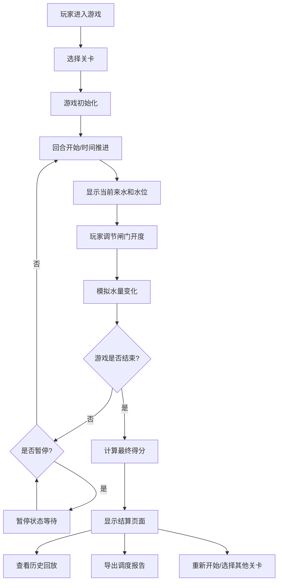

## 1. 产品概述

水库调度闸门游戏是一款水利教学类2D浏览器模拟器，通过真实的水文学规则让玩家体验水库调度的决策过程。玩家需要在上游来水变化、下游安全水位限制和水库蓄水需求之间做出平衡取舍，学习水利调度的核心原理。

- 核心目标：通过游戏化方式教授水库调度知识，理解"开闸过猛、下游超警、蓄水不足"等常见调度难点
- 目标用户：水利专业学生、相关从业人员、对水利感兴趣的公众
- 产品价值：将抽象的水文概念转化为可交互的游戏体验，提升学习效果

## 2. 核心功能

### 2.1 用户角色
| 角色 | 注册方式 | 核心权限 |
|------|----------|----------|
| 玩家 | 无需注册，直接游玩 | 开始游戏、控制闸门、查看回放、导出报告 |

### 2.2 功能模块
1. **游戏主界面**：水库可视化、闸门控制、实时数据面板、来水/水位曲线
2. **关卡系统**：多个难度递增的关卡，每关有不同的来水曲线和目标要求
3. **游戏控制**：暂停/继续、重新开始、游戏速度调节
4. **计分系统**：实时分数计算、关卡评分、失败原因判定
5. **历史回放**：完整记录游戏过程，支持回放查看决策过程
6. **调度报告**：游戏结束后生成详细调度报告，支持导出

### 2.3 页面详情
| 页面名称 | 模块名称 | 功能描述 |
|---------|----------|----------|
| 开始页面 | 关卡选择 | 展示可用关卡、难度说明、最高分记录 |
| 游戏页面 | 水库可视化 | 2D渲染水库水位、闸门、水流效果 |
| 游戏页面 | 控制面板 | 闸门开度滑块、暂停/继续/重开按钮、速度控制 |
| 游戏页面 | 数据面板 | 实时显示水库水位、下游水位、来水量、放水量 |
| 游戏页面 | 曲线图 | 历史来水曲线、水位变化曲线、预警线标记 |
| 结算页面 | 结果展示 | 最终得分、失败原因（如失败）、各项指标评分 |
| 结算页面 | 历史回放 | 进度条控制、逐帧回放、关键决策点标记 |
| 结算页面 | 报告导出 | 生成调度报告、支持JSON格式下载 |

## 3. 核心流程

## 4. 用户界面设计

### 4.1 设计风格
- **主色调**：深蓝色系（#1e3a5f、#2563eb）代表水和专业感，辅助色：绿色（#10b981）表示安全，橙色（#f59e0b）表示警告，红色（#ef4444）表示危险
- **按钮风格**：圆角矩形、轻微阴影、悬停放大效果
- **字体**：标题使用 Noto Sans SC 粗体，正文使用系统无衬线字体，数字使用等宽字体
- **布局风格**：仪表盘式布局，左侧水库可视化，右侧数据面板和曲线图，底部控制栏
- **图标风格**：简约线性图标，使用水坝、水滴、图表等水利相关元素

### 4.2 页面设计概述
| 页面名称 | 模块名称 | UI 元素 |
|---------|----------|---------|
| 开始页面 | 关卡选择 | 卡片式关卡列表，显示关卡名称、难度、最高分 |
| 游戏页面 | 水库可视化 | 2D侧视图：水库大坝、闸门动画、水位线、上下游河道 |
| 游戏页面 | 数据面板 | 卡片式数据展示，关键指标高亮显示 |
| 游戏页面 | 曲线图 | 实时更新的折线图，预警线用红色虚线标记 |
| 结算页面 | 结果展示 | 大字显示最终得分，分项评分进度条 |
| 结算页面 | 历史回放 | 时间轴控件、播放/暂停按钮、速度调节 |

### 4.3 响应式
- 桌面端优先设计，支持1280px及以上分辨率
- 平板端自适应布局，数据面板可折叠
- 移动端简化界面，保证核心操作可用

## 5. 游戏规则与参数

### 5.1 核心参数
- **水库最大库容**：10000 万立方米
- **水库正常高水位**：对应库容 8000 万立方米
- **水库死水位**：对应库容 2000 万立方米
- **下游安全水位**：对应流量 ≤ 500 立方米/秒
- **下游预警水位**：对应流量 400 立方米/秒（黄色预警）

### 5.2 游戏机制
- 每回合时间步进：1小时
- 来水曲线：根据关卡预设，模拟洪水过程
- 闸门开度：0-100%，对应最大泄流量 800 立方米/秒
- 水量平衡：水库蓄水变化 = 来水量 - 泄流量
- 下游水位：由泄流量决定，超过安全水位则扣分

### 5.3 计分规则
| 项目 | 分值 | 说明 |
|------|------|------|
| 最终库容达标 | 30分 | 结束时库容在正常范围内 |
| 下游未超警 | 40分 | 全程下游流量未超安全值 |
| 蓄水效率 | 20分 | 充分利用库容但不漫溢 |
| 调度平稳性 | 10分 | 闸门调节不过于频繁 |

### 5.4 失败条件
1. 水库漫坝：库容超过最大值超过3小时
2. 下游溃坝：下游流量超过安全值超过6小时
3. 蓄水放空：库容低于死水位超过12小时
