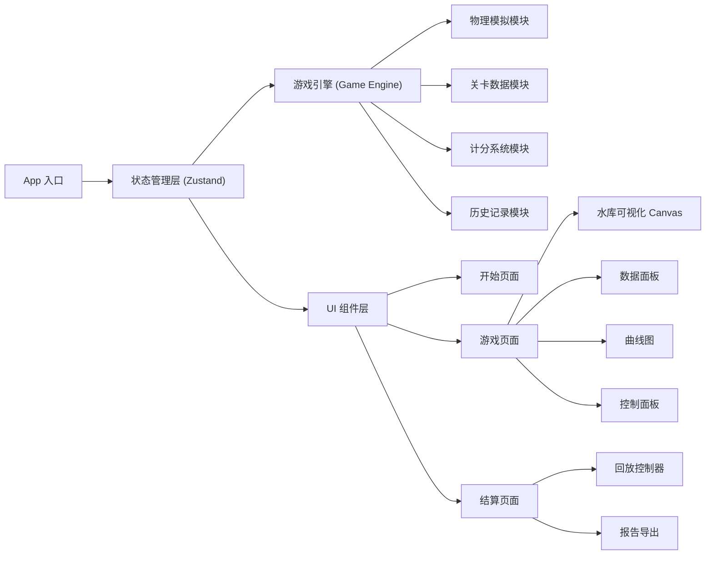

## 1. 架构设计



## 2. 技术选型说明

| 技术 | 版本 | 用途 |
|------|------|------|
| React | 18.x | UI 框架 |
| TypeScript | 5.x | 类型安全 |
| Vite | 5.x | 构建工具 |
| Tailwind CSS | 3.x | 样式框架 |
| Zustand | 4.x | 状态管理 |
| Recharts | 2.x | 图表渲染 |
| Canvas API | - | 2D 水库可视化 |

## 3. 目录结构

```
src/
├── components/          # React 组件
│   ├── game/           # 游戏相关组件
│   │   ├── ReservoirCanvas.tsx    # 水库可视化
│   │   ├── ControlPanel.tsx       # 控制面板
│   │   ├── DataPanel.tsx          # 数据面板
│   │   └── CurveChart.tsx         # 曲线图
│   ├── layout/         # 布局组件
│   └── ui/             # 通用UI组件
├── store/              # 状态管理
│   └── useGameStore.ts # 游戏状态
├── engine/             # 游戏引擎
│   ├── types.ts        # 类型定义
│   ├── constants.ts    # 常量配置
│   ├── levels.ts       # 关卡数据
│   ├── physics.ts      # 物理模拟
│   ├── scoring.ts      # 计分系统
│   └── recorder.ts     # 历史记录
├── hooks/              # 自定义 Hooks
├── utils/              # 工具函数
├── pages/              # 页面组件
│   ├── StartPage.tsx
│   ├── GamePage.tsx
│   └── ResultPage.tsx
├── App.tsx
└── main.tsx
```

## 4. 核心类型定义

```typescript
// 游戏状态
type GameStatus = 'idle' | 'playing' | 'paused' | 'ended' | 'replaying';

// 游戏状态快照
interface GameState {
  time: number;                    // 当前时间（小时）
  reservoirStorage: number;        // 水库库容（万立方米）
  gateOpening: number;             // 闸门开度 0-100%
  inflow: number;                  // 上游来水（立方米/秒）
  outflow: number;                 // 泄流量（立方米/秒）
  downstreamLevel: number;         // 下游水位
  isOvertopping: boolean;          // 是否漫坝
  isDownstreamWarning: boolean;    // 下游是否超警
  overtoppingHours: number;        // 漫坝持续时间
  downstreamWarningHours: number;  // 下游超警持续时间
  deadStorageHours: number;        // 死水位持续时间
}

// 关卡配置
interface Level {
  id: string;
  name: string;
  difficulty: 'easy' | 'medium' | 'hard';
  description: string;
  duration: number;                // 游戏时长（小时）
  inflowCurve: number[];           // 来水曲线
  initialStorage: number;          // 初始库容
  targetStorage: number;           // 目标库容
  maxStorage: number;              // 最大库容
  normalStorage: number;           // 正常高水位库容
  deadStorage: number;             // 死水位库容
  safeDischarge: number;           // 安全泄流量
  warningDischarge: number;        // 预警泄流量
  maxDischarge: number;            // 最大泄流量
}

// 历史记录
interface GameRecord {
  levelId: string;
  startTime: Date;
  endTime: Date;
  states: GameState[];
  gateChanges: { time: number; opening: number }[];
  finalScore: ScoreResult;
  failureReason?: string;
}

// 计分结果
interface ScoreResult {
  total: number;
  storageScore: number;
  downstreamScore: number;
  efficiencyScore: number;
  stabilityScore: number;
  details: {
    finalStorage: number;
    maxDownstreamDischarge: number;
    gateChanges: number;
    overflowEvents: number;
    warningEvents: number;
  };
}
```

## 5. 状态管理设计

### 5.1 Zustand Store

```typescript
interface GameStore {
  // 状态
  gameStatus: GameStatus;
  currentLevel: Level | null;
  currentState: GameState | null;
  history: GameState[];
  gameRecord: GameRecord | null;
  replayIndex: number;
  gameSpeed: number;  // 1x, 2x, 4x
  
  // 操作
  selectLevel: (level: Level) => void;
  startGame: () => void;
  pauseGame: () => void;
  resumeGame: () => void;
  restartGame: () => void;
  setGateOpening: (opening: number) => void;
  setGameSpeed: (speed: number) => void;
  endGame: (reason?: string) => void;
  startReplay: (record: GameRecord) => void;
  setReplayIndex: (index: number) => void;
  stopReplay: () => void;
  exportReport: () => string;
}
```

## 6. 游戏循环设计

### 6.1 主循环
- 使用 `requestAnimationFrame` 驱动渲染
- 固定时间步长：每 100ms 推进 1 游戏小时（可调节速度）
- 状态更新与渲染分离

### 6.2 物理模拟
```typescript
function simulateStep(state: GameState, level: Level, deltaHours: number): GameState {
  // 1. 获取当前来水量
  const inflow = getInflowAtTime(level.inflowCurve, state.time);
  
  // 2. 计算泄流量（闸门开度 * 最大泄流量）
  const outflow = state.gateOpening * level.maxDischarge / 100;
  
  // 3. 计算库容变化
  // 流量(m³/s) * 时间(h) * 3600(s/h) / 10000 = 万立方米
  const storageChange = (inflow - outflow) * deltaHours * 3600 / 10000;
  const newStorage = Math.max(0, state.reservoirStorage + storageChange);
  
  // 4. 计算下游水位（简化为泄流量的函数）
  const downstreamLevel = calculateDownstreamLevel(outflow, level);
  
  // 5. 更新各种计时
  const isOvertopping = newStorage > level.maxStorage;
  const isDownstreamWarning = outflow > level.safeDischarge;
  const isDeadStorage = newStorage < level.deadStorage;
  
  return {
    ...state,
    time: state.time + deltaHours,
    reservoirStorage: newStorage,
    inflow,
    outflow,
    downstreamLevel,
    isOvertopping,
    isDownstreamWarning,
    overtoppingHours: isOvertopping ? state.overtoppingHours + deltaHours : 0,
    downstreamWarningHours: isDownstreamWarning ? state.downstreamWarningHours + deltaHours : 0,
    deadStorageHours: isDeadStorage ? state.deadStorageHours + deltaHours : 0,
  };
}
```

## 7. 路由定义

| 路由 | 页面 | 说明 |
|------|------|------|
| `/` | StartPage | 开始页面，关卡选择 |
| `/game` | GamePage | 游戏主界面 |
| `/result` | ResultPage | 结算页面 |

## 8. 关键技术点

### 8.1 Canvas 2D 渲染
- 使用 Canvas API 绘制水库侧视图
- 水位动画使用线性插值平滑过渡
- 闸门动画根据开度实时更新
- 水流效果使用粒子系统模拟

### 8.2 历史回放
- 录制每一步的完整状态快照
- 回放时按索引恢复状态
- 支持进度条拖动定位
- 关键决策点高亮标记

### 8.3 报告导出
- 生成 JSON 格式的完整调度报告
- 包含所有历史数据和评分详情
- 支持下载到本地

### 8.4 状态隔离
- 重开游戏时完全重置状态
- 暂停时冻结游戏循环
- 回放模式与游戏模式互斥
- 使用独立的状态分支避免冲突
