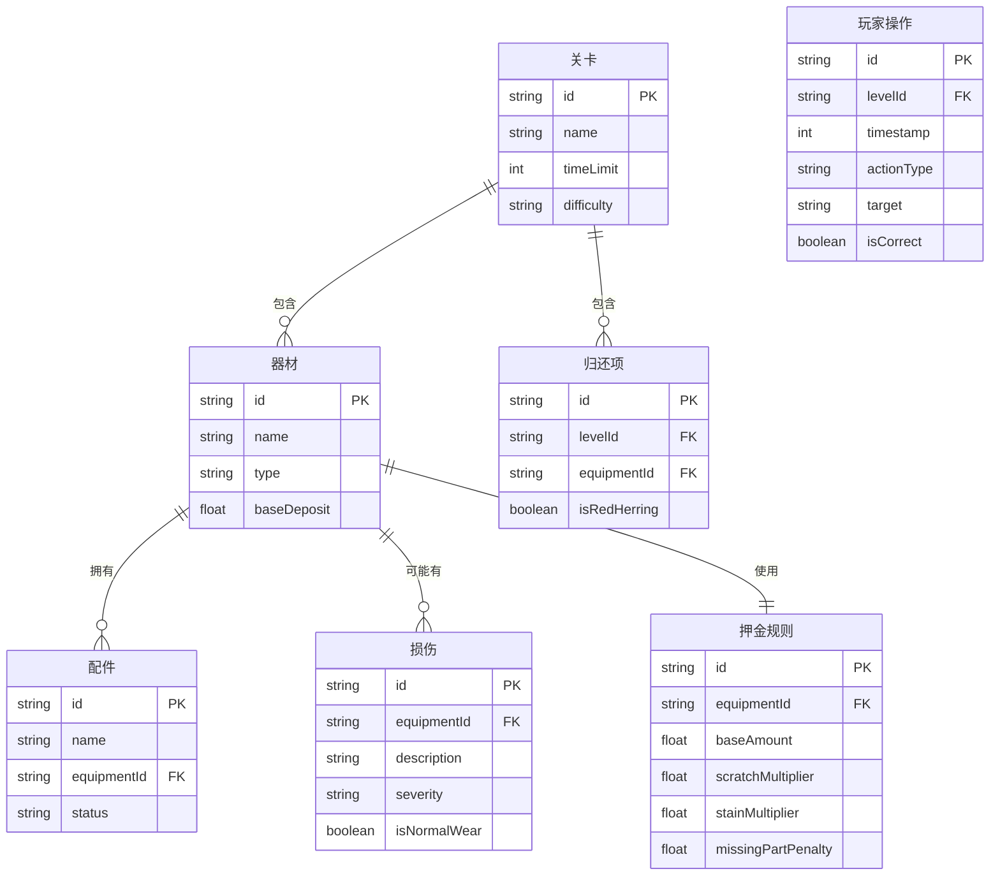

## 1. 架构设计

```mermaid
flowchart TD
    "React 前端" --> "Three.js 3D 渲染层"
    "React 前端" --> "2D UI 交互层"
    "React 前端" --> "状态管理层 (Zustand)"
    "React 前端" --> "路由层 (React Router)"
    "React 前端" --> "工具层 (导出/格式化)"
```

纯前端应用，无后端。所有数据为前端 mock。

## 2. 技术说明

- **前端**：React 18 + TypeScript + Vite
- **3D 渲染**：three.js + @react-three/fiber + @react-three/drei
- **2D UI**：React 组件 + Tailwind CSS + Framer Motion
- **状态管理**：Zustand
- **路由**：React Router DOM
- **构建工具**：Vite
- **初始化模板**：react-ts

## 3. 路由定义

| 路由 | 用途 |
|------|------|
| `/` | 主菜单页面 |
| `/game/:levelId` | 游戏场景页面 |
| `/result/:levelId` | 结算页面 |

## 4. 数据模型

### 4.1 数据模型定义



### 4.2 Mock 数据结构

```typescript
interface Level {
  id: string;
  name: string;
  difficulty: 'beginner' | 'intermediate' | 'expert';
  timeLimit: number;
  description: string;
  equipment: EquipmentItem[];
  accessories: Accessory[];
  damages: Damage[];
  depositRules: DepositRule[];
  redHerrings: RedHerring[];
}

interface EquipmentItem {
  id: string;
  name: string;
  type: 'camera' | 'lens' | 'light_stand' | 'battery' | 'memory_card' | 'filter' | 'tripod' | 'reflector';
  icon: string;
  baseDeposit: number;
  accessories: string[];
  hasDamage: boolean;
  batteryLevel?: number;
}

interface Accessory {
  id: string;
  name: string;
  equipmentId: string;
  isMissing: boolean;
}

interface Damage {
  id: string;
  equipmentId: string;
  description: string;
  severity: 'minor' | 'major' | 'fatal';
  isNormalWear: boolean;
  position: { x: number; y: number; z: number };
}

interface DepositRule {
  equipmentId: string;
  baseAmount: number;
  scratchMultiplier: number;
  stainMultiplier: number;
  missingPartPenalty: number;
  lowBatteryPenalty: number;
}

interface RedHerring {
  id: string;
  name: string;
  type: string;
  reason: string;
}
```

## 5. 项目结构

```
src/
├── components/
│   ├── game/
│   │   ├── StudioScene.tsx         # 3D 影棚场景
│   │   ├── ReturnTable.tsx         # 归还台 3D 模型
│   │   ├── EquipmentRack.tsx       # 器材架
│   │   ├── InspectionPanel.tsx     # 2D 清点面板
│   │   ├── DraggableItem.tsx       # 可拖拽器材卡片
│   │   ├── DamageMarker.tsx        # 损伤标记按钮
│   │   ├── DepositCalculator.tsx   # 押金计算器
│   │   └── GameHUD.tsx             # 顶部状态栏
│   ├── menu/
│   │   ├── MainMenu.tsx            # 主菜单
│   │   ├── LevelCard.tsx           # 关卡卡片
│   │   └── GameInstructions.tsx    # 游戏说明
│   ├── result/
│   │   ├── ResultPage.tsx          # 结算页
│   │   ├── ScoreBreakdown.tsx      # 得分分解
│   │   ├── FailureReasons.tsx      # 失败原因
│   │   ├── ReplayTimeline.tsx      # 历史回放
│   │   └── ExportReport.tsx        # 报告导出
│   └── common/
│       ├── Button.tsx
│       ├── Modal.tsx
│       └── Timer.tsx
├── hooks/
│   ├── useGameState.ts             # 游戏状态 hook
│   ├── useDragDrop.ts              # 拖拽逻辑 hook
│   └── useTimer.ts                 # 计时器 hook
├── stores/
│   └── gameStore.ts                # Zustand 游戏状态
├── pages/
│   ├── MenuPage.tsx
│   ├── GamePage.tsx
│   └── ResultPage.tsx
├── data/
│   ├── levels.ts                   # 三个关卡数据
│   └── equipmentTypes.ts           # 器材类型定义
├── utils/
│   ├── scoring.ts                  # 评分逻辑
│   ├── depositCalc.ts              # 押金计算
│   ├── reportExport.ts             # 报告导出
│   └── replay.ts                   # 回放数据生成
├── types/
│   └── index.ts                    # 全局类型定义
├── App.tsx
├── main.tsx
└── index.css
```

## 6. 核心游戏逻辑

### 6.1 状态机

```
menu → playing → paused → playing
                ↘ result
playing → result (时间到/提交)
```

### 6.2 游戏状态存储（Zustand）

```typescript
interface GameState {
  currentLevel: Level | null;
  phase: 'menu' | 'playing' | 'paused' | 'result';
  timeRemaining: number;
  score: number;
  matchedAccessories: Map<string, string>;
  markedDamages: Map<string, string>;
  depositCalculations: Map<string, number>;
  actionHistory: PlayerAction[];
  // actions
  startLevel: (levelId: string) => void;
  pause: () => void;
  resume: () => void;
  submit: () => void;
  matchAccessory: (accessoryId: string, equipmentId: string) => void;
  markDamage: (equipmentId: string, damageId: string) => void;
  calculateDeposit: (equipmentId: string, amount: number) => void;
  reset: () => void;
}
```

### 6.3 评分算法

```typescript
function calculateScore(level: Level, state: GameState): ScoreResult {
  let score = 0;
  const failures: string[] = [];
  
  // 配件匹配
  for (const accessory of level.accessories) {
    const matched = state.matchedAccessories.get(accessory.id);
    if (matched === accessory.equipmentId) {
      score += 10;
    } else if (!matched && accessory.isMissing) {
      // 正确识别缺失
      score += 5;
    } else {
      score -= 15;
      failures.push(`配件 ${accessory.name} 匹配错误`);
    }
  }
  
  // 损伤标记
  for (const damage of level.damages) {
    const marked = state.markedDamages.get(damage.equipmentId);
    if (marked === damage.id) {
      score += damage.severity === 'fatal' ? 25 : 15;
    } else if (!marked && !damage.isNormalWear) {
      score -= 20;
      failures.push(`漏记 ${damage.description}`);
    } else if (marked && damage.isNormalWear) {
      score -= 10;
      failures.push(`误记正常使用痕迹为损伤: ${damage.description}`);
    }
  }
  
  // 押金计算
  for (const rule of level.depositRules) {
    const calc = state.depositCalculations.get(rule.equipmentId);
    const correct = computeCorrectDeposit(rule, level);
    if (Math.abs((calc || 0) - correct) < 0.01) {
      score += 20;
    } else {
      score -= 25;
      failures.push(`押金计算错误: ${rule.equipmentId}`);
    }
  }
  
  // 时间奖励
  score += Math.floor(state.timeRemaining * 0.5);
  
  return { score, failures };
}
```

## 7. 3D 场景实现要点

- 使用 `@react-three/fiber` 声明式 Three.js
- 归还台：简单长方体 + 木质纹理
- 器材：使用 drei 的 `<Html>` 组件在 3D 空间中渲染 2D 卡片
- 灯光：`SpotLight` + `AmbientLight`
- 交互：`useThree` + 射线检测，点击 3D 物体触发 2D 面板联动
- 相机动画：使用 `@react-three/drei` 的 `<OrbitControls>` 支持拖拽旋转
