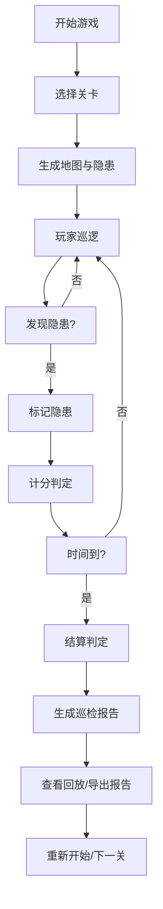

## 1. 产品概述
仓库消防巡逻游戏是一款基于真实消防安全规则的2D策略模拟游戏，玩家扮演安全员在仓库内巡逻检查，发现并标记消防隐患。
- 核心目标：通过沉浸式游戏体验，让玩家学习仓库消防安全知识，识别通道堵塞、灭火器过期、违规充电等常见隐患
- 目标用户：企业安全培训人员、仓库管理员、消防安全教育受众

## 2. 核心功能

### 2.1 用户角色
| 角色 | 注册方式 | 核心权限 |
|------|----------|----------|
| 玩家 | 无需注册 | 游戏游玩、查看报告、回放历史 |

### 2.2 功能模块
1. **游戏主界面**：Canvas地图渲染、角色控制、状态显示
2. **关卡系统**：多难度关卡、回合制时间限制
3. **巡检系统**：隐患识别、异常标记、计分判定
4. **控制面板**：暂停/继续、重新开始、关卡选择
5. **结算系统**：分数统计、失败原因、巡检报告导出
6. **历史回放**：记录游戏过程、支持回放查看

### 2.3 页面详情
| 页面名称 | 模块名称 | 功能描述 |
|---------|----------|----------|
| 游戏主界面 | 地图渲染 | 2D Canvas仓库地图、货架、通道、消防设施绘制 |
| 游戏主界面 | 玩家控制 | WASD/方向键移动、空格键标记隐患 |
| 游戏主界面 | 状态面板 | 剩余时间、当前分数、已发现隐患数、关卡信息 |
| 游戏主界面 | 控制面板 | 暂停按钮、重开按钮、关卡切换、回放按钮 |
| 结算弹窗 | 分数详情 | 基础分、错误扣分、超时扣分、资源浪费扣分明细 |
| 结算弹窗 | 失败原因 | 未发现隐患、超时、错误标记过多等原因说明 |
| 结算弹窗 | 报告导出 | 生成巡检报告、下载为JSON/文本格式 |
| 回放界面 | 历史回放 | 按时间轴回放巡逻路径、标记记录 |

## 3. 核心流程

玩家巡逻流程：
1. 玩家从起点出发，在仓库地图中移动巡逻
2. 靠近可疑目标时，界面提示可检查
3. 按空格键标记隐患，系统实时判定正确与否
4. 正确标记加分，错误标记扣分
5. 时间结束或完成全部巡检后进入结算
6. 结算显示分数明细、失败原因、巡检报告
7. 支持回放巡逻过程或导出报告

## 4. 用户界面设计

### 4.1 设计风格
- **主色调**：工业深蓝色 (#1a365d) 作为主色，安全橙色 (#ed8936) 作为警示强调色
- **辅助色**：安全绿色 (#38a169) 表示正常，警示红色 (#e53e3e) 表示隐患
- **按钮风格**：圆角矩形、3D阴影效果、悬停缩放动画
- **字体**：使用JetBrains Mono等宽字体显示数据，Inter作为UI字体
- **布局风格**：左侧游戏画布，右侧状态面板，底部控制栏
- **视觉元素**：网格背景、工业风格边框、故障艺术效果强调隐患

### 4.2 页面设计概述
| 页面名称 | 模块名称 | UI元素 |
|---------|----------|--------|
| 游戏主界面 | 地图区域 | Canvas 2D渲染，网格线，货架，灭火器，充电点，消防通道 |
| 游戏主界面 | 状态面板 | 时间倒计时条，分数显示，隐患进度条，关卡信息卡 |
| 游戏主界面 | 控制栏 | 暂停/播放图标按钮，重开按钮，关卡选择下拉，回放按钮 |
| 结算弹窗 | 分数面板 | 分数环形图，扣分明细列表，评级徽章 |
| 结算弹窗 | 报告区域 | 隐患列表，巡检摘要，导出按钮 |
| 回放界面 | 时间轴 | 播放控制，进度条，关键事件标记 |

### 4.3 响应式
- 桌面端优先设计，游戏画布固定比例
- 平板设备适配：控制面板移至底部
- 移动端简化：单指拖动移动，双击标记

### 4.4 视觉动效
- 玩家移动：平滑插值动画
- 隐患标记：脉冲扩散效果
- 正确/错误反馈：颜色闪烁动画
- 倒计时：最后10秒红色警示闪烁
- 界面切换：淡入淡出过渡
