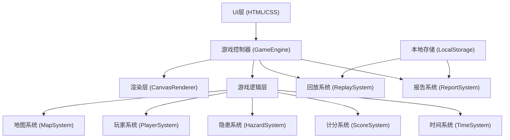

## 1. 架构设计



## 2. 技术描述
- **前端框架**：原生 HTML5 + Canvas 2D + 原生 JavaScript (ES6+)
- **样式方案**：Tailwind CSS 3
- **构建工具**：Vite
- **数据存储**：LocalStorage 存储游戏记录和回放数据
- **无后端架构**：纯前端实现，所有逻辑在客户端运行

## 3. 模块目录结构

| 路径 | 用途 |
|------|------|
| `/src/index.html` | 入口HTML文件 |
| `/src/main.js` | 游戏入口，初始化游戏引擎 |
| `/src/game/GameEngine.js` | 游戏核心控制器 |
| `/src/game/render/CanvasRenderer.js` | Canvas渲染器 |
| `/src/game/systems/MapSystem.js` | 地图生成与管理 |
| `/src/game/systems/PlayerSystem.js` | 玩家控制与状态 |
| `/src/game/systems/HazardSystem.js` | 隐患生成与检测 |
| `/src/game/systems/ScoreSystem.js` | 计分规则与计算 |
| `/src/game/systems/TimeSystem.js` | 倒计时与时间管理 |
| `/src/game/systems/ReplaySystem.js` | 游戏记录与回放 |
| `/src/game/systems/ReportSystem.js` | 巡检报告生成 |
| `/src/game/data/levels.js` | 关卡配置数据 |
| `/src/game/utils/helpers.js` | 工具函数 |
| `/src/style.css` | 全局样式 |

## 4. 核心数据模型

### 4.1 游戏状态
```javascript
GameState = {
  status: 'idle' | 'playing' | 'paused' | 'finished',
  currentLevel: number,
  timeRemaining: number,
  score: number,
  player: Player,
  map: GameMap,
  hazards: Hazard[],
  markedHazards: MarkRecord[],
  replayData: ReplayFrame[]
}
```

### 4.2 隐患类型定义
```javascript
HazardType = {
  BLOCKED_PATH: 'blocked_path',      // 通道堵塞
  EXPIRED_EXTINGUISHER: 'expired_extinguisher',  // 过期灭火器
  ILLEGAL_CHARGING: 'illegal_charging',  // 违规充电
  NORMAL: 'normal'                   // 正常设施
}

Hazard = {
  id: string,
  type: HazardType,
  x: number,
  y: number,
  width: number,
  height: number,
  isHazard: boolean,
  description: string,
  penaltyPoints: number,
  detected: boolean
}
```

### 4.3 计分规则
```javascript
ScoreRule = {
  baseScore: 1000,           // 基础分
  correctMark: +100,         // 正确标记加分
  wrongMark: -50,            // 错误标记扣分
  timeBonusPerSecond: +2,    // 剩余时间奖励
  missedHazard: -100,        // 未发现隐患扣分
  overtimePenalty: -10,      // 超时每秒扣分
  resourceWaste: -30         // 重复标记扣分
}
```

### 4.4 关卡配置
```javascript
LevelConfig = {
  id: number,
  name: string,
  difficulty: 'easy' | 'medium' | 'hard',
  timeLimit: number,         // 秒
  mapSize: { width: number, height: number },
  hazardCount: number,
  normalItemCount: number,
  description: string
}
```

## 5. 核心接口定义

### 5.1 游戏引擎接口
```typescript
interface IGameEngine {
  init(canvas: HTMLCanvasElement): void
  startLevel(levelId: number): void
  pause(): void
  resume(): void
  restart(): void
  markHazard(): void
  movePlayer(direction: Direction): void
  getState(): GameState
  onStateChange(callback: (state: GameState) => void): void
}
```

### 5.2 渲染器接口
```typescript
interface ICanvasRenderer {
  render(state: GameState): void
  resize(width: number, height: number): void
  clear(): void
}
```

### 5.3 回放系统接口
```typescript
interface IReplaySystem {
  recordFrame(frame: ReplayFrame): void
  startReplay(data: ReplayFrame[]): void
  stopReplay(): void
  seekTo(time: number): ReplayFrame
  saveToStorage(): void
  loadFromStorage(id: string): ReplayFrame[]
}
```

## 6. 事件系统

游戏采用事件驱动架构，核心事件：
- `game:start` - 游戏开始
- `game:pause` - 游戏暂停
- `game:resume` - 游戏继续
- `game:end` - 游戏结束
- `player:move` - 玩家移动
- `hazard:mark` - 标记隐患
- `hazard:correct` - 正确标记
- `hazard:wrong` - 错误标记
- `time:tick` - 时间变化
- `score:change` - 分数变化
