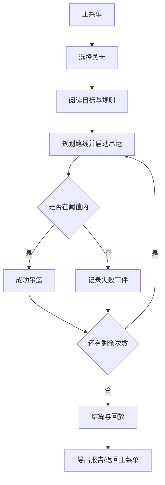

## 1. 产品概述

"钢卷吊运平衡游戏"是一款面向钢厂新员工培训的轻 3D 浏览器游戏/模拟器，用于理解钢卷吊运的重心偏移、路线避让、轨道冲突等真实工业安全规则。通过关卡回合让玩家在限定条件下完成吊运任务，触发事故将直接失败并回放全过程。

- 目标用户：钢厂新员工、安全培训教员
- 核心价值：把抽象的"重心偏移/轨道冲突"变成可操作可复盘的规则反馈，低成本重复练习
- 主要问题：新员工仅靠口头培训难以内化真实吊运风险

## 2. 核心功能

### 2.1 用户角色

| 角色 | 注册方式 | 核心权限 |
|------|----------|----------|
| 学员 | 直接进入 | 选择关卡、完成吊运、查看失败回放、导出报告 |
| 教员 | 直接进入 | 查看全局分数、边界案例说明、导出标准演示报告 |

### 2.2 功能模块

1. **主菜单页面**：关卡列表、继续、开始新局、历史记录、规则说明、导出报告
2. **游戏主场景**：2.5D/轻 3D 俯视视角、行车轨道、钢卷、作业区、人员区、重心指示器、避让提示
3. **结算页面**：胜利/失败判定、扣分点、失败原因、回放、导出 JSON/文本报告

### 2.3 页面详情

| 页面名称 | 模块名称 | 功能描述 |
|---------|---------|---------|
| 主菜单 | 关卡列表 | 显示所有可用关卡、难度、最佳得分 |
| 主菜单 | 规则说明 | 重心偏移、轨道冲突、人员穿越、作业区碰撞的判定规则 |
| 主菜单 | 边界案例 | 列出若干典型事故场景与判定依据 |
| 游戏场景 | 2.5D 场景 | 俯视+倾斜角，显示行车（龙门吊）、小车、吊具、钢卷、轨道、作业区 |
| 游戏场景 | 重心 HUD | 实时显示钢卷重心偏移方向与幅度，超过阈值闪烁/震动 |
| 游戏场景 | 路线规划 | 玩家点击作业区/放卷点进行路线规划，显示轨迹与冲突区 |
| 游戏场景 | 暂停/重开 | 随时暂停、重新开始当前回合 |
| 游戏场景 | 回合计数器 | 当前回合、剩余吊运次数、剩余时间 |
| 结算页面 | 失败原因 | 列出导致失败的具体事件：重心超限、轨道冲突、人员穿越、作业区碰撞等 |
| 结算页面 | 历史回放 | 时间轴播放本次操作过程，支持步进、定位失败帧 |
| 结算页面 | 报告导出 | 导出 JSON 或文本格式的吊运报告，含得分与事故项 |

## 3. 核心流程

玩家进入主菜单 → 选择关卡 → 阅读当前回合目标（吊运钢卷到指定作业区）→ 点击起点/终点规划路线 → 启动吊运 → 实时监控重心与轨道状态 → 完成或失败 → 查看结算与回放 → 可选择导出报告。

## 4. 用户界面设计

### 4.1 设计风格

- 主色：工业蓝（#1e3a5f）+ 安全橙（#ff8c1a）+ 警示红（#d9363e）
- 辅助色：钢卷金属灰（#6b7280），作业区绿（#16a34a）
- 按钮：3D 工业风，圆角 4px，厚边框，按下有下沉效果
- 字体：标题使用 `"Orbitron"`/`"Bebas Neue"` 工业风字体，正文使用 `"JetBrains Mono"` 等宽字体
- 布局：左侧信息面板 + 中央 3D 视图 + 右侧操作面板
- 图标：简洁几何图标，使用 SVG
- 整体感觉：工业控制台风格，高对比、信息密集但层次清晰

### 4.2 页面设计概览

| 页面名称 | 模块名称 | UI 元素 |
|---------|---------|---------|
| 主菜单 | 关卡列表 | 卡片网格，工业蓝背景，橙色悬停边框，显示关卡名、难度、最佳得分 |
| 主菜单 | 规则说明 | 侧边滑出面板，暗色半透明，规则项带图标 |
| 游戏场景 | HUD | 顶部：回合/时间/剩余次数；左侧：重心指示器 + 偏移条；右侧：操作按钮 |
| 游戏场景 | 2.5D 视图 | 俯视 30°倾斜，钢卷为圆柱体，行车为龙门式，轨道为矩形 |
| 结算页面 | 失败原因 | 时间轴列表，红色标记事件节点，可点击回放定位 |
| 结算页面 | 回放控制 | 播放/暂停/步进/定位，滑块控制进度 |

### 4.3 响应式

- 桌面优先设计（1280×720 以上）
- 窗口缩放时 3D 场景自适应，HUD 面板可折叠
- 移动端降级为 2D 俯视（非必须，MVP 聚焦桌面）

### 4.4 3D 场景指引

- 环境：工业车间地面，使用程序化生成的金属纹理地板
- 光照：方向光模拟车间顶灯，柔和阴影
- 相机：OrthographicCamera（正交投影），俯视 30°倾斜，可上下左右平移，滚轮缩放
- 构图：中央为钢卷与吊具，周围为作业区、轨道、人员穿越区
- 交互：鼠标点击选择钢卷/作业区规划路线，键盘箭头微调吊具位置
- 动画：吊运时钢卷轻微摇晃，重心偏移时显示倾斜效果，事故时屏幕震动+红色闪烁
- 后处理：无（轻量优先），使用 CSS 阴影模拟
- 性能：单场景物体 < 50 个，无纹理贴图，几何体全部程序化

## 5. 关卡与回合设计

| 关卡 | 名称 | 难度 | 核心难点 |
|------|------|------|---------|
| 1 | 基础吊运 | ★ | 单钢卷、无障碍、熟悉重心 |
| 2 | 偏移警觉 | ★★ | 钢卷偏心装载，必须调整吊点 |
| 3 | 双线轨道 | ★★ | 两条行车轨道，规划避让 |
| 4 | 人员穿越 | ★★★ | 下方有人员活动区，禁止穿越 |
| 5 | 综合作业 | ★★★★ | 多钢卷、多作业区、多障碍 |

每关卡分 3 回合，每回合吊运次数有限，单回合失败则本关失败。
